# 🖥️ Write-Up: [ROAD TO OLYMPUS](https://dockerlabs.es)

## 📌 Información General
    - Nombre de la máquina: Road to Olympus
    - Plataforma: Dockerlabs
    - Dificultad: Difícil
    - Creador: PatxaSec
    - OS: Linux
---

Este es el diagrama de conexiones de las tres máquinas.

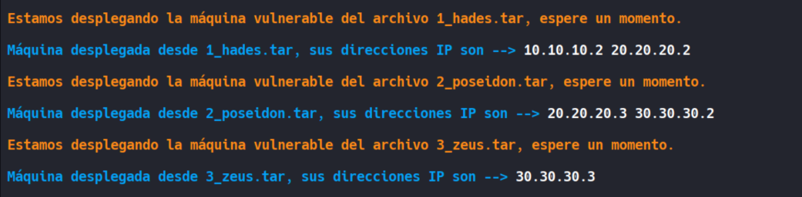

Nuestra IP es la 10.10.10.1.

Sólo tenemos conexión con la máquina Hades cuya IP es la 10.10.10.2, así que tenemos que acceder a ella, después a través de ella a la máquina Poseidón y por último, a través de Poseidón a la máquina Zeus.

## 🔥 Primera Máquina - Hades

En primer lugar, mediante `ping` enviamos una traza icmp a la 10.10.10.2 para comprobar la conexión con la máquina.

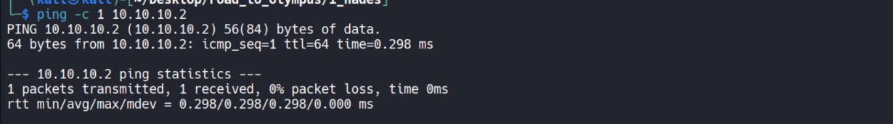

### 🔍 Enumeración de Puertos

Vemos que disponemos de conexión, así que vamos a proceder a enumerar los puertos abiertos de la máquina, para ello, emplearemos la herramienta `nmap`.

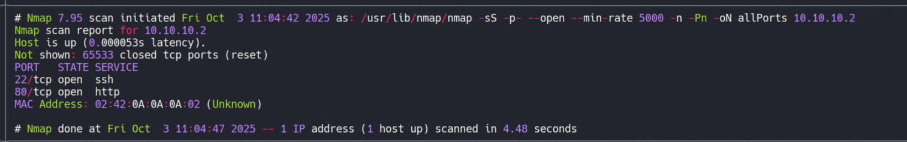

Observamos que la máquina tiene abiertos los puertos `22` y `80`, así que vamos a enumerar los servicios y sus versiones que se están ejecutando en ellos.

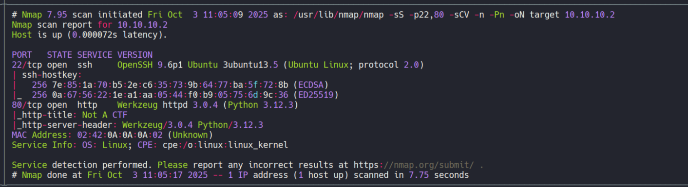

### Puerto 80

En el escaneo, vemos que la web está montada con Python.
Al acceder a ella, de primeras vemos una pantalla roja con un texto informativo:"¡Atención, esto no es un CTF!" y un botón de cerrar, el cual pulsamos y se nos muestra una web informativa sobre el uso de `Ligolo`, aunque ya adelanto de que vamos a resolver este reto utilizando `chisel` y `socat`.

Revisando el código fuente de la página, justo abajo del todo, encontramos una contraseña codificada y un nombre de usuario.

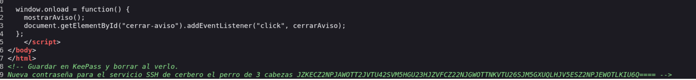

Vamos a decodificar la contraseña, para ello, primero decodificamos con `base32` y después con `base64`. El resultado obtenido nos lo da en formato hexadecimal, así que utilizando `xxd` lo pasamos a string.

```bash
echo 'JZKECZ2NPJAWOTT2JVTU42SVM5HGU23HJZVFCZ22NJGWOTTNKVTU26SJM5GXUQLHJV5ESZ2NPJEWOTLKIU6Q====' | base32 -d | base64 -d | xxd -r -p
```

Obtenemos como resultado --> P0seidón2022!

Aclaración: la "ó" no la interpreta correctamente la terminal, pero intuimos que se trata de ella.

### 🔑 Acceso por SSH

Ahora que disponemos de credencialas, `cerbero:P0seidón2022!`, vamos a conectarnos por ssh a la 10.10.10.2.

Una vez conectados, vemos que tenemos permisos sudoers para ejecutar todo lo que queramos, así que usando un `sudo bash` nos convertiremos en root.

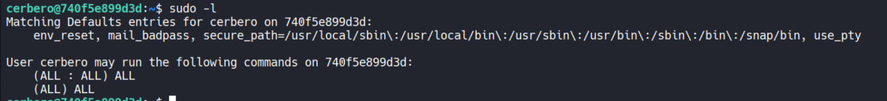

Primera máquina - Hades completada.

## 🌊 Segunda Máquina - Poseidón

Con la primera máquina - Hades completada, tenemos que utilizarla para pivotar y poder acceder a la segunda máquina - Poseidón, la cual posee la Ip 20.20.20.3.

### ⚙️ Configuración de Chisel

Nosotros no disponemos de conexión directa con la máquina Poseidón pero la Hades si la tiene, por lo tanto, vamos a utilizar `chisel` para mandarnos las conexiones de la máquina Hades a la nuestra.

Primero usamos en Hades el comando `uname -m` y obtenemos `x86_64`, lo que nos indica que es una arquitectura amd64. Ahora vamos al repositorio de github de chisel [https://github.com/jpillora/chisel] y accemos click en `v1.11.3 Latest`.

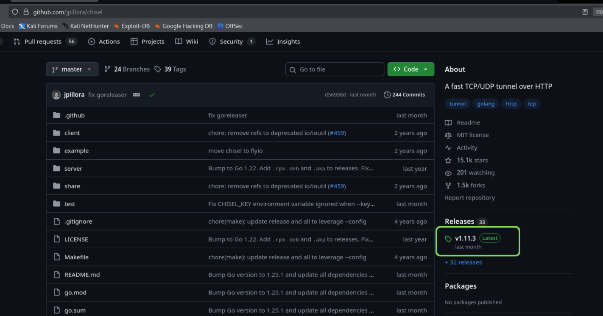

Una vez dentro, buscamos la versión para `linux_amd64` y nos la descargamos. En este caso, bajamos la de extensión `.gz`

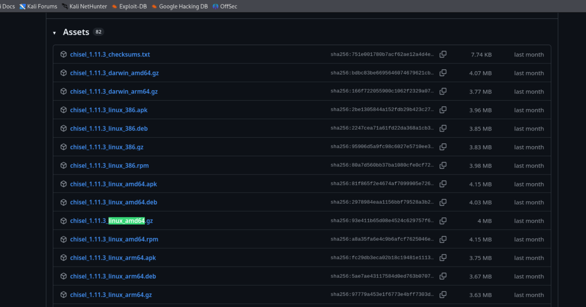


Ahora que la tenemos descargada, la descomprimimos con `gunzip` y le ponemos un nombre más simple, chisel.
```bash
gunzip chisel_1.11.3_linux_adm64.gz
mv chisel_1.11.3_linux_adm64 chisel
```

También vamos a descargar `socat`, lo necesitaremos más adelante, el procedimiento es el mismo pero desde el repositorio de `socat` en github [https://github.com/3ndG4me/socat], una vez en él, hacemos click `v1.7.3 Linux, Windows, ...`

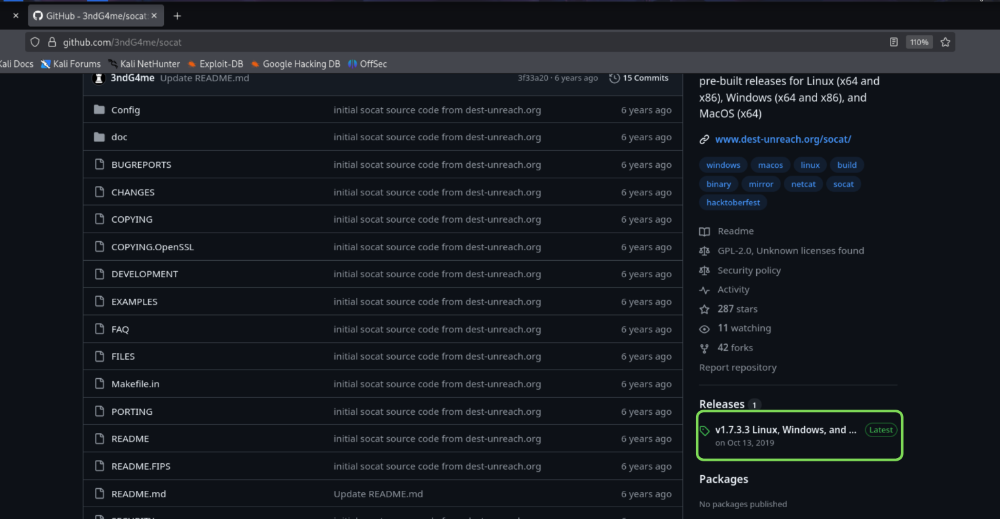

Una vez ahí, nos bajamos la versión de 64 para linux, en este caso cogemos el `.bin` y lo renombramos como socat.

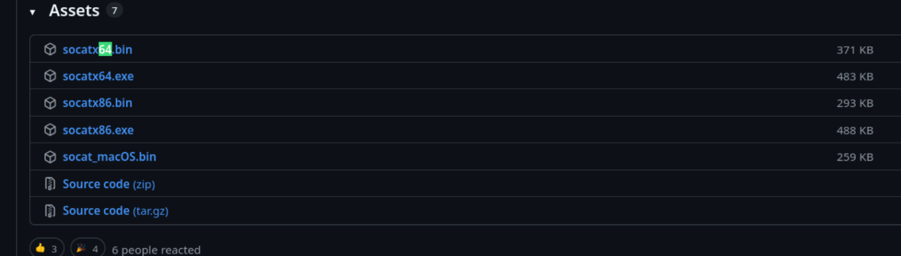


Ya lo tenemos todo descargado y toca pasarlo a la máquina Hades, para ello, como disponemos de credenciales para ssh vamos a utilizar scp para pasarnos desde nuestra máquina a la Hades tanto chisel como socat.

```bash
scp chisel cerbero@10.10.10.2:/home/cerbero/chisel
```

```bash
scp socat cerbero@10.10.10.2:/home/cerbero/socat
```

Ahora que los tenemos en la máquina Hades les damos permisos de ejecución.

```bash
chmod +x chisel socat
```

Para comenzar con el pivoting, en nuestra máquina creamos un servidor con chisel, importante darle permisos de ejecución, este servidor lo vamos a levantar en el puerto 1234.

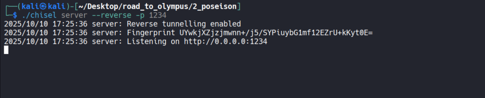

Hay que tener mucho cuidado con esta pestaña de nuestra terminal, ya que si se cerrara, el servidor se apagaría.

Ahora en la máquina Hades nos conectamos a nuestro servidor de chisel, con nuestra IP y el puerto en el que lo hemos levantado. Además, mandamos el proceso a segundo plano con `&` y misma precaución, cuidado de no cerrar la pestaña.

```bash
./chisel client 10.10.10.1:1234 R:socks &
```

Al ejecutarlo y mirar nuestro servidor, vemos que se ha conectado.

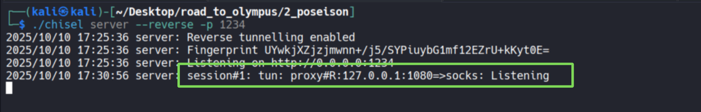

Toca editar el archivo /etc/proxychains.conf, en él, comentamos la línea de strict_chain y descomentamos la línea de dynamic_chain.

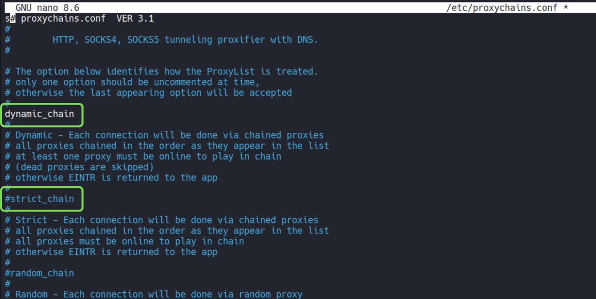

Por último, abajo del todo, tenemos que tener descomentada la línea de `socks5 127.0.0.1 1080`, ya que es el puerto por defecto que usa chisel.

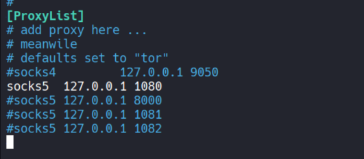

Ahora todas nuestras acciones sobre la máquina Poseidón deberán de utilizarse junto con proxychains o proxychains4, ya que en mi sistema utilizan el mismo archivo de configuración, el cual acabamos de editar.


### 🔍 Enumeración de Puertos

En nuestra máquina utilizamos `proxychains4` y nmap sobre la 20.20.20.3 para obtener tanto sus puertos abiertos como los servicios y versiones que se ejecutan en ellos.
```bash
proxychains4 -q nmap -sT -sCV -n -Pn 20.20.20.3
```


Vemos que tenemos el puerto `22` y el `80` abiertos.

### Puerto 80

Vamos a ver el puerto 80 con el navegador pero nosotros no tenemos conexión directa con la 20.20.20.3, así que tenemos que configurar un proxy en el navegador para poder acceder.

Para ello, usamos la extensión de `FoxyProxy`.

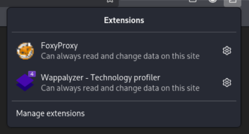

Y en él, añadimos el siguiente proxy.

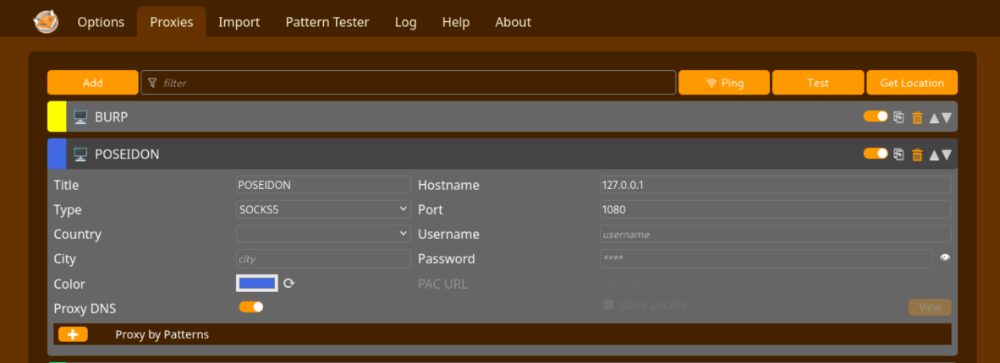

Lo activamos y accedemos a la 20.20.20.3


En su barra de navegación vemos tres apartados: Buscar, Ranking y Perfil. A nosotros nos interesa Buscar, ya que nos lleva a un subdirectorio con un sistema de búsqueda.

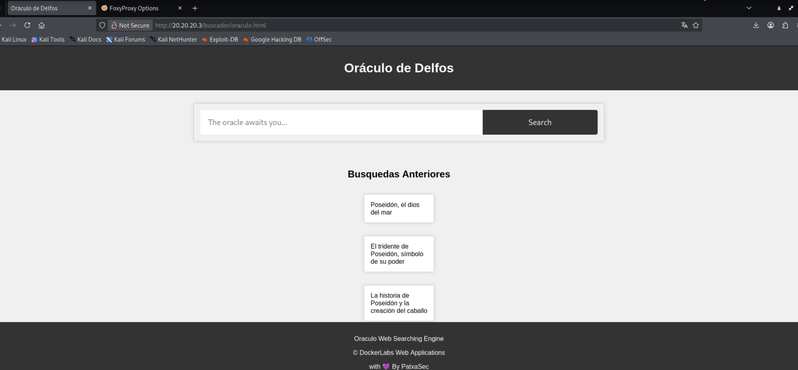

Revisamos el código fuente para ver como tramita la petición este sistema de búsqueda.

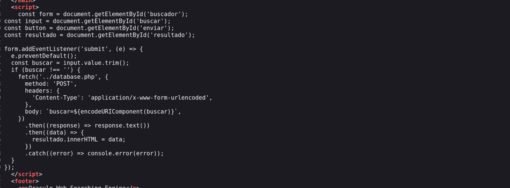

Podemos observar como tramita mediante el método `POST` una petición a un archivo `database.php`, por lo que entendemos que pasa el parámetro del campo de búsqueda y realiza la consulta a la base de datos con él.

Intentamos utilizar la herramienta `sqlmap` para obtener la información de la base de datos, pero no nos funcionó. Así que tras varios intentos de averiguar que base de datos se estaba utilizando, conseguimos saber que se emplea una `sqlite`, ya que estas bases de datos usan una tabla interna que contiene el esquema de las bases de datos almacenadas, llamada sqlite_master.

Para poder leer la información introducimos en el campo de búsqueda la consulta `select name from sqlite_master`.

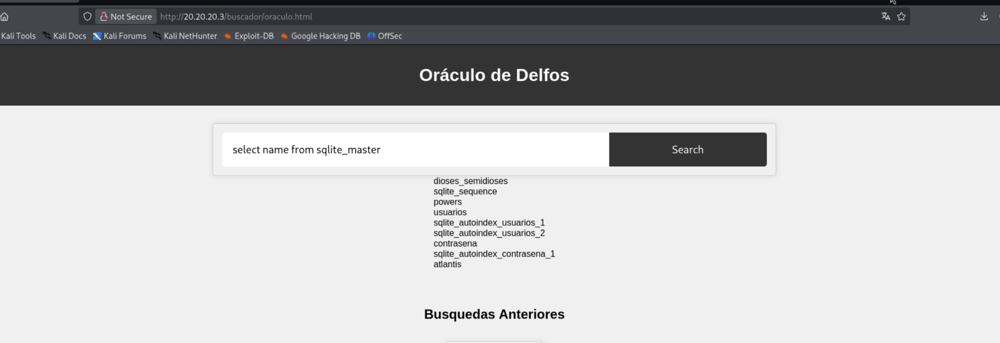

Vemos dos tablas interesantes, "usuarios" y "contrasena", así que vamos a ver su contenido.

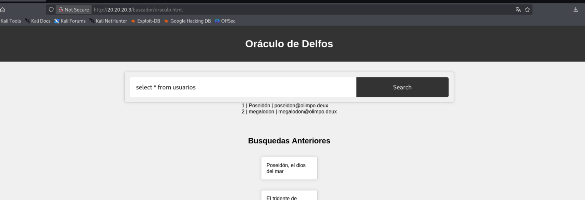


Tenemos a los usuarios: `poseidon` y `megalodon`, y las contraseñas que parecen codificadas, así que vamos a decodificarlas.

```
$sha1$oceanos$QqFgxFPmqRex1ZKFCZ2ONJKWOTTNKFTU46SBM5ZKFCZ2ONJKWOTTNKFTU4GQPdkh3nQSWp3I=
$sha1$hahahaha$JZKFCZ2ONJKWOTTNKFTU46SBM5HG2TLHJV5ECZ2NPJEWOTL2IFTU26SFM5GXU23HJVVEKPI=
```

Observamos que una parte de ellas está en texto claro, así que nos quedamos con la parte que parece codificada.

Usando el mismo procedimiento que en la máquina Hades encontramos una contraseña.

```bash
echo 'JZKFCZ2ONJKWOTTNKFTU46SBM5HG2TLHJV5ECZ2NPJEWOTL2IFTU26SFM5GXU23HJVVEKPI=' | base32 -d | bae64 -d | xxd -r -p
```
Obtenemos --> Templ02019!

### 🔑 Acceso por SSH

Entramos por ssh con el usuario megalodon.
```bash
proxychains4 -q ssh megalodon@20.20.20.3 
```

Una vez conectados, vemos que tenemos permisos sudoers para ejecutar todo lo que queramos, así que usando un `sudo bash` nos convertiremos en root.

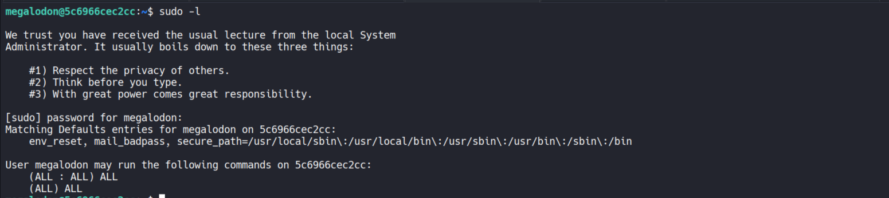

Segunda máquina - Poseidón completada.

## ⚡ Tercera Máquina - Zeus

### ⚙️ Configuración de Chisel y Socat

La máquina Poseidón tiene conexión con la tercera máquina - Zeus, por lo tanto, realizamos el procedimiento anterior pero con alguna variación. Así que vamos a empezar con pasarnos `chisel` y `socat` a la máquina Poseidón.

Comprobamos con el comando `uname -m` que posee la misma arquitectura que la máquina Hades y como ese es el caso, podemos usar el mismo chisel que hemos estado utilizando. 

Como disponemos de credenciales ssh, scp está instalado en la máquina Hades y tenemos chisel en ella, nos lo posamos desde ahí.

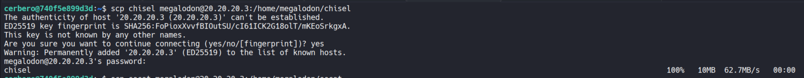

En la máquina Poseidón tenemos que usar chisel para enviar las conexiones a la máquina Hades y en esta, utilizar socat para reenviarlas al servidor de chisel de nuestra máquina. Para ello:

Primero, en la máquina Hades utilizamos socat para abrir el puerto 1111 y reenviar todas las conexiones que entren ahí a nuestro servidor de chisel.

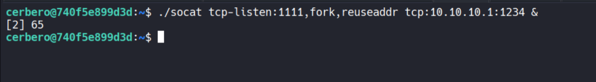

Y desde la máquina Poseidón, utilizamos chisel para conectarnos al puerto 1111 de la máquina Hades. Además, especificamos un puerto para el nuevo proxy, ya que por defecto chisel usa el 1080 y ya lo estamos usando. Le especificamos el puerto 8888.

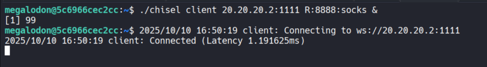

Y en nuestro servidor de chisel vemos como hay una nueva conexión.

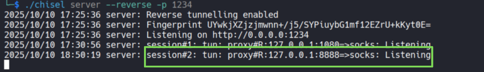

Tenemos que realizar un cambio en el archivo /etc/proxychains.conf, comentamos la línea del puerto 1080 y añadimos una nueva con el puerto 8888 que hemos fijado.

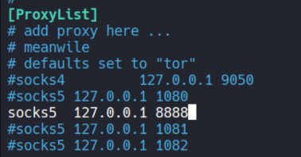

Ya está todo configurado, así que ejecutamos un escaneo de puertos como hemos hecho antes.

### 🔍 Enumeración de Puertos

En nuestra máquina, utilizamos proxychains y nmap sobre la 30.30.30.3 para obtener tanto sus puertos abiertos como los servicios y versiones que ejecutan.
```bash
proxychains4 -q nmap -sT -sCV -n -Pn 30.30.30.3
```

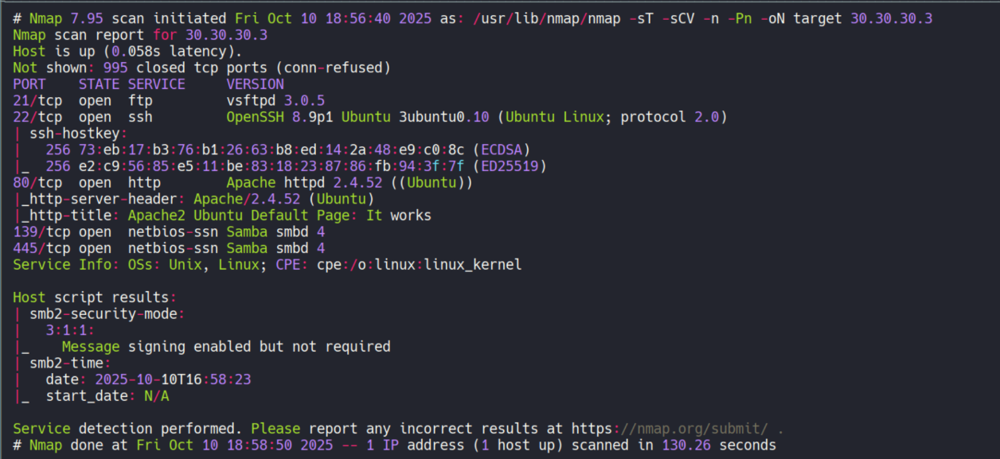

Vemos que la máquina Zeus tiene abierto los puertos 21, 22, 80, 139 y 445.

### Puertos 139 y 445

En los puertos 139 y 445 está ejecutándose SAMBA, así que vamos a utilizar `enum4linux` para obtener información.

```bash
proxychains4 -q enum4linux -a 30.30.30.3
```

Vemos que no hay directorios interesantes, pero tenemos dos usuarios, hercules y rayito.

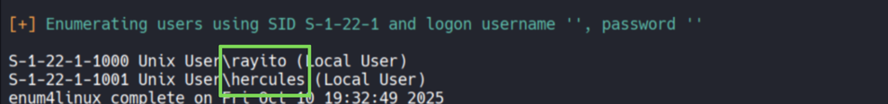

### Puerto 80

Vamos a ver el puerto 80 pero primero configuramos el proxy para poder acceder. Tenemos que poner el puerto 8888 que habíamos fijado anteriormente.

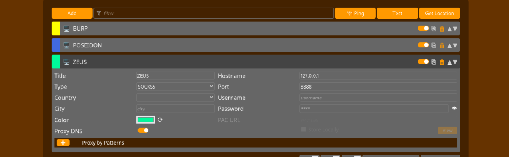

Vemos la página por defecto de Apache. En el código fuente no encontramos nada y tras realizar fuzzing utilizando la herramienta de `wfuzz` no hemos encontrado ningún subdirectorio.

### Puerto 21

Teniedo dos usuario (rayito y hercules) podemos probar a relizar un ataque de fuerza bruta contra el puerto 21.
En este caso como diccionario, vamos a usar una versión reducida del rockyou con sólo las primeras 5000 contraseñas, lo llamamos minirock.

```bash
proxychains4 -q hydra -L users -P minirock ftp://30.30.30.3 
```

Tras un buen rato, encontramos las credenciales hercules:thunder1 y con ella accedemos al servido de ftp.

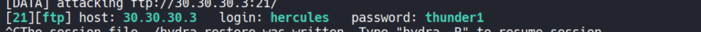

Una vez en el servidor ftp vemos un archivo .exe que nos descargamos usando el comando get.

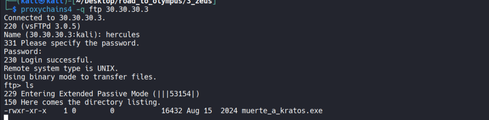

Como es un binario vamos a utilizar `strings` para ver las cadenas legibles. Revisándolas encontramos una cadena que parece codificada.

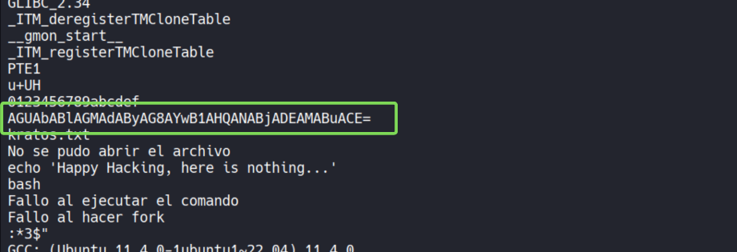

Está en base64 así que lo decodificamos.
```bash
echo 'AGUAbABlAGMAdAByAG8AYwB1AHQANABjADEAMABuACE=' | base64 -d
```

Y obtenemos --> electrocut4c10n!

### 🔑 Acceso por SSH

Con esa contraseña y el usuario rayito nos conectamos por ssh.

```bash
proxychains4 -q ssh rayito@30.30.30.3
```

Y como en las otras máquinas, nuestro usuario puede ejecutar como sudo todo lo que quiera, así que lanzando un sudo bash seremos root.

Tercera máquina - Zeus completada.
