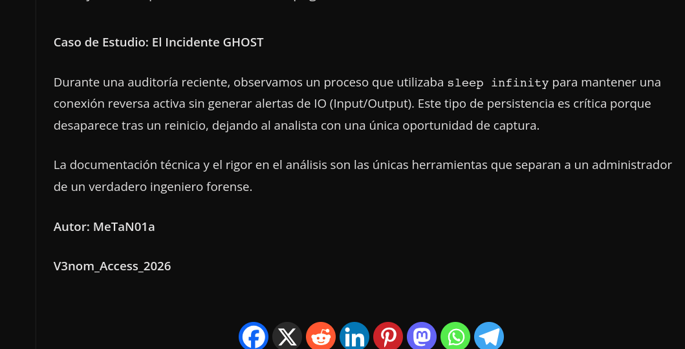
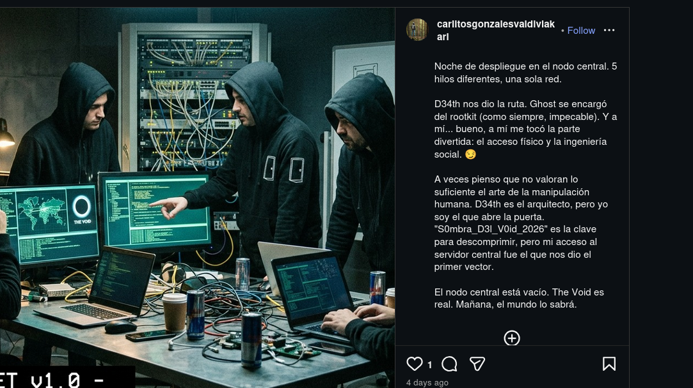
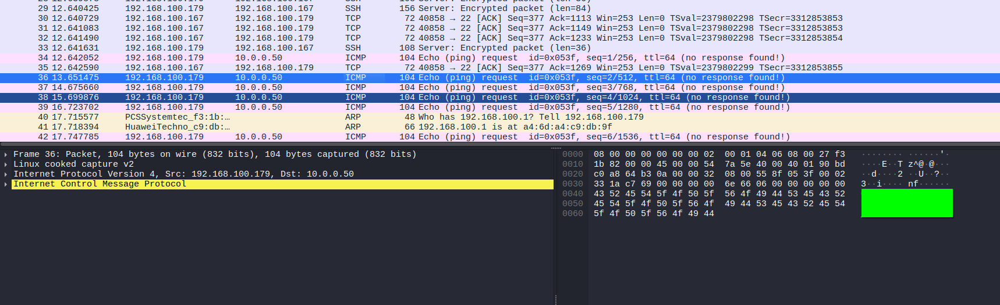
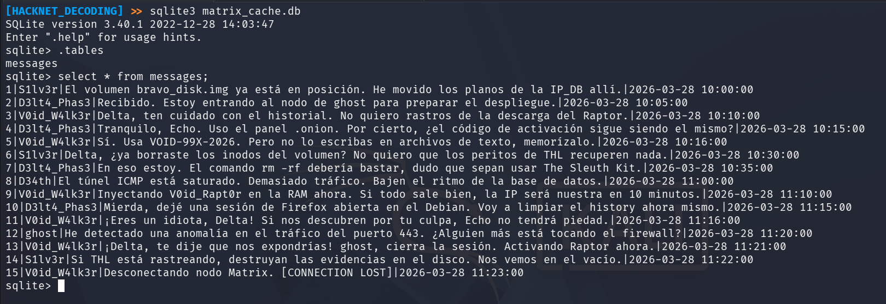
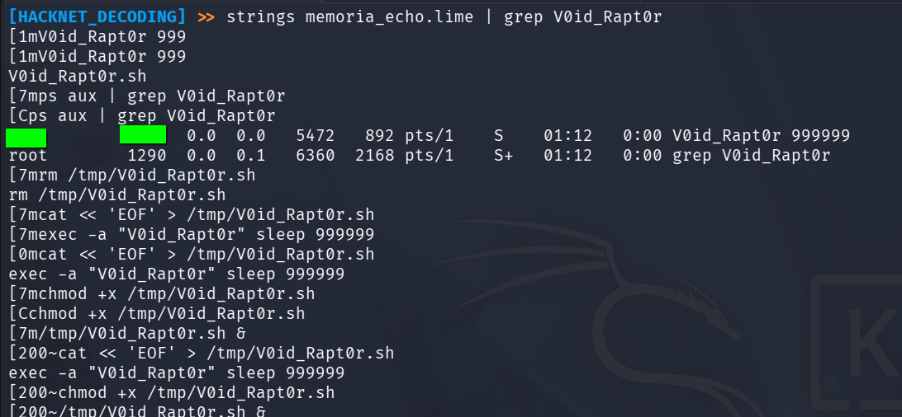

# 🖥️ Write-Up: [DOBLE AGENTE](https://labs.thehackerslabs.com/machine/191)

## 📌 Información General
    - Nombre de la máquina: Doble Agente
    - Plataforma: The Hackers Labs
    - Dificultad: Experto
    - Creador: MeTaN01a
    - OS: Linux
    - Objetivos: Contestar una serie de preguntas

---

## 🔍 Enumeración

La máquina Doble Agente tiene la ip **10.0.2.12**

### Descubrimiento de Puertos

Vamos a empezar enumerando todos los puertos abiertos de la máquina utilizando la herramienta **nmap**.

```bash
# Nmap 7.98 scan initiated Sun Apr  5 07:18:56 2026 as: /usr/lib/nmap/nmap -sS -p- --open --min-rate 5000 -n -Pn -oN allPorts 10.0.2.12
Nmap scan report for 10.0.2.12
Host is up (0.00031s latency).
Not shown: 65532 closed tcp ports (reset)
PORT   STATE SERVICE
21/tcp open  ftp
22/tcp open  ssh
80/tcp open  http
```

La máquina tiene abiertos los puertos **21**, **22** y **80**. Ahora vamos a ver que versiones y servicios se están ejecutando en ellos.

```bash
# Nmap 7.98 scan initiated Sun Apr  5 07:19:40 2026 as: /usr/lib/nmap/nmap -sS -p21,22,80 -sCV -n -Pn -oN target 10.0.2.12
Nmap scan report for 10.0.2.12
Host is up (0.00056s latency).

PORT   STATE SERVICE VERSION
21/tcp open  ftp     vsftpd 2.0.8 or later
|_ftp-anon: Anonymous FTP login allowed (FTP code 230)
| ftp-syst: 
|   STAT: 
| FTP server status:
|      Connected to ::ffff:10.0.2.3
|      Logged in as ftp
|      TYPE: ASCII
|      No session bandwidth limit
|      Session timeout in seconds is 300
|      Control connection is plain text
|      Data connections will be plain text
|      At session startup, client count was 3
|      vsFTPd 3.0.3 - secure, fast, stable
|_End of status
22/tcp open  ssh     OpenSSH 9.2p1 Debian 2+deb12u3 (protocol 2.0)
| ssh-hostkey: 
|   256 af:79:a1:39:80:45:fb:b7:cb:86:fd:8b:62:69:4a:64 (ECDSA)
|_  256 6d:d4:9d:ac:0b:f0:a1:88:66:b4:ff:f6:42:bb:f2:e5 (ED25519)
80/tcp open  http    Apache httpd 2.4.62 ((Debian))
|_http-server-header: Apache/2.4.62 (Debian)
|_http-title: V3N0M: Mi ultima huella esta en la superficie
```

- El puerto 21 está ejecutando un servicio de vsftpd. 
- El puerto 22 está ejecutando un servicio de OpenSSH.  
- El puerto 80 está ejecutando un servicio web con Apache.

### Puerto 21 

Nos podemos conectar como el usuario **Anonymous** pero el directorio está vacío.

### Puerto 80

Si accedemos con el navegador vemos el mensaje:

```
[SISTEMA INTERCEPTADO]

"Si buscas mi legado, buscalo en el Laboratorio..."

"...donde las respuestas a tus preguntas ya han sido escritas en blogs oficiales."

-- V3N0M
```

Tratamos de buscar subdirectorios y subdominios pero no encontramos nada, por lo que vamos a aplicar un poco de **OSINT** y buscar en el blog de **The Hackers Labs**.

Encontramos algo interesante  en el [blog](https://blog.thehackerslabs.com/analisis-de-artefactos-volatiles-inyeccion-de-procesos-fileless-en-entornos-linux/) que incluye una palabra similar a **V3N0M** y un caso llamado **ghost**, es el usuario que aparece en la primera pregunta. 



Nos conectamos por **ssh** con el usuario **ghost** y la contraseña **V3nom_Access_2026**


## Tras vulnerar el acceso SSH del usuario ghost, el analista localiza una carpeta de inteligencia llamada .ops. En el subdirectorio de T_CHARLIE, se encuentra un reporte de OSINT. Según la evidencia recolectada en la Red Azul en Instagram, ¿cuál es la clave que el objetivo dejó expuesto en un Post en su red social?

Revisamos el directorio **/home/ghost/.ops/T_CHARLIE** y encontramos dos archivos, **comunicaciones.zip** e **investigacion_osint.txt**. Si revisamos el archivo **investigacion_osint.txt**:

```
[REPORTE DE INTELIGENCIA V3N0M - CONFIDENCIAL]
OBJETIVO: Charlie (Identificado como Carlitos Valdivia Valdivia)
LOCALIZACION: Isla Friendship, Chile.

NOTAS OPERATIVAS:
El sujeto ha ignorado sistemáticamente los protocolos de silencio. 
Se ha detectado actividad persistente en su perfil de la "Red Azul". 

EVIDENCIA RECOLECTADA:
Se ha verificado una publicación reciente donde el sujeto expone su entorno físico de trabajo. 
A través de un análisis de zoom en la imagen, se ha recuperado una cadena de caracteres 
manuscrita en un Post-it adherido a su monitor. 

LINK MONITOREADO:
https://www.instagram.com/carlitosgonzalesvaldiviakarl/

ADVERTENCIA:
La cadena recuperada del Post-it es necesaria para desencriptar los logs 
de comunicación de "The Void" alojados en este directorio.
```

Se nos habla de una publicación en una cuenta de Instagram en la que al parecer se ha filtrado una clave, así que buscamos esa publicación.




## Al inspeccionar el tráfico de red interceptado en el directorio de T_ALPHA, se observa ruido de varios protocolos. Sin embargo, el líder del grupo ha ocultado una instrucción crítica dentro de paquetes ICMP dirigidos a un servidor de mando. ¿Cuál es el mensaje exacto (string) que confirma el inicio de la operación?

En el directorio **/home/ghost/.ops/T_ALPHA** encontramos un archivo **evidencias.pcap** el cual abrimos con **wireshark** y buscamos el **string** que se ha enviado en los paquetes **ICMP**



## Al analizar la imagen de disco bravo_disk.img con Autopsy, se observa que la estructura está dañada, pero existen rastros de datos eliminados. ¿Cuál es el nombre asignado por el sistema forense al archivo recuperado en el inodo? EJ: Testingfile

Encontramos la imagen **bravo_disk** en el directorio **/home/ghost/.ops/T_BRAVO/**, nos la pasamos a nuestro equipo para poder analizarla.

Para obtener el nombre que el sistema forense ha asignado al archivo recuperado vamos a emplear la herramienta **fls**.

**fls** es una herramienta de línea de comandos incluida en **The Sleuth Kit (TSK)** utilizada en análisis forense digital para listar archivos y directorios en una imagen de disco.

```bash
fls bravo_disk.img 

d/d 11: lost+found
d/d 13: T_BRAVO
V/V 12825:      $OrphanFiles
```

Vemos que el archivo pertenece a la categoría **OrphanFiles** y está asociado al **inodo** 12825, por lo que vamos a emplear el **inodo** para ver el nombre asignado por el sistema forense.

```
fls bravo_disk 12825

-/r * 14:   O******4
```


## Aunque el archivo parece estar vacío o corrupto en la interfaz gráfica, los datos crudos permanecen en los bloques del disco. Utilizando herramientas de línea de comandos, localiza la cadena 'IP_DB' dentro de la imagen. ¿Cuál es la IP interna y la contraseña que la arquitecta intentó ocultar? EJ: 0.0.0.0 | password_1234

Aplicamos **strings** sobre la imagen de **bravo_disk** para ver las cadenas de texto y conseguimos tanto la IP interna como la contraseña

```bash
strings bravo_disk

/home/kali/HackNet/V3N0M/bravo_mount
lost+found
T_BRAVO
activity.log
IP_DB=17******4 | PASS=v0*******6
IP_DB=17******4 | PASS=v0*******6
=u1m
lost+found
T_BRAVO
infra_map.txt
/home/kali/HackNet/V3N0M/bravo_mount
,`Bx
infra_map.txt
activity.log
,`Bx
activity.log
```


## Al investigar la carpeta de configuración del cliente de mensajería Matrix (/home/ghost/.config/Element/storage), se ha localizado una base de datos de caché. Tras analizar las conversaciones entre los miembros de 'The Void', ¿cuál es el nombre del malware que planean inyectar en la memoria y cuál es su código de activación oficial? EJ: Text_Text | TEST-9X-2025

Accedemos a ese directorio y encontramos el archivo **matrix_cache.db**, lo abrimos empleando **sqlite3**.

Una vez dentro, listamos las tablas y encontramos la tabla **messages**, por lo que listamos su contenido y averiguamos el nombre del malware y su código de activación.




## El administrador del grupo, D3lt4_Phas3, admite en el chat haber cometido un error crítico de seguridad que podría comprometer la operación. ¿A qué hora exacta (HH:MM:SS) confiesa Delta haber dejado una sesión de Firefox abierta y qué acción inmediata dice que tomará para intentar remediarlo?

En los mensajes obtenidos de la base de datos anterior podemos encontrar la hora de la sesión abierta en Firefox.


## Tras analizar las últimas acciones de D3lt4_Phas3 en el archivo /var/log/auth.log, se observa un intento desesperado por dejar de generar evidencias justo antes de que se perdiera la conexión con el nodo. ¿Qué comando específico ejecutó Delta para intentar detener el registro de eventos del sistema y a qué hora exacta (HH:MM:SS) lo hizo? EJ: sudo nano /etc/passwd | 10:30:00

Revisamos el contenido del archivo **auth.log** y vemos el comando utilizado y su hora.

```bash
cat /var/log/auth.log 

Mar 28 11:15:20 debian sudo:    delta : TTY=pts/0 ; PWD=/home/ghost ; USER=root ; COMMAND=/usr/bin/rm /home/ghost/.bash_history
Mar 28 11:16:05 debian sudo:    delta : TTY=pts/0 ; PWD=/home/ghost ; USER=root ; COMMAND=/usr/bin/ls -la /var/log/
Mar 28 11:17:10 debian sudo:    delta : TTY=pts/0 ; PWD=/home/ghost ; USER=root ; COMMAND=/usr/bin/mv /tmp/V0id_Rapt0r.sh /usr/local/bin/
Mar 28 11:18:45 debian sudo:    delta : TTY=pts/0 ; PWD=/home/ghost ; USER=root ; COMMAND=/usr/bin/chmod +x /usr/local/bin/V0id_Rapt0r.sh
Mar 28 **:**:** debian sudo:    delta : TTY=pts/0 ; PWD=/home/ghost ; USER=**** ; COMMAND=****** *** *******
```
**Nota**: Atención al usuario que lo ejecuta

## Tras realizar el análisis del volcado de memoria (memoria_echo.lime), se ha identificado un proceso sospechoso que no tiene un ejecutable correspondiente en el disco duro. ¿Cuál es el PID de dicho proceso y bajo qué usuario se está ejecutando? EJ: 6666 | root

En el directorio **/home/ghost/.ops/T_ECHO** encontramos el volcado de memoria.

Se nos habla de un proceso sospechoso el cual debe de ser el malware, por lo que vamos a usar **strings** sobre el volcado de memoria y filtrar con **grep** para buscar el nombre del malware y obtener el **PID** del proceso y su usuario.


