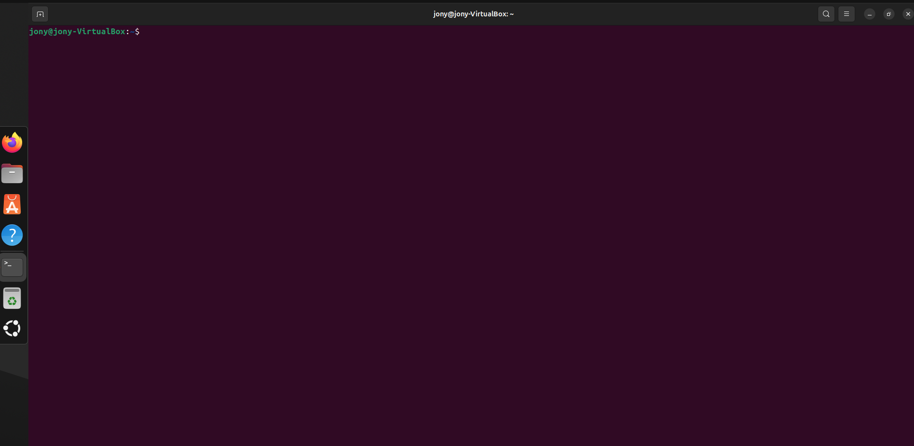
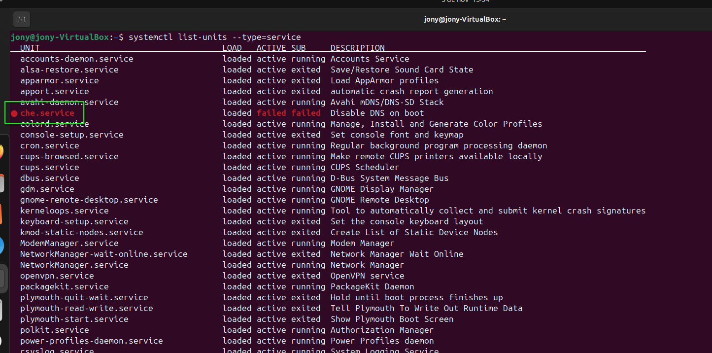
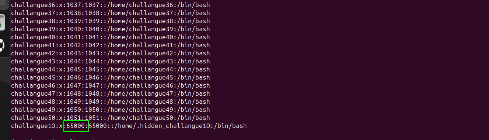
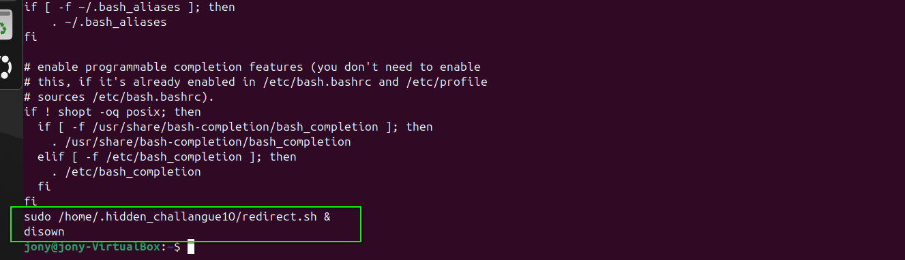
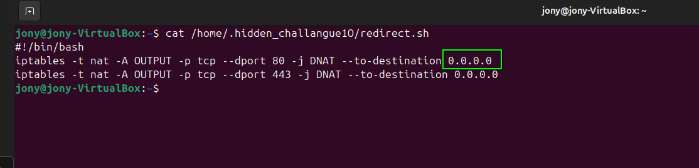

# 🖥️ Write-Up: [EL AMIGO](https://labs.thehackerslabs.com/machine/105)

## 📌 Información General
    - Nombre de la máquina: El Amigo
    - Plataforma: The Hackers Labs
    - Dificultad: Avanzado
    - Creador: oscaar90
    - OS: Linux
    - Objetivos: Responder a las preguntas

---

## 📖 Contexto

Disponemos de un archivo **pdf** que nos cuenta como un amigo ha descargado y ejecutado un archivo de dudosa procedencia y ahora su ordenador no funciona correctamente. Nos pide ayuda para averiguar que le ocurre.

También, tenemos otro archivo **login.txt** con sus credenciales **jony : jony2025**

El ordenador tiene instalado Ubuntu así que abrimos su terminal y comenzamos con la investigación.



## ⁉️ Preguntas

### ¿Nombre del servicio malicioso?

Vamos a revisar que servicios está ejecutando el sistema operativo y así poder ver si hay alguno sospechoso. Ejecutamos:

```bash
systemctl list-units --type=service
```

Y encontramos el servicio malicioso, **che.service**




### ¿Cuántos usuarios ha creado el atacante? 

Vamos a ver el archivo **/etc/passwd**, filtrar por la palabra **home** para saber cuantos usuarios tiene el sistema y contar sus líneas.

```bash
cat /etc/passwd | grep "home" | wc -l
```

Nos devuelve 53, pero claro, nuestro usuario **jony** ya existía, así que el atacante ha creado **52** usuarios.


### ¿Cuál es el UID/GID de la cuenta creada por el atacante con privilegios?

Si volvemos a revisar el **/etc/passwd** vemos que un usuario posee un punto al inicio de su nombre simulando la forma de crear un directorio oculto, .hidden_challenge10, una forma de intentar camuflar su existencia en la máquina. Su **UID** es **65000** 



### ¿Desde qué script se redirige el tráfico?

Si revisamos el **.bashrc** de nuestro usuario, vemos que se ejecuta un script situado en el directorio del usuario mencionado en la anterior pregunta y además se desvincula su ejecución de la terminal, por lo que ya tenemos el nombre del script, **redirect.sh**



### ¿A qué IP se redirige el tráfico?

Si accedemos al contenido del script anterior vemos que el tráfico se redirige a la **0.0.0.0**

