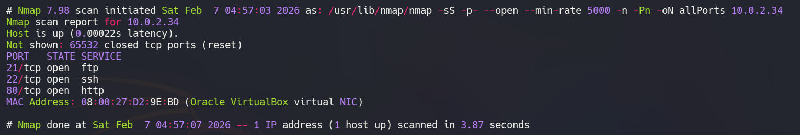
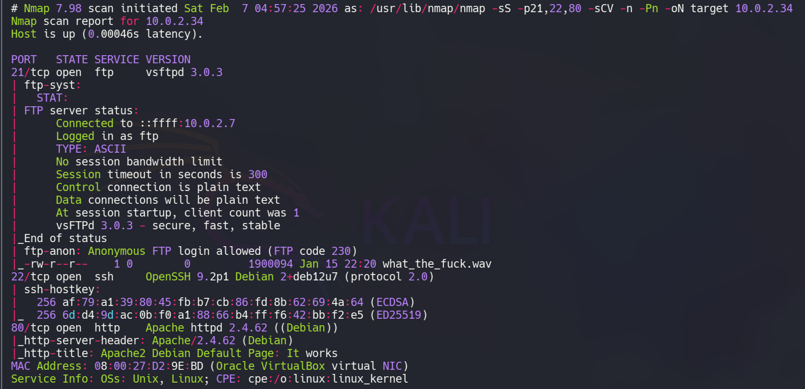
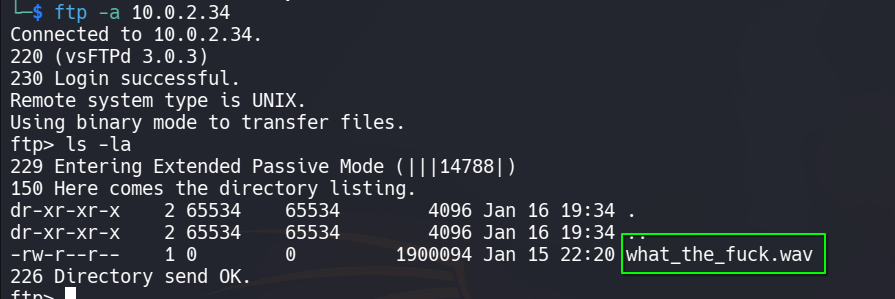
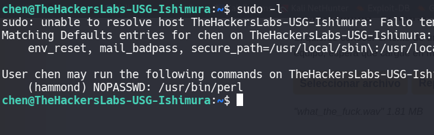
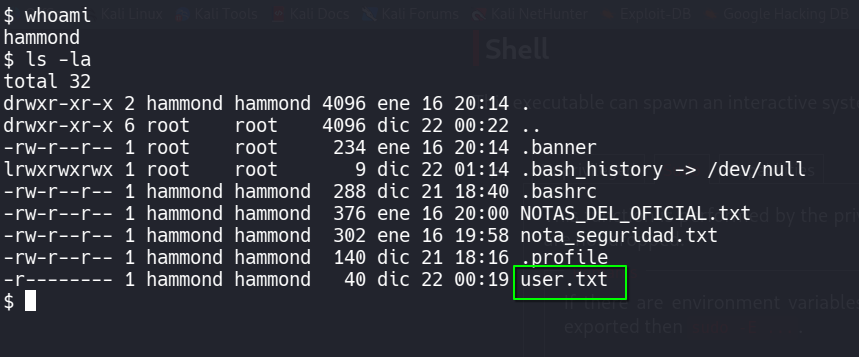
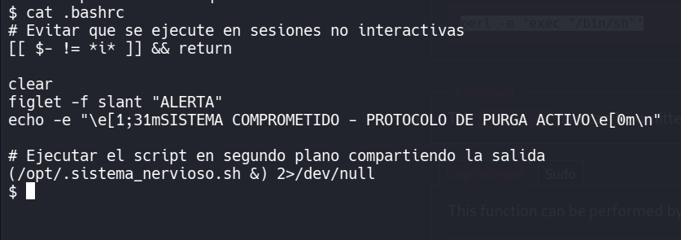
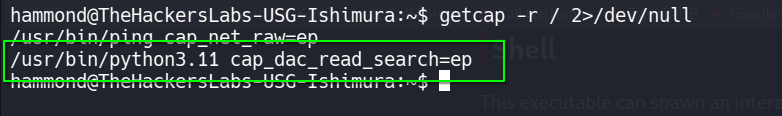
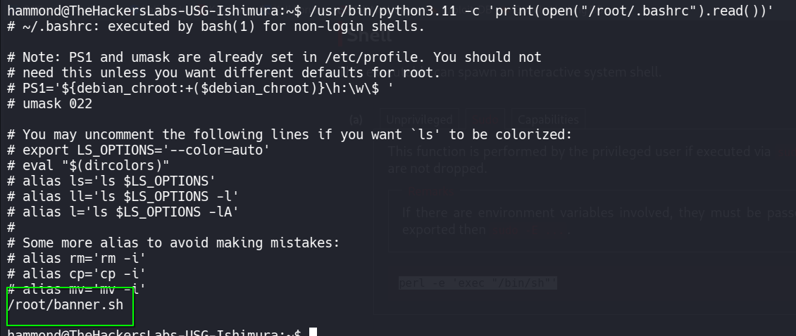
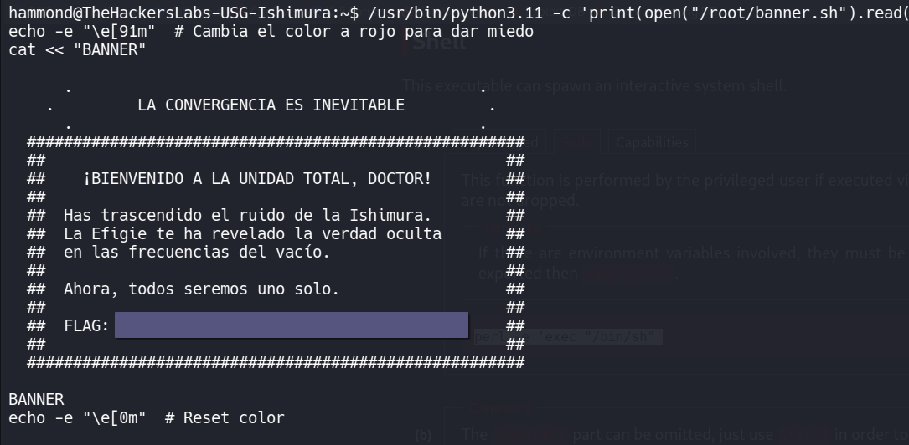

# 🖥️ Write-Up: [USG - Ishimura](https://labs.thehackerslabs.com/machine/169)

## 📌 Información General
    - Nombre de la máquina: USG - Ishimura
    - Plataforma: The Hackers Labs
    - Dificultad: Avanzado
    - Creador: MeTaN01a
    - OS: Linux
    - Objetivos: Obtención de la Flag de usuario y de root

---

## 🔍 Enumeración

La máquina USG-Ishimura tiene la ip **10.0.2.34**

### Descubrimiento de Puertos

Vamos a empezar enumerando todos los puertos abiertos de la máquina utilizando la herramienta **nmap**.



La máquina tiene abiertos los puertos **21**, **22** y **80**. Ahora vamos a ver que versiones y servicios se están ejecutando en ellos.



- El puerto 21 está ejecutando un servicio de vsftpd
- El puerto 22 está ejecutando un servicio de OpenSSH.  
- El puerto 80 está ejecutando un servicio web con Apache.

### Puerto 21

Como podemos observar en el análisis de **nmap**, el servicio de **ftp** tiene habilitada la conexión mediante **Anonymous**, por lo que procedemos a conectarnos al servicio y a listar su contenido.

```bash
ftp -a 10.0.2.34
```



## 🔥 Explotación

Encontramos un archivo de audio, **what_the_fuck.wav**, el cual nos descargamos.

Tras revisarlo vemos que se trate de un audio en código morse, así que vamos a utilizar la web **https://morsecw.com/decodificador.html** para decodificarlo.

Obtenemos el mensaje:
```txt
TDA CONTRASENA DE CHEN ES GATONEGROISHIMURA+
```
Tenemos un usuario y una contraseña, pero claro el código morse no distingue entre mayúsculas y minúsculas, por lo que tenemos que probar diferentes combinaciones.

## 🔑 Acceso SSH
### Chen
Conseguimos entrar al servicio **ssh** con las credenciales **chen** : **gatonegroishimura**

Si revisamos los permisos sudoers de chen, vemos que podemos ejecutar como el usuario **hammond** el binario de **perl**, por lo que nos podemos lanzar una shell.



## 🧗 Escalada de Privilegios
### Hammond

Utilizamos

```bash
sudo -u hammond perl -e 'exec "/bin/bash"'
```

Obtenemos una bash como **hammond** pero en unos segundos nos cierra sesión, al parecer por un script de seguridad.


Por lo tanto, en lugar de lanzarnos una **bash**, vamos a utilizar una **sh**

```bash
sudo -u hammond perl -e 'exec "/bin/sh"'
```

De este modo evitamos el script. Ya tenemos la **flag de usuario**.



Si revisamos el **.bashrc** vemos que es quien nos impide tener una **bash**.



Vaciamos su contenido con `echo "" > .bashrc` y nos lanzamos una **bash** para trabajar más cómodamente.

Revisamos el contenido del archivo **NOTAS_DEL_OFICIAL.txt**

```
[LOG DE OPERACIONES]
- El Dr. Mercer ha bloqueado el acceso al Nucleo.
- Kendra dice tener un plan de contingencia, pero no confia en mi.
- He visto que guarda sus credenciales en un archivo llamado 'CRED_ACCESO_SISTEMA.txt' dentro de su home.
- He configurado el binario de Python para intentar leer su archivo desde mi cuenta,
  pero Mercer me tiene vigilado con su script.
```

Las credenciales del usuario **kendra** se encuentran en un archivo **CRED_ACCESO_SISTEMA.txt** de su home y parece que podemos ejecutar **Python** para leerlo.

Revisamos las capabilities del sistema.



Podemos usar el binario de **python3.11** para leer archivos del sistema.

```bash
usr/bin/python3.11 -c 'print(open("/home/kendra/CRED_ACCESO_SISTEMA.txt").read())'
```

Obtenemos las credenciales de **kendra** : **kendra_is_watching_you**

Como podemos leer archivos, podemos intentar leer la flag de root, pero no existe como root.txt.

Leemos el **.bashrc** del usuario **root**.

```bash
/usr/bin/python3.11 -c 'print(open("/root/.bashrc").read())'
```



Vemos un archivo **banner.sh**, lo leemos y obtenemos la **flag de root**.

```bash
/usr/bin/python3.11 -c 'print(open("/root/banner.sh").read())'
```

