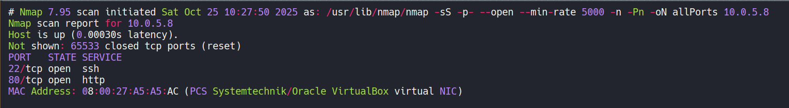
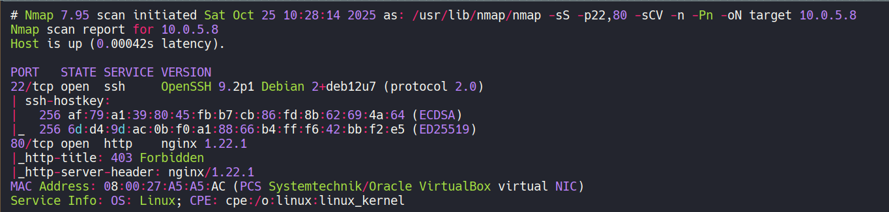
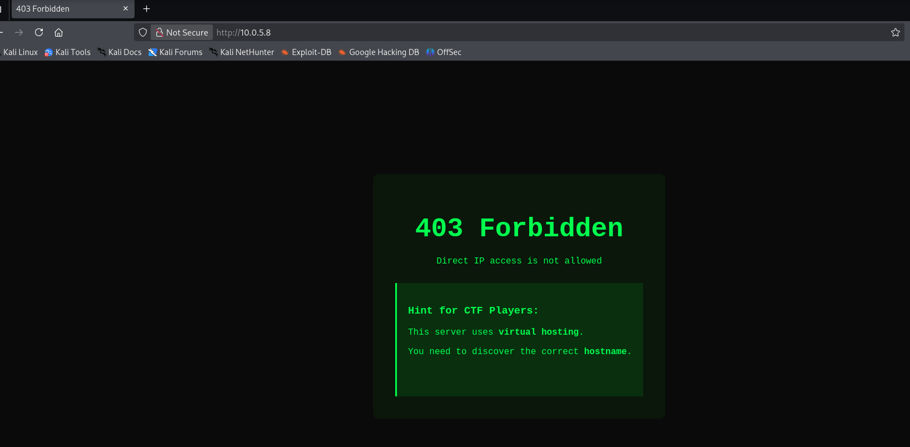
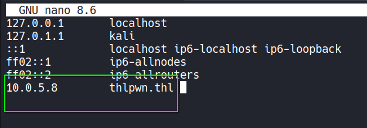
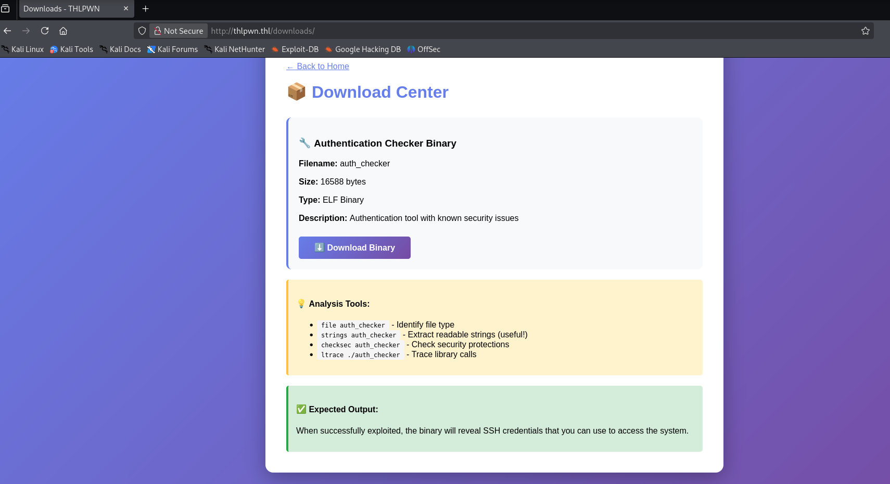
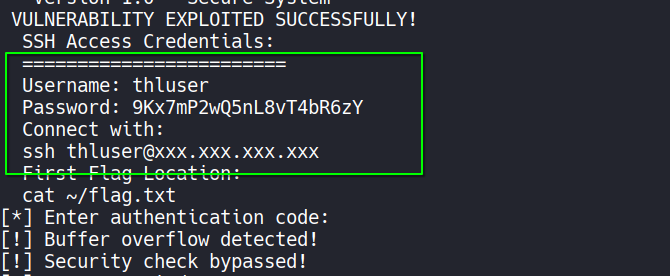
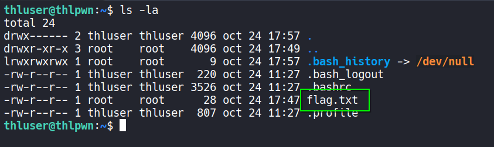
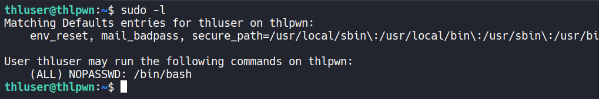
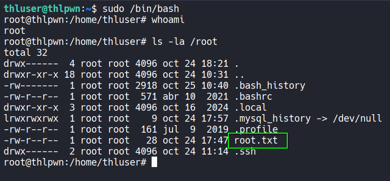

# 🖥️ Write-Up: [THLPWN](https://labs.thehackerslabs.com/machine/141)

## 📌 Información General
    - Nombre de la máquina: THLPWN
    - Plataforma: The Hacker Labs
    - Dificultad: Principiante
    - Creador: Oscar
    - OS: Linux
    - Objetivos: Obtención de la Flag de usuario y de root

---

## 🔍 Enumeración

La máquina THLPWN tiene la ip **10.0.5.8**

### Descubrimiento de Puertos

Comenzamos utilizando la herramienta **nmap** para obtener los puertos abiertos de la máquina y  averiguar los servicios y versiones que se ejecutan en ellos.

Primero vamos a ver que puertos están abiertos.



La máquina tiene abiertos los puertos **22** y **80**. Ahora vamos a averiguar los servicios y versiones.



- El puerto 22 ejecuta un servicio de OpenSSH, del que no disponemos de credenciales.
- El puerto 80 ejecuta un servicio web con nginx.

### Puerto 80

Si accedemos con el navegador obtenemos un código de estado **403**, **Forbidden**, y una pista que nos indica que el servidor está aplicando **Virtual Hosting**.



Sabiendo que el nombre de la máquina es **thlpwn**, vamos a añadir al **/etc/hosts** la ip de la máquina y el dominio **thlpwn.thl**



Ahora accedemos con el navegador a **thlpwn.thl** y vemos una nueva página.


Revisamos los enlaces a subdirectorios que están debajo del botón de "Submit".  
En **Downloads** encontramos un botón para poder descargar un archivo binario, "Download Binary".



## 🔥 Explotación

Pulsamos en él y nos descarga un binario llamado **auth_checker**. Vamos a utilizar **strings** para que nos nuestre sus cadenas legibles.

```bash
strings auth_checker
```



Encontramos unas credenciales para conectarnos por ssh, **thluser : 9Kx7mP2wQ5nL8vT4bR6zY**

## 🔑 Acceso SSH

Nos conectamos con ellas como el usuario **thluser**.

```bash
ssh thluser@10.0.5.8
```

Una vez dentro ya tenemos la primera flag.



## 🧗 Escalada de Privilegios

### Root

Si revisamos los permisos sudoers con `sudo -l` vemos que podemos ejecutar como el usuario root la **bash**



Así que ejecutamos `sudo /bin/bash` y ya somos root. En el directorio **/root** encontramos su flag.

