# 🖥️ Write-Up: [POLICY](https://vulnyx.com/)

## 📌 Información General
    - Nombre de la máquina: Policy
    - Plataforma: Vulnyx
    - Dificultad: Easy
    - Creador: d4t4s3c
    - OS: Windows
    - Objetivos: Obtención de la Flag de usuario y de root

---

## 🔍 Enumeración

La máquina Policy tiene la ip **192.168.0.27**

### Descubrimiento de Puertos

Vamos a empezar enumerando todos los puertos abiertos de la máquina utilizando la herramienta **nmap**.

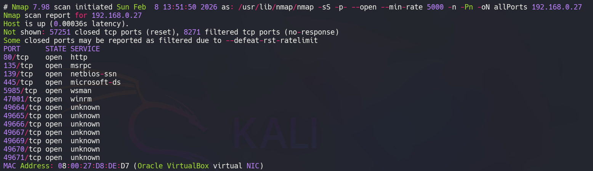

Continuamos analizando las versiones y servicios que se están ejecutando en los puertos **80**, **135**, **139**, **445** y **5985**.

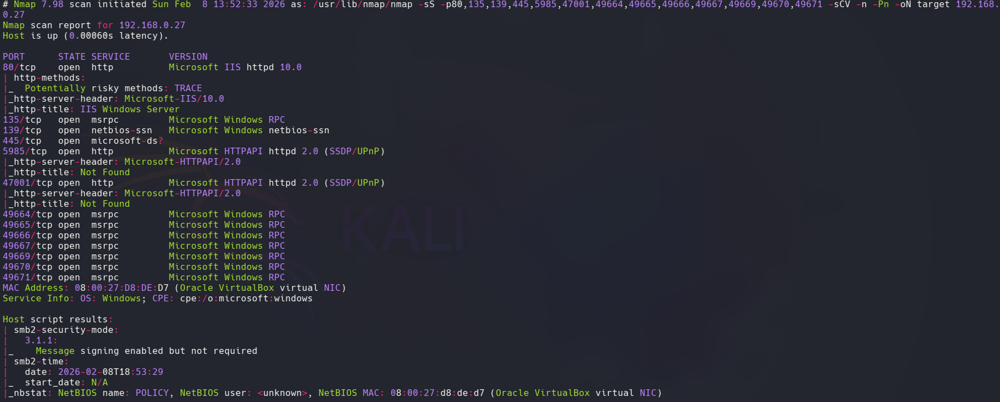

- El puerto 80 está ejecutando un servicio web con **Microsoft IIS**
- El servicio **Microsoft RPC** está disponible
- El servicio **SMB** está activo
- **WinRM** está habilitado
  
### Puerto 80

Accedemos a él con el navegador y vemos la página por defecto del **IIS**.

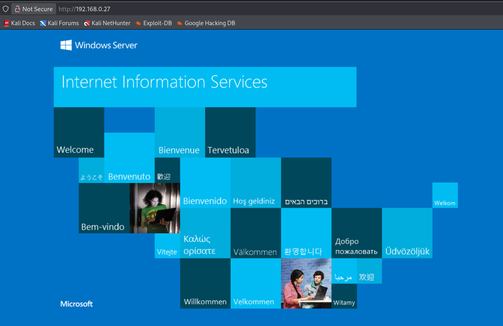

Vamos a enumerar subdirectorios utilizando la herramienta de **gobuster**.

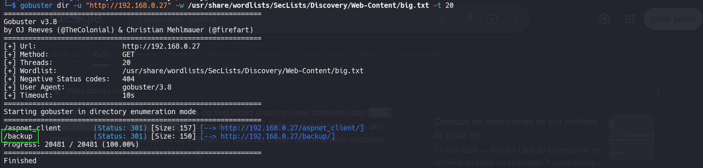

Tenemos un subdirectorio **/backup**, vamos a volver a utilizar **gobuster** pero ahora para buscar en ese subdirectorio archivos con extensión **bak**, **zip**, **tar**, **gz**, **sql**, **backup** y **bkp**. 

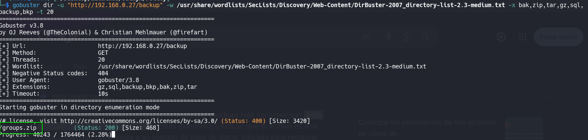

Encontramos un archivo **groups.zip**. Accedemos con el navegador a la ruta **/backup/groups.zip** y nos lo descargamos.

## 🔥 Explotación

El archivo posee una contraseña, por lo que vamos a emplear **John The Ripper** y el diccionario **rockyou** para romperla.

```bash
zip2john groups.zip > zip_hash.txt
john zip_hash.txt --wordlist=/usr/share/wordlists/rockyou.txt
```

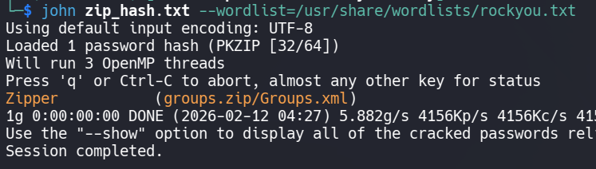

Usamos la contraseña **Zipper** para extraer el contenido del archivo.

Podemos ver el nombre de usuario **xerosec** y la contraseña **IwLNLy0Ck5xIlXEsPMTbOF1f/NnliQFKeGv139eUEgE**, la cual está cifrada con **AES**

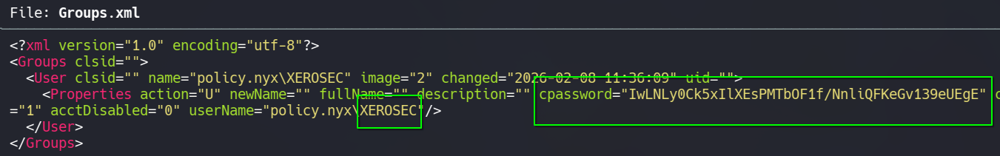

Para poder desencriptar esta contraseña utilizamos la herramienta **gpp-decrypt**

```bash
gpp-decrypt IwLNLy0Ck5xIlXEsPMTbOF1f/NnliQFKeGv139eUEgE
```

Obtenemos --> **GPP2k26blahblah**

Teniendo estas credenciales, vamos a usar **NetExec** para validarlas en el **smb** y en el **winrm**.

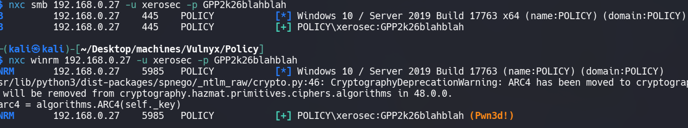

## Acceso WinRM
### Xerosec

Como podemos observar, las credenciales son válidas, así que nos conectamos por el servicio de **WinRM** a la máquina.

```bash
evil-winrm -i 192.168.0.27 -u xerosec -p GPP2k26blahblah
```
Conseguimos la **flag de user**.

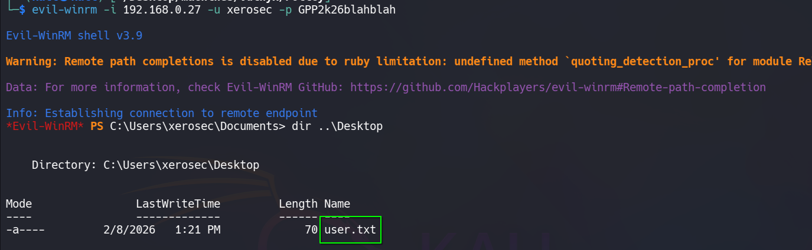

## 🧗 Escalada de Privilegios
### Administrator

Vamos a enumerar el sistema empleando la herramienta de [winPEAS.ps1](https://github.com/peass-ng/PEASS-ng/blob/master/winPEAS/winPEASps1/winPEAS.ps1)

Una vez descargada la subimos usando la terminal del **evil-winrm** y lo ejecutamos.

```bash
upload /home/kali/Desktop/winPEAS.ps1
.\winPEAS.ps1
```
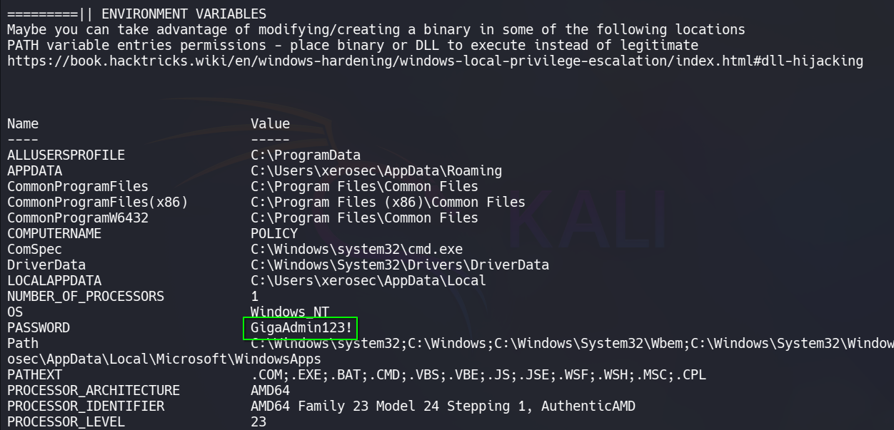

Obtenemos las credenciales del usuario **Administrator** : **GigaAdmin123!**

Las comprobamos usando **NetExec**

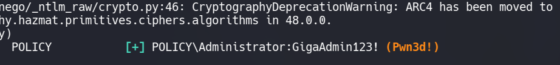

Son válidas, así que nos conectamos como **Administrator**

```bash
evil-winrm -i 192.168.0.27 -u Administrator -p GigaAdmin123!
```

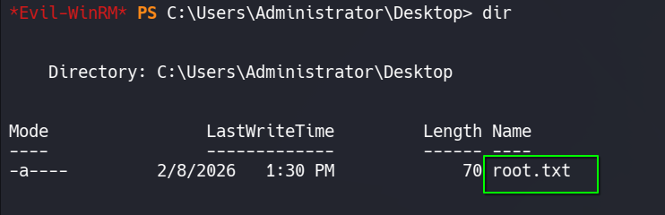